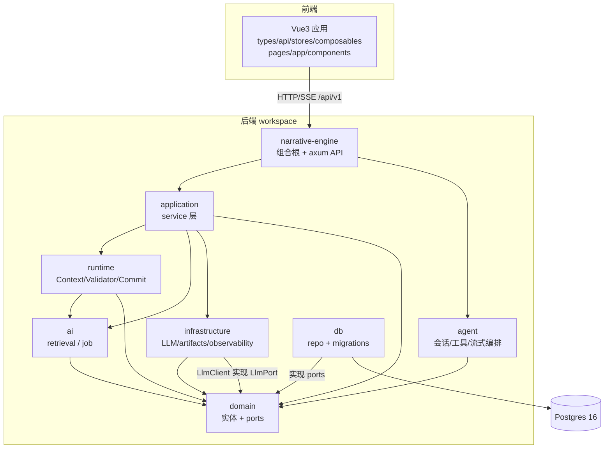

# Novel Creator 架构总览（源码级）

> 本文档汇总 `docs/modules/` 下 11 篇模块文档（8 个 Rust crate + 7 篇前端技术层）的结论，给出跨模块的统一架构视图、依赖拓扑、核心架构原则与已识别的核心痛点。所有论断均可在对应模块文档及 `文件:行号` 处核对，**以源码为准**。

## 1. 项目定位

Novel Creator 是一个「AI 辅助长篇小说创作」系统：后端用 Rust workspace（`cargo`，8 个 crate）承载领域建模、AI 编排、Canonical 世界状态与 HTTP API；前端用 Vue 3 + TypeScript 提供世界/故事/提案/对话引导等创作界面。数据库为 Postgres 16（docker 容器 `novel-postgres`，端口 5432），通过 `sqlx` 直连，迁移文件位于 `crates/db/migrations/`（001 为权威 schema，共 21 个迁移）。

设计目标（见顶层 `ARCHITECTURE.md`）是「AI 只提案、人类/统一写入口裁决并落库」，把**可复现的确定性世界状态**作为唯一真源。

## 2. 分层架构与依赖方向

整体遵循「端口与适配器（依赖倒置）」+「分层」混合风格。权威依赖方向（见 `crates/ai/src/lib.rs:14-18`、各 crate `lib.rs`）：

```
domain  ←  db / infrastructure / application / ai / runtime / agent / narrative-engine
（domain 定义实体与端口；上层仅依赖 domain 的端口与实体，具体实现在 db 注入）
```

关键约束（源码事实）：
- `domain` 不依赖任何上层，是依赖图的「汇」（`crates/domain/src/lib.rs`）。
- `runtime` 仅依赖 `domain`，**不**直接 `use db`/`sqlx`（`crates/runtime/src/commit/state_committer.rs:8-9`），DB 事务下沉到 `domain::ports` 由 `db` 注入。
- `agent` 仅依赖 `domain`（取 `LlmPort` 端口），具体 LLM 实现在 `narrative-engine` 组合根注入（`crates/agent/src/lib.rs:7-8`）。
- `narrative-engine` 既是 HTTP 层也是**组合根**：把 `LlmClient`、各 Repo、领域工具装配进 `AgentRuntime` 与 application services（`crates/narrative-engine/src/main.rs`）。



### 2.1 agent 与 ai 的职责边界（源码印证）

二者都属「AI 过程」，但职责分明，避免功能在 crate 间摇摆：

| Crate | 职责 | 源码印证 |
|---|---|---|
| `agent` | **引导式会话编排**：维护 session、装配工具、非流式/流式聊天、记忆召回，依赖 `domain::ports::LlmPort`（具体实现由组合根注入） | `crates/agent/src/runtime.rs`（AgentRuntime / chat / chat_stream）；`crates/agent/src/lib.rs:7-8` 仅依赖 `domain` |
| `ai` | **检索与异步任务**：`retrieval`（上下文检索）与 `job`（异步作业），被 `application`/`runtime` 调用 | `crates/ai/src/retrieval.rs`、`crates/ai/src/job.rs` |

边界原则：`agent` 负责「与用户/工具的对话编排」，不实现底层检索；`ai` 负责「可被编排复用的检索/任务原语」，不含会话状态。组合根（narrative-engine）负责把 `LlmClient` 等具体实现注入二者。

## 3. 核心架构原则（源码印证）

| 原则 | 含义 | 源码印证 |
|---|---|---|
| **Canonical State 唯一真源** | `world`/`entity`/`character_*`/`event`/`fact`/`narrative_node` 等表是确定性世界状态，AI 不直接写 | `ARCHITECTURE.md`；`db` 的 `WorldRepo` 等实现 `EntityPort`/`StatePort` |
| **AI 只提案** | 模型产出 `ProposedChange`，不落 Canon | `runtime` 的 `Validator`/`StateCommitter` 裁决后提交；`domain::validation::ProposedChange` |
| **统一写入口** | 变更必须经统一边界落到 Canon | 见 §5「双写入口」问题——此原则**当前被违反** |
| **world_version git-commit 式** | 状态推进带 `world_version`（语义化/递增），支持可复现 | `domain::generation::ReproducibilityMeta`（generation.rs:124-139）；`runtime` 填充 world_version |
| **可复现性** | 上下文构建固化检索引用、模型/temperature 由 Generation Runtime 负责 | `runtime/src/execution/context_engine.rs:124-157, 406-445` |

## 4. 数据库概览

- 21 个迁移，001 为权威 schema；软删策略（`status='Active'`/`'Deleted'` 或 `deleted_at`）。
- 实体采用「共享 `entity` 表 + 按 `entity_type_id` 区分人物/地点/势力/物品」的宽表模型（`001_canonical_schema.sql:67-83`；`domain/src/entity.rs:46-66`）。
- 角色（Character）在 **R2 重构**（`017_character_r2_refactor.sql`）中把 `real_name→name`、`background→background_origin`、`age→age_range`、`social_status→social_position`，并把状态拆为 `physical_state/mental_state/resource_state/social_state/flags`（`character_state` 表，`001:583-616` 经 017 演进）。
- 会话-项目强绑定（`021_bind_session_to_project.sql`）：`agent_session.project_id NOT NULL`。

**⚠ 关键错位**：前端 `types/character.ts` 仍用 R2 前的 `real_name/nickname/health/cultivation/money/wanted` 等已删字段（见 `docs/modules/types.md` §4.3），后端 `get_character_state` 已不再生产这些列。

## 5. 已识别的核心痛点（跨模块）

按「混乱性价比」归并所有模块文档的「问题/代码异味」小节。完整证据在 `docs/modules/*.md`。

### 5.1 两套 Canon 写入口并存（高优先级 · 架构违规）
- `runtime/src/commit/state_committer.rs:15-31`：`DbStateCommitter` 走 `domain::ports::StateCommitterPort`，提交 `ProposedChange`。
- `application/src/mutation/committer.rs:14-63`：`MutationCommitter` 走 `domain::mutation::MutationCommitterPort`，写入 `MutationCommand`/`MutationBatch`。
- 二者都声称「只有此处能把变更落到 Canon」，但端口与命令模型各一套，提交路径/状态机不统一（详见 `docs/modules/runtime.md` §8.1、`docs/modules/application.md`）。

### 5.2 死代码 / 未编译代码（高优先级 · 易清理）
- `ai` crate 的 `character_mind.rs`/`state_mgmt.rs`/`repair.rs` **未被 `lib.rs` 的 `mod` 声明**，仅 `pub use domain::*` 垫片（`crates/ai/src/lib.rs:22-28`）；真正定义已下沉 `domain`，这三文件是与 `domain` 逐行重复的未编译死代码。
- 前端 4 个未引用组件：`EntityHighlight.vue`、`NeTooltip.vue`、`ContextInspector.vue`、`HistoryInspector.vue`（`grep` 全仓库无匹配，见 `docs/modules/components.md` §6.1）。
- `types`/`stores` 中的占位注释块、`get_by_type` 未被调用（`docs/modules/agent.md` §8.8）。

### 5.3 前后端字段/枚举不一致（高优先级 · 直接致 bug）
- **CharacterProfile / CharacterState**：前端停留 R2 前旧 schema（`types/character.ts:5-29` vs `domain/src/character.rs:278-328`）。
- **FactCertainty**：前端 `'Confirmed'|'Likely'|'Rumor'|'Uncertain'` vs 后端 `'CANON'|'PROBABLE'|'RUMOR'|'BELIEF'|'SPECULATION'|'FALSE_BELIEF'|'UNKNOWN'`（`types/world.ts:69` vs `domain/src/canon.rs:100-115`）。
- **GenerationTaskStatus**：前端多出 `BuildingContext/Generating/Validating`、缺后端 `Running`，导致轮询/进度 UI 永不匹配（`types/generation.ts:14-21` vs `domain/src/generation.rs:56-62`）。
- **ApprovalRecord**：`reviewer`(string)/`review_notes`(string) 与后端 `reviewer_id`(UUID)/`reviewer_comment` 错位（`types/approval.ts:15-25` vs `001:889-902`）。
- **Foreshadowing 缺 `storyline_id`**、**Rules 缺 `constraints`/`source`** 等。详见 `docs/modules/types.md` §4、§7。

### 5.4 功能断裂 / 假数据（高优先级 · 用户可见）
- **Context 模块整块瘫痪**：后端 `api/context.rs:8-52` 的 6 个 handler **全部返回 501**；前端 `stores/context.ts:15-33` 必进 `catch→reset()`，context 面板永远空白。
- **死路由**：前端 `generation.ts:14` 调用 `/api/v1/generations/{id}/stream`，但 `api/mod.rs:33-126` **未注册**该路由（仅 `/execute`）。
- **Validation 假通过**：`narrative-engine/src/api/validation.rs` 三端点返回硬编码假通过（`docs/modules/narrative-engine.md` §8）。
- **history version 伪造 / proposal change 级 accept-reject 假成功不落库 / location 子资源返回空数组**（同上）。

### 5.5 能力缺口 / 弱契约（中优先级）
- `infrastructure/src/llm/port_impl.rs:44`：`let _ = model;` 丢弃 `model` 参数，且 `max_tokens:4096`/`temperature:0.7` 硬编码——调用方传入 model 无效。
- `infrastructure` 的 `health_check` 恒 `true`、`Metrics` 无导出（可观测性缺位）。
- `settings`/`rules`/`snapshots` 后端返回裸 `serde_json::Value`（弱类型，前端强类型断言形同虚设，`docs/modules/api.md` §4.5/§4.6）。
- `agent` 与 `ai` 的「AI 过程」职责边界：已在 §2.1 显式划分（agent=会话编排 / ai=检索+异步任务）。

### 5.6 重复逻辑 / 冗余（中优先级）
- `narrative-engine` 的组合根在 `api/*` handler 与 `agent_tools.rs` 两处重复构造（`docs/modules/narrative-engine.md` §8）。
- 前端 `Characters.vue`/`Locations.vue`/`Factions.vue` 三页结构高度雷同未抽象（`docs/modules/pages.md` §7.10）。
- `ProjectLayout` 与子页面重复取数（`docs/modules/app.md` §7.1）。
- `runtime::ContextScore` 乘积模型脆弱、`ranking::filter` 内排序冗余（`docs/modules/runtime.md` §8.4/§8.6）。
- `ContractValidator::required_characters_met` 硬编码 `true` 占位（`docs/modules/runtime.md` §8.3/§8.5，安全相关）。

## 6. 前端技术层概览

```
frontend/src
├── types/        契约层（13 子模块 export *），当前滞后于后端 R2 重构
├── api/          网络边界（client.ts 统一 fetch；agent.ts 独立 SSE）
├── stores/       Pinia 适配器（8 store，agent/world/story 对齐良好，context 失效）
├── composables/  视图无关 UI 逻辑（5 个，useGeneration 进度错位、useContext 空）
├── pages/        23 个路由级视图（与 router.ts 一一对应）
├── layouts/      AppLayout / ProjectLayout / WritingLayout
├── app/          App.vue / router.ts
└── components/   56 个 .vue 组件 + utils/markdown.ts（17 分组）
```

数据流向：**页面 → store → api → 后端**；对话走 `agentStore` 的 SSE 流式。详见 `docs/modules/{types,api,stores,composables,pages,app,components}.md`。

## 7. 结论

项目架构意图清晰（Canonical 唯一真源 + AI 只提案 + 依赖倒置），但实现层面存在**原则违反（双写入口）、大量死代码/未编译代码、前后端字段错位的系统性漂移、以及 Context/Validation 等功能断裂**。这些不是「细节毛刺」而是贯穿多层的结构性问题，需在路线图中分阶段治理。

→ 下一步见 `docs/ROADMAP.md`（按混乱性价比排序的分阶段重构计划）、`docs/ONBOARDING.md`（如何构建运行）、`docs/GLOSSARY.md`（领域术语）。
