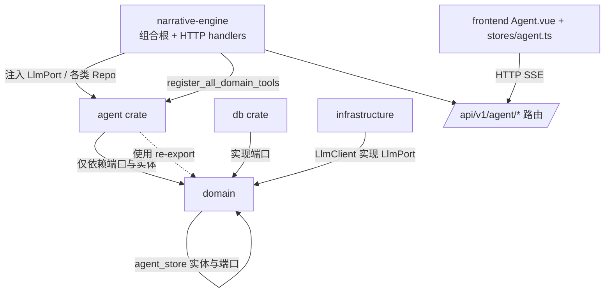
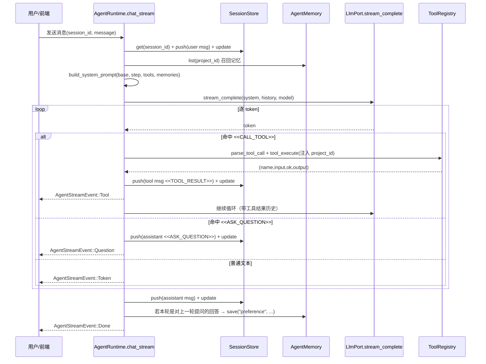

# agent（引导式 Agent 核心层）

## 1. 概述

`agent` crate 是 Novel Creator 的**引导式 Agent 核心层**，对应 GPT 方案中 Phase 1（P1：基础框架）的对话 / Session / SSE streaming / Tool framework 部分。它提供一组**与 HTTP 无关**的 Agent 核心抽象，由 `narrative-engine` 接线为 `/api/agent/*` 路由（见 `lib.rs:1-18`）。

一句话定位：本 crate 是"编排大脑"——负责把 LLM 端口、工具注册表、会话存储、记忆、提示词持久化组装到一起，并编排"一次会话回合"的完整生命周期（记录用户消息 → 拼接提示词 → 调 LLM → 解析工具/选择题标记 → 执行工具/记忆 → 落库 → 流式回传）。

**P1 标注含义**：文档与代码注释中反复出现的 P1/P2/P3 是方案阶段标记。P1 = 基础框架（当前 crate 已实现的范围）；P2/P3 为后续待接入的能力（持久化 4 张表、Workflow 引擎驱动 `current_step`、真实领域工具、消息数组式流式等）。本 crate 在 `lib.rs:10-18` 显式列出了 P1 范围边界。

关键职责边界（来自 `lib.rs:7-18`）：
- 仅依赖 `domain`（取 `LlmPort` 端口），不直接依赖 `infrastructure`；具体 LLM 实现在组合根注入。
- 会话 / 记忆用**内存实现**（测试/无 DB 场景）；生产持久化由 `db` crate 提供、`narrative-engine` 接线。
- SSE 为**真实 token 级流式**（Provider `stream:true` → `AgentRuntime` 透传），不再使用端点级切词。
- 工具仅内置基础工具（echo / ask_question）；真实领域工具在组合根 `narrative-engine` 构造并注册到 `ToolRegistry`。
- 工具调用做"输入须为对象"校验 + JSON Schema 轻量校验（required + type）。

## 2. 模块职责

| 模块（文件） | 职责 |
|---|---|
| `lib.rs` | crate 根：模块声明、`pub use` 再导出、P1 范围边界说明 |
| `session.rs` | 会话与消息的**内存实现**（端口/实体已上移至 `domain::agent_store`） |
| `runtime.rs` | **编排核心**：`AgentRuntime` 持有全部依赖，提供创建会话、聊天（含流式）、工具执行、记忆存取、提示词视图 |
| `types.rs` | Agent HTTP 层请求/响应 DTO 与 `ToolMeta` |
| `prompt.rs` | 系统提示词拼接（`build_system_prompt`）与内置默认基座常量 |
| `prompt_store.rs` | 提示词持久化的**内存实现**（`PromptRepositoryPort`） |
| `memory.rs` | 记忆的**内存实现**（`AgentMemory` 端口） |
| `tool.rs` | 工具框架：`AgentTool` trait + `ToolRegistry` + 示例工具 `EchoTool` / `AskQuestionTool` |
| `tests/agent_tests.rs` | 用 Mock LLM + 内存存储的核心层单测（不触网、不依赖 DB） |

## 3. 依赖关系

本 crate 仅依赖 `domain`（依赖倒置边界）。`domain::ports` 提供 `LlmPort`、`PromptRepositoryPort`、`AgentPromptConfig`；`domain::agent_store` 提供 `AgentSession`、`ChatMessage`、`SessionStore`、`AgentMemory`、`MemoryItem`。具体 Postgres 实现在 `db` crate，由 `narrative-engine`（组合根）注入。

依赖方向要点（来自 `runtime.rs:9`、`lib.rs:7-8`）：`agent → domain`（端口），`agent` 不直接依赖 `infrastructure`/`db`；`narrative-engine` 既是 HTTP 层也是组合根，把 `LlmClient`、`SessionRepo`、`MemoryRepo`、`PromptRepo`、领域工具全部装配进 `AgentRuntime`。

## 4. 目录与源码对照

| 文件路径 | 行数 | 职责 |
|---|---|---|
| `crates/agent/src/lib.rs` | 36 | 模块声明、再导出、P1 范围边界注释 |
| `crates/agent/src/session.rs` | 72 | `InMemorySessionStore` 实现 `SessionStore`（create/get/update/delete/list_by_project） |
| `crates/agent/src/runtime.rs` | 682 | `AgentRuntime` 编排核心 + `AgentStreamEvent`/`PromptView` + 流闭包与标记解析自由函数 |
| `crates/agent/src/types.rs` | 58 | DTO：`CreateSessionRequest/Response`、`ChatRequest`、`ExecuteToolRequest/Response`、`ToolMeta`、`ListToolsResponse` |
| `crates/agent/src/prompt_store.rs` | 57 | `InMemoryPromptRepo` 实现 `PromptRepositoryPort` |
| `crates/agent/src/memory.rs` | 62 | `InMemoryAgentMemory` 实现 `AgentMemory` |
| `crates/agent/src/tool.rs` | 131 | `AgentTool` trait、`ToolRegistry`、`EchoTool`、`AskQuestionTool` |
| `crates/agent/src/prompt.rs` | 71 | `DEFAULT_SYSTEM_PROMPT_BASE` 常量与 `build_system_prompt` |
| `crates/agent/tests/agent_tests.rs` | 119 | Mock LLM + 内存实现的 9 个核心层单测 |

## 5. 字段设计

### 5.1 核心结构体

| 结构体 | 关键字段 | 来源文件:行号 | 说明 |
|---|---|---|---|
| `AgentSession` | `id`, `project_id`, `title`, `messages`, `current_step`, `created_at`, `updated_at` | `domain/agent_store.rs:24-34` | 一次引导会话；`current_step` P1 仅记录，Workflow 引擎在 P2/P3 驱动 |
| `ChatMessage` | `role`, `content`, `created_at` | `domain/agent_store.rs:15-20` | 单条消息；`role` 取值 user/assistant/tool（流式再加 system 语义） |
| `MemoryItem` | `memory_type`, `content`, `created_at` | `domain/agent_store.rs:64-69` | 一条记忆项（用户偏好/故事风格/重要设定） |
| `AgentRuntime` | `llm`, `tools`, `sessions`, `memory`, `prompt_store`, `default_system_prompt`, `model` | `runtime.rs:64-75` | 编排核心，全部为 `Arc` 共享 |
| `AgentStreamEvent` | `Token` / `Question` / `Tool` / `Done` / `Error` 变体 | `runtime.rs:30-50` | 流式输出事件枚举 |
| `PromptView` | `scope`, `system_prompt`, `default_prompt`, `is_customized` | `runtime.rs:53-62` | API 返回的提示词视图 |
| `AgentTool`（trait） | `name`/`description`/`input_schema`/`execute` | `tool.rs:21-30` | 工具接口 |
| `ToolRegistry` | `tools: RwLock<HashMap<String, Arc<dyn AgentTool>>>` | `tool.rs:33-35` | 工具注册表 |
| `ToolMeta` | `name`, `description`, `input_schema` | `types.rs:47-52` | 工具元信息（提示词拼接 + 前端展示） |
| `AgentPromptConfig` | `id`, `scope`, `project_id`, `system_prompt`, `updated_at` | `domain/ports.rs:224-233` | 提示词落库实体 |

### 5.2 与 domain 对照

`SessionStore` 与 `AgentMemory` 端口、以及 `AgentSession`/`ChatMessage`/`MemoryItem` 实体**已上移至 `domain::agent_store`**（`agent_store.rs:1-6` 注释说明原因：为支持持久化、与 `PromptRepositoryPort` 一致）。`agent` crate 仅保留内存实现（`session.rs:12` `pub use domain::agent_store::...`、`memory.rs:12` 同）。因此领域类型的主定义不在本 crate，而在 `domain`。

### 5.3 与前端 agent 类型对照

| 后端（Rust） | 前端（TypeScript） | 一致性 |
|---|---|---|
| `ChatMessage.role: String`（`user/assistant/system`） | `stores/agent.ts:6-10` `role: 'user' \| 'assistant' \| 'tool'` | **不一致**：后端 `role` 含 `tool`（见 `runtime.rs:458-461` 写入 `role:"tool"`），前端类型联合含 `tool` 但**不含 `system`**；后端 `ChatMessage` 注释允许 `system`（`agent_store.rs:16`）但运行时从未写 `system`。去重后：真实取值为 `user/assistant/tool`，前后端 `tool` 一致，但 `system` 在两端均未被实际使用。 |
| `AgentSession`（`id/project_id/title/messages/current_step/...`） | `api/agent` 的 `AgentSession` + `Agent.vue:138` 用 `current_step` | **一致**：前端直接复用后端 `AgentSession` 序列化（`agent_tests` 也直接序列化）；`current_step` 字段名 snake_case 经（框架）映射为 `current_step`，Vue 中 `activeSession.value?.current_step` 读取正常。 |
| `ToolMeta`（`name/description/input_schema`） | `stores/agent.ts:16` `agentApi.ToolMeta[]` | 一致 |
| `AgentStreamEvent::Tool {name,input,ok,output}` | `stores/agent.ts:176-186` 组装 `<<TOOL_RESULT>>...<<END>>` | **一致**：前端按后端持久化格式重写 `content`（与 `runtime.rs:452-457` 完全一致），保证刷新重载时 `parse_tool_result` 可回读。 |
| `AgentStreamEvent::Question {question,options}` | `stores/agent.ts:165-167` 写 `<<ASK_QUESTION>>...<<END>>` | **一致**：前端按后端格式落库，与 `runtime.rs:389` 同构。 |

前端 `stores/agent.ts` 的 `ChatMessage` 额外有 `streaming?: boolean` 仅用于 UI 渲染，不持久化（与后端 `ChatMessage` 字段不冲突，属纯前端扩展）。

## 6. 核心流程

一次会话回合（以 `chat_stream` 为主，真实流式路径）的时序：

非流式路径 `chat`（`runtime.rs:188-238`）为简化版：把历史拍平进单个 user prompt，调用 `LlmPort::complete`，P1 明确其为"复用非流式"的过渡实现（注释 `runtime.rs:186-187`）。流式路径的循环上限为 `MAX_TOOL_ITERS = 6`（`runtime.rs:298`），超过则报错（`runtime.rs:430-435`）。

工具执行的关键约束（`runtime.rs:608-629`）：用会话 `project_id` **物理覆盖**模型可能传入的 `project_id`，实现项目级隔离；`input` 非对象直接 `bail`；先做 `validate_input` 轻量 JSON Schema 校验再交给工具实现，任一环节失败都返回明确错误、不静默放行。

## 7. 接口/类型签名

| 签名 | 文件:行号 | 说明 |
|---|---|---|
| `pub fn new(llm, tools, sessions, memory, prompt_store, default_system_prompt, model) -> Self` | `runtime.rs:78-96` | 构造 `AgentRuntime` |
| `pub fn with_default_tools(self) -> Self` | `runtime.rs:102-106` | 注册 echo/ask_question 基础工具，链式返回 |
| `pub async fn create_session(&self, project_id: Uuid) -> Result<Uuid>` | `runtime.rs:112-117` | 新建会话 |
| `pub async fn chat(&self, session_id: Uuid, message: &str) -> Result<String>` | `runtime.rs:188-238` | 非流式聊天（P1 过渡） |
| `pub async fn chat_stream(...) -> Result<Pin<Box<dyn Stream<Item=Result<AgentStreamEvent>>+Send>>>` | `runtime.rs:246-512` | 真实 token 级流式聊天，核心编排 |
| `pub async fn execute_tool(&self, project_id, name, input) -> Result<Value>` | `runtime.rs:516-523` | 直接执行工具（含校验） |
| `pub async fn remember / recall` | `runtime.rs:525-531` | 记忆存取 |
| `pub async fn get_prompt / save_prompt / delete_prompt` | `runtime.rs:145-174` | 提示词视图与自定义 persisted |
| `pub fn build_system_prompt(base, current_step, tools, memories) -> String` | `prompt.rs:23-70` | 拼装系统提示词（含提问/工具协议） |
| `pub trait AgentTool: Send + Sync { name/description/input_schema/execute }` | `tool.rs:21-30` | 工具接口 |
| `pub fn register/get/list` (ToolRegistry) | `tool.rs:44-67` | 注册表操作（`RwLock` 支持运行时注册） |
| `pub async fn SessionStore::{create,get,update,delete,list_by_project}` | `domain/agent_store.rs:53-60` | 会话端口 |
| `pub async fn AgentMemory::{save,list,get_by_type}` | `domain/agent_store.rs:73-76` | 记忆端口 |

## 8. 问题/代码异味

> 注：经核查 `narrative-engine/src/main.rs:105-125` 与 `agent_tools.rs`，**领域工具已在组合根真实接线**（`register_all_domain_tools`），故"未接线工具"一条不成立，已修正为"内存实现未在主链路使用"的描述。

1. **与 `ai` crate 职责边界模糊（潜在重叠）** — `lib.rs:1-8` 与 `crates/ai/src/lib.rs:1-21`。`ai` crate 自述承载"AI 执行 / 上下文建模的过程模块（retrieval、job）"，而 `agent` 也承载 LLM 编排与提示词拼接。当前 `LlmPort` 被放在 `domain::ports`（`ports.rs:205-221`）而非 `ai`，导致"LLM 调用编排"归 `agent`、"检索/任务状态机"归 `ai`，两者都在做"AI 过程"相关的事，缺少清晰的顶层划分。`ai/lib.rs:8-12` 也承认原 extractor trait 已移除、领域数据已下沉 domain。建议文档明确：`agent` = 引导会话编排，`ai` = 检索与异步任务，避免后续功能在两者间摇摆。

2. **`chat`（非流式）与 `chat_stream`（流式）存在双实现、逻辑重复** — `runtime.rs:188-238` vs `runtime.rs:246-512`。两者都做"push user → 召回记忆 → build_system_prompt → 调 LLM → push assistant → update"，但 `chat` 把历史拍平进单 user prompt（`runtime.rs:218-225`），`chat_stream` 用 `role：content` 格式（`runtime.rs:312-332`）。`chat` 在 `runtime.rs:186-187` 自述为 P1 过渡，但 `narrative-engine/src/api/agent.rs` 仅接线 `chat_stream`（`api/agent.rs:112`），`chat` 现仅被单测使用（`agent_tests.rs:43-53`）。属于**死代码/待清理**：保留两套提示词拼接逻辑会增加维护成本。

3. **前后端 `ChatMessage.role` 类型不一致** — 后端 `domain/agent_store.rs:16` 注释 `role: "user" | "assistant" | "system"`，但实际运行时只写 `user`/`assistant`/`tool`（`runtime.rs:195,229,458`）；前端 `stores/agent.ts:6-10` 联合类型为 `'user' | 'assistant' | 'tool'`（无 `system`、有 `tool`）。`system` 从未被写入却出现在文档/注释里，`tool` 在后端注释中被遗漏却实际存在。属**前后端字段契约未对齐**，应统一为一处权威定义（如导出 TS 类型与 Rust 枚举同步）。

4. **`resolve_base` 硬编码 scope `"global"`，但 `get_prompt` 接受任意 scope** — `runtime.rs:177-182` 的 `resolve_base` 始终 `load("global")`，而 `get_prompt`/`save_prompt`/`delete_prompt` 接受 `scope` 参数（`runtime.rs:145-174`）。即"当前生效基座"永远取 global，scope 级自定义（如 `project:<uuid>`）在 `save_prompt` 能存但 `resolve_base` 不读（`save_prompt` 在 `main.rs:183` 也以 `None` project_id 调用）。意味着**项目级提示词定制实际不生效**，是潜在的功能-实现错位。

5. **内存实现在生产路径被绕过，但单测仍断言其语义** — `InMemorySessionStore`/`InMemoryAgentMemory`/`InMemoryPromptRepo`（`session.rs:15`、`memory.rs:15`、`prompt_store.rs:14`）仅用于测试和"无 DB 场景"。生产由 `narrative-engine/main.rs:112-116` 的 `SessionRepo`/`MemoryRepo`/`PromptRepo` 注入。无集成测试覆盖 DB 实现与内存实现行为一致，存在**实现漂移风险**（如 `InMemoryPromptRepo::save` 未更新 `updated_at` 之外的字段，但 `domain` 实体本身带 `updated_at`，DB 实现需自行保证）。

6. **`AskQuestionTool::execute` 为占位空实现（自述不真正执行）** — `tool.rs:108-131`。`execute` 直接 `Ok(input)` 回显，真实渲染由 `AgentRuntime` 拦截 `<<ASK_QUESTION>>` 标记完成（`runtime.rs:384-406`）。该工具在 `ToolRegistry` 中"注册了却从不经 `tool_execute` 执行"，与 `EchoTool` 语义不同，易让维护者误以为存在独立执行路径。建议在 `tool.rs:104-107` 注释中强调"此工具不通过 execute 路径，仅用于提示词展示与标记拦截"。

7. **`validate_input` 为"轻量"校验，类型检查不完全** — `runtime.rs:643-682`。仅检查 `required` 存在非空 + `properties` 中声明的 `type`（string/object/array/number/boolean/integer），**不校验 `minItems`、枚举、嵌套结构、额外字段**。`tool.rs:123` 的 `ask_question` schema 声明 `"minItems": 10`，但 `validate_input` 完全忽略该约束（`runtime.rs:660-678` 只看 `type`）。即**schema 中 `minItems` 形同虚设**，与 `prompt.rs:58` "options 至少包含 10 个"的文本要求不一致。

8. **死代码/占位：`types.rs:20-21` 注释占位 + `get_by_type` 未被调用** — `types.rs:20-21` 有一段"仅占位以便后续按需裁剪字段"的空注释块；`AgentMemory::get_by_type`（`domain/agent_store.rs:76`）在 `agent` crate 中无任何调用方（仅 `InMemoryAgentMemory` 实现），属未被使用的端口方法。

## 9. 小结

`agent` crate 是 Novel Creator P1 阶段设计良好的**引导式 Agent 编排核心**：它把 LLM 端口、工具注册表、会话/记忆/提示词持久化以依赖倒置方式组装，并通过 `chat_stream` 实现了"真实 token 级流式 + `<<CALL_TOOL>>`/`<<ASK_QUESTION>>` 标记驱动的 tool/question 协议 + 自动记忆捕获"的完整闭环；端口与实体已上移至 `domain::agent_store`，内存实现与 DB 实现通过统一 trait 解耦，前端 `stores/agent.ts` 与 `Agent.vue` 在核心字段（`AgentSession`、`ToolMeta`、流式事件、标记格式）上与后端高度一致，可支撑刷新恢复与跨项目隔离。

主要待办（供主代理落地 docs 时标注）：① 与 `ai` crate 的"AI 过程"职责边界需在架构文档中显式划分；② 非流式 `chat` 为 P1 遗留、仅单测使用，建议后续删除或合并；③ `ChatMessage.role` 的 `system`/`tool` 前后端契约未对齐；④ `resolve_base` 硬编码 `global` 使项目级提示词定制不生效；⑤ `validate_input` 不支持 `minItems` 等约束，与提示词文本要求脱节；⑥ `get_by_type`、占位注释块为死代码。以上均已在第 8 节逐条给出源码位置，主代理核对后可据此修订或建 issue。
