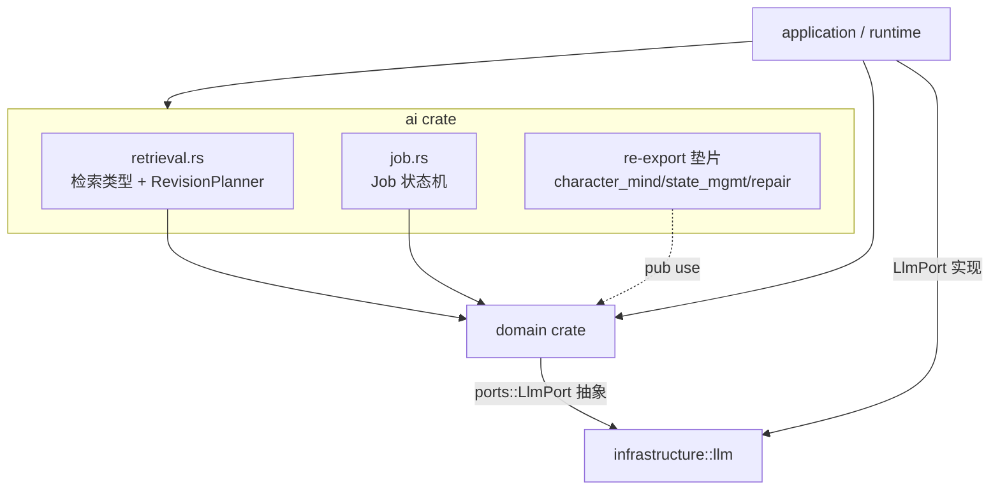
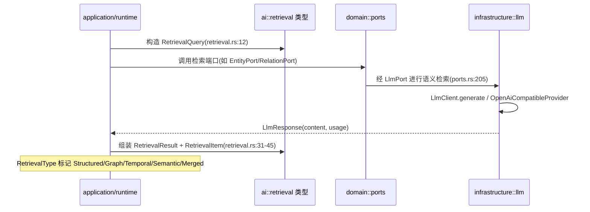
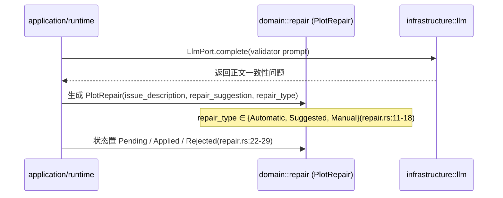
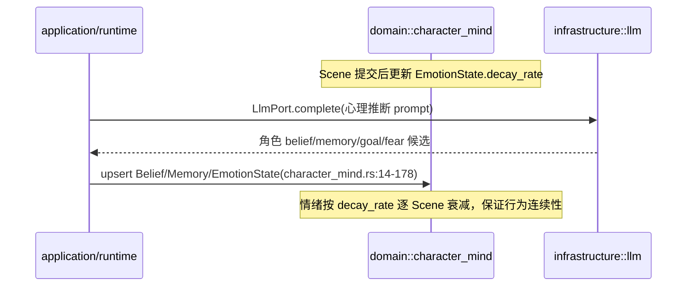

# ai（AI 执行与上下文层）

> 本文档为 `crates/ai` 模块文档草稿，供主代理核对后落地为 `docs/modules/ai.md`。
> 所有源码位置均以 `文件:行号` 标注。阅读范围：`crates/ai/src/*`、`crates/domain/src/*`（ai 依赖 domain 类型）、`crates/infrastructure/src/llm/*`（ai 意图对应的真实 LLM 调用实现）。

## 1. 概述

`ai` crate 当前定位为 **AI 执行与上下文模型层**，承载 AI 执行/上下文建模的"过程"模块。依据 `crates/ai/src/lib.rs:1-21` 的模块头注释，本 crate 经历了一轮架构修正（对应 ARCHITECTURE 评审与"铁三角"评审）：

- 结构化抽取（LLM 输出→世界变更）已下沉到 `application::extraction_executor`，不再属于本 crate 的 `extractor` trait（见 `lib.rs:6-8`，相关未接线 trait 已移除）。
- `character_mind` / `state_mgmt` / `repair` 这三类描述"世界事实"的领域数据已下沉到 `domain`（见 `lib.rs:10-12`），本 crate 仅保留 re-export 垫片（`lib.rs:26-28`）。
- 依赖方向修正为：`db → domain`、`ai → domain`、`application/runtime/narrative-engine → domain (+ ai)`（`lib.rs:14-17`）。
- `generation`（含 `ContextPackage` / `ContextLayer`）仍留在 `domain`，因为 `domain::ports` 直接引用 `ContextPackage`，domain 不能反向依赖 ai（`lib.rs:19-20`）。

**实际编译内容**：本 crate 真正参与编译的只有两个模块——`retrieval`（检索体系 + RevisionPlanner）和 `job`（异步任务状态机）。`src/` 目录下的 `character_mind.rs`、`state_mgmt.rs`、`repair.rs` 三个文件**并未被 `mod` 声明**，它们只是与 `domain` 中同名文件逐行重复的残留源（详见第 8 节）。

## 2. 模块职责

| 模块（文件） | 实际是否编译 | 职责 |
|---|---|---|
| `retrieval` (`retrieval.rs`) | 是 | 四种检索接口类型 + `RevisionPlanner` 修订规划器，定义结构化/图/时间/语义检索的统一查询与结果模型 |
| `job` (`job.rs`) | 是 | 异步后台任务的 state machine（Pending→Running→…→Completed/Failed/Cancelled/Timeout），提供 `Job`/`CreateJobRequest` 及状态迁移方法 |
| `character_mind` (`character_mind.rs`) | 否（re-export 来自 domain） | 角色认知模型：Belief/Memory/Goal/Fear/Emotion，描述角色心理事实 |
| `state_mgmt` (`state_mgmt.rs`) | 否（re-export 来自 domain） | 状态快照/回滚、知识缺口、多级记忆（Scene→Chapter→Arc→Volume→Global） |
| `repair` (`repair.rs`) | 否（re-export 来自 domain） | 剧情修复记录：修复类型/状态/建议 |

**意图 ↔ 实现对照**：本 crate 仅定义"数据形状"与"状态语义"，**不含任何 LLM 调用、prompt 拼装或检索执行逻辑**。真正的 LLM 调用由 `infrastructure::llm` 提供（`LlmProvider`/`LlmClient`），并通过 `domain::ports::LlmPort` 这一依赖倒置边界被上层（`GenerationExecutor` 等）消费。

## 3. 依赖关系

- `ai → domain`：通过 `pub use domain::*`（`lib.rs:26-28`）复用 domain 的类型定义；`Cargo.toml` 中唯一非标准库依赖即 `domain`（见 `crates/ai/Cargo.toml`，依赖项仅有 `domain/anyhow/tracing/serde/serde_json/uuid/chrono`）。
- `ai → infrastructure`：**无直接依赖**。ai 不调用 LLM；infrastructure 的 `InfraLlmPort` 实现的是 `domain::ports::LlmPort`（`infrastructure/src/llm/port_impl.rs:10,28`），二者经 domain 解耦。
- `application/runtime` 依赖 `ai` 与 `domain`，但 ai 当前对检索/任务仅提供类型，执行编排在 application 层。



## 4. 目录与源码对照

| 文件路径 | 行数 | 职责 |
|---|---|---|
| `crates/ai/src/lib.rs` | 32 | 模块声明（`retrieval`/`job`）与 domain 的 re-export 垫片；架构归属说明 |
| `crates/ai/src/retrieval.rs` | 118 | `RetrievalQuery`/`TimeRange`/`RetrievalResult`/`RetrievalItem`/`RetrievalType`/`RevisionPlan`/`RevisionIssue`/`ExtendedSkillType` |
| `crates/ai/src/job.rs` | 224 | `JobStatus` 状态机 + `Job`/`CreateJobRequest` 及生命周期方法 + 单测 |
| `crates/ai/src/character_mind.rs` | 178 | ⚠️ 未被编译；与 `domain::character_mind` 逐行重复 |
| `crates/ai/src/state_mgmt.rs` | 138 | ⚠️ 未被编译；与 `domain::state_mgmt` 逐行重复 |
| `crates/ai/src/repair.rs` | 43 | ⚠️ 未被编译；与 `domain::repair` 逐行重复 |
| `crates/domain/src/character_mind.rs` | 178 | 真正的角色认知模型定义（ai 经 re-export 暴露） |
| `crates/domain/src/state_mgmt.rs` | 138 | 真正的状态管理/回滚/知识缺口/多级记忆定义 |
| `crates/domain/src/repair.rs` | 43 | 真正的剧情修复定义 |
| `crates/domain/src/skill.rs` | 830 | `SkillType`/`ContextPolicy`/`SkillDefinition`/13 个 Skill 模板（含 prompt） |
| `crates/domain/src/generation.rs` | 183 | `ContextPackage`/`ContextLayer`/`Skill`/`GenerationTask`/`ReproducibilityMeta` |
| `crates/domain/src/ports.rs` | 666 | `LlmPort` 等依赖倒置端口（ai 意图的落地边界） |
| `crates/infrastructure/src/llm/mod.rs` | 13 | LLM 抽象层模块导出 |
| `crates/infrastructure/src/llm/types.rs` | 34 | `LlmRequest`/`Message`/`LlmResponse`/`LlmUsage` |
| `crates/infrastructure/src/llm/client.rs` | 136 | `LlmClient`：provider 选择、`generate`/`stream_generate`/`health_check` |
| `crates/infrastructure/src/llm/provider.rs` | 236 | `LlmProvider` trait + `OpenAiCompatibleProvider`（真实 HTTP 调用，含重试/流式） |
| `crates/infrastructure/src/llm/port_impl.rs` | 72 | `InfraLlmPort`：`domain::ports::LlmPort` 的 infrastructure 实现 |

## 5. 字段设计

### 5.1 核心 struct / enum（ai 直接定义的类型）

| 类型 | 关键字段 | 说明 | 文件:行号 |
|---|---|---|---|
| `JobStatus` | `Pending/Running/WaitingInput/Completed/Failed/Cancelled/Timeout` | 任务状态机枚举 | `job.rs:14-29` |
| `Job` | `id, project_id, job_type, name, description, status, priority, input, output, error, progress, created_at, started_at, completed_at` | 后台任务实体，`input`/`output` 为 `serde_json::Value` | `job.rs:52-67` |
| `CreateJobRequest` | `project_id, job_type, name, description, priority, input` | 建任务请求 | `job.rs:71-78` |
| `RetrievalQuery` | `project_id, scene_id, character_id, query_text, time_range, entity_ids, max_results` | 统一检索查询 | `retrieval.rs:12-20` |
| `TimeRange` | `start: Option<String>, end: Option<String>` | 时间范围（字符串，非强类型） | `retrieval.rs:24-27` |
| `RetrievalResult` | `items, total_count, retrieval_type` | 检索结果 | `retrieval.rs:31-35` |
| `RetrievalItem` | `id, item_type, content: Value, relevance_score, source` | 结果条目；`item_type` 为自由字符串 | `retrieval.rs:39-45` |
| `RetrievalType` | `Structured/Graph/Temporal/Semantic/Merged` | 五种检索类型 | `retrieval.rs:49-60` |
| `RevisionPlan` | `id, project_id, scene_id, original_draft_id, issues, revision_strategy, revision_prompt, created_at` | 修订规划器 | `retrieval.rs:67-80` |
| `RevisionIssue` | `issue_type, severity, description, suggestion, location` | 修订问题（自由字符串字段） | `retrieval.rs:84-95` |
| `ExtendedSkillType` | 原 14 类 + `RevisionPlanner` + `Custom(String)` | ⚠️ 与 `domain::SkillType` 高度重复（见第 8 节） | `retrieval.rs:99-118` |

### 5.2 经 re-export 暴露的 domain 类型（ai 名义归属，实为 domain）

| 类型 | 关键字段 | 文件:行号 |
|---|---|---|
| `Belief` | `belief_content, confidence: f64, source, source_scene_id, is_active` | `domain/character_mind.rs:14-30` |
| `MemoryType` | `Traumatic/Important/False/Secret`（含 `as_str`/`from_str`） | `domain/character_mind.rs:34-63` |
| `Memory` | `memory_content, memory_type, emotional_impact, scene_id, importance, is_active` | `domain/character_mind.rs:67-85` |
| `CharacterGoalMind` | `goal_content, priority, status: GoalStatus, source` | `domain/character_mind.rs:93-107` |
| `GoalStatus` | `Active/Completed/Abandoned/Blocked` | `domain/character_mind.rs:111-137` |
| `CharacterFear` | `fear_content, intensity, source, is_active` | `domain/character_mind.rs:141-155` |
| `EmotionState` | `emotion_type, intensity, decay_rate, trigger_scene_id, trigger_description` | `domain/character_mind.rs:162-178` |
| `StateSnapshot` | `scene_id, state_before, changes, state_after` | `domain/state_mgmt.rs:13-24` |
| `KnowledgeGap` | `gap_type, description, importance, required_by_scene_id, status: GapStatus, designer_skill_hint` | `domain/state_mgmt.rs:30-47` |
| `ChapterSummary`/`ArcSummary`/`VolumeSummary`/`GlobalStoryState` | 各层级摘要字段 | `domain/state_mgmt.rs:77-137` |
| `PlotRepair` | `scene_id, issue_description, repair_suggestion, repair_type, status, applied_at` | `domain/repair.rs:33-43` |

**与 domain 对照结论**：ai 通过 `pub use domain::*`（`lib.rs:26-28`）暴露的全部"领域数据"类型，其唯一真源在 `crates/domain/src/*`，字段定义完全一致，无 ai 层独立扩展。

### 5.3 infrastructure LLM 字段（ai 意图的落地实现）

| 类型 | 关键字段 | 文件:行号 |
|---|---|---|
| `LlmRequest` | `messages: Vec<Message>, max_tokens: u32, temperature: f32` | `infrastructure/llm/types.rs:7-11` |
| `Message` | `role: String, content: String` | `infrastructure/llm/types.rs:15-18` |
| `LlmResponse` | `content, usage: LlmUsage, model` | `infrastructure/llm/types.rs:22-26` |
| `LlmUsage` | `prompt_tokens, completion_tokens, total_tokens` | `infrastructure/llm/types.rs:30-34` |
| `LlmPort` (trait) | `complete(system, user, model) -> String`、`stream_complete(...)` | `domain/ports.rs:205-221` |

## 6. 核心流程

由于 ai 仅提供类型、不含执行逻辑，以下流程以"数据如何在 ai/domain 类型与 infrastructure LLM 之间流转"描述。

### 6.1 一次 retrieval（检索）的数据流



### 6.2 一次 repair（剧情修复）的数据流



> 说明：`RetrievalQuery`/`PlotRepair` 等类型本身不含"执行"，上图描述的是上层如何使用这些类型穿越 ai→domain→infrastructure 边界。

### 6.3 一次 character mind 更新（情绪衰减/信念写入）



## 7. 接口/类型签名

**ai crate 实际编译的 pub 接口：**

```rust
// crates/ai/src/job.rs:33 —— 状态迁移合法性校验
pub fn can_transition_to(&self, new_status: &JobStatus) -> bool

// crates/ai/src/job.rs:82 —— 构造新 Job（Pending）
pub fn new(request: CreateJobRequest) -> Self

// crates/ai/src/job.rs:102 —— 启动：Pending→Running
pub fn start(&mut self) -> Result<()>

// crates/ai/src/job.rs:113 —— 完成：Running→Completed
pub fn complete(&mut self, output: serde_json::Value) -> Result<()>

// crates/ai/src/job.rs:126 —— 失败：Running→Failed
pub fn fail(&mut self, error: String) -> Result<()>

// crates/ai/src/job.rs:138 —— 取消
pub fn cancel(&mut self) -> Result<()>
```

检索与修订类型均为纯数据 struct（无方法），其构造依赖调用方直接初始化，例如：

```rust
// crates/ai/src/retrieval.rs:12
pub struct RetrievalQuery { /* ... */ }

// crates/ai/src/retrieval.rs:67
pub struct RevisionPlan { /* ... */ }

// crates/ai/src/retrieval.rs:99
pub enum ExtendedSkillType { /* 14 原类 + RevisionPlanner + Custom(String) */ }
```

**LLM 调用边界（ai 意图的真实落点，在 domain/infrastructure）：**

```rust
// crates/domain/src/ports.rs:205 —— ai 层"调用 LLM"的唯一抽象
#[async_trait]
pub trait LlmPort: Send + Sync {
    async fn complete(&self, system_prompt: &str, user_prompt: &str, model: &str) -> Result<String>;
    async fn stream_complete(&self, system_prompt: &str, user_prompt: &str, model: &str)
        -> Result<Pin<Box<dyn Stream<Item = Result<String>> + Send>>>;
}

// crates/infrastructure/src/llm/port_impl.rs:28 —— 实现（包裹 LlmClient）
impl LlmPort for InfraLlmPort {
    async fn complete(&self, system_prompt: &str, user_prompt: &str, model: &str) -> Result<String>
    // 固定 max_tokens: 4096, temperature: 0.7（port_impl.rs:41-42）
}
```

**Skill / Prompt 定义（context 策略与 prompt 模板的真正归属）：**

```rust
// crates/domain/src/skill.rs:79 —— 完整 Skill 定义（含 prompt_template）
pub struct SkillDefinition {
    pub skill_type: SkillType,
    pub prompt_template: String,   // skill.rs:94
    pub context_policy: ContextPolicyConfig,
    // ...
}

// crates/domain/src/skill.rs:164 —— 每个 SkillType 绑定 ContextPolicy
pub fn context_policy(&self) -> ContextPolicy
```

## 8. 问题 / 代码异味

逐条附源码位置：

1. **死代码 / 重复源码（高优先级）**：`crates/ai/src/character_mind.rs`、`state_mgmt.rs`、`repair.rs` 三个文件**没有被 `mod` 声明**（`lib.rs` 仅 `pub mod retrieval; pub mod job;`，见 `lib.rs:22-23`），但 `lib.rs:26-28` 又 `pub use domain::*`。这意味着这三个 ai 源文件根本不参与编译，且与 `domain` 中同名文件逐行一致（`ai/src/character_mind.rs:1-178` ≡ `domain/character_mind.rs:1-178`，其余两者同理）。属于迁移残留，应删除 ai 侧副本，仅保留 re-export。

2. **未接线的 Skill（`ExtendedSkillType` 与 `SkillType` 分裂）**：`retrieval.rs:99-118` 的 `ExtendedSkillType` 复制了 `domain::SkillType`（`skill.rs:133-160`）的全部变体并新增 `RevisionPlanner`，但：
   - `domain` 已有 `SkillType::Custom(String)` 机制，`RevisionPlanner` 可直接用 `Custom("revision_planner")` 表达，无需新建枚举；
   - `ExtendedSkillType` 在 ai crate 内**无任何使用方**（无函数引用、无 trait 绑定），是孤立类型；
   - 两套枚举并存造成"skill 类型"概念分裂，调用方需决定用哪一个。

3. **与 infrastructure / domain 重复的 prompt 与上下文策略**：ai crate 当前不含 prompt 模板（符合 lib.rs 头注释"extractor 已移除"），但 `RetrievalItem.item_type`/`RevisionIssue.issue_type`（`retrieval.rs:41,86`）使用自由字符串（如 `"entity"/"knowledge_violation"`），而 domain 已有权威枚举与 `ContextLayerType`（`skill.rs:15-23`）、`ContextPolicy`（`skill.rs:27-75`）。ai 的检索/修订类型与 domain 的上下文策略体系没有类型级对齐，存在"字符串约定 vs 强类型枚举"的不一致异味。

4. **时间类型弱类型化**：`TimeRange` 的 `start/end` 为 `Option<String>`（`retrieval.rs:24-27`），未使用 ai 其它处一致的 `chrono::DateTime<Utc>`，后续解析易出错且缺乏校验。

5. **`Job` 无持久化/调度语义**：`job.rs` 的 `Job` 是内存态状态机，提供 `start/complete/fail/cancel`，但 ai crate 没有任何存储端口或调度器引用（ai 的 Cargo.toml 不依赖 db/ports）。`job_type`/`input` 全为 `String`/`Value`，无配套的执行器接口——该模块目前是"只有状态、没有运行"的半成品，实际 Job 生命周期大概率由 application 层另实现。

6. **`RetrievalType::Merged` 无合并逻辑**：`retrieval.rs:49-60` 定义了 `Merged` 变体，但 ai 内无任何合并函数；合并策略（权重/去重/排序）未在本 crate 体现，属于"类型先行、实现缺失"。

7. **`domain::ports::LlmPort::complete` 的 `model` 参数被忽略**：`infrastructure/src/llm/port_impl.rs:44` 与 `:55` 处 `let _ = model;`，真实模型由 provider 构造时固定（`OpenAiCompatibleProvider::new` 的 `model` 字段，`provider.rs:45`），导致 `LlmPort` 签名承诺的"按调用指定模型"语义未兑现——这是 infrastructure 层的契约失效，但 ai/domain 调用方可能误以为可按任务切换模型。

## 9. 小结

`ai` crate 在架构修正后已大幅瘦身：**实际仅有 `retrieval`（检索类型 + 修订规划器）与 `job`（任务状态机）两块真正编译的内容**，二者皆为纯数据类型/状态机，不含 LLM 调用、prompt 拼装或检索执行。LLM 能力经 `domain::ports::LlmPort` 抽象下沉到 `infrastructure::llm`（`LlmProvider`/`LlmClient`/`OpenAiCompatibleProvider` + `InfraLlmPort`），Skill 与 ContextPolicy 的权威定义归 `domain::skill`。

最突出的问题是 **ai/src 下 `character_mind.rs`/`state_mgmt.rs`/`repair.rs` 三个文件为与 domain 逐行重复的未编译残留**（应为迁移遗留），以及 `ExtendedSkillType` 这一与 `domain::SkillType` 分裂的孤立枚举。建议在落地文档时明确：ai 当前真实对外暴露的能力边界 = retrieval 类型 + job 状态机 + domain 类型的 re-export；其余领域数据归属于 domain，避免读者误以为 ai 自持这些类型。
