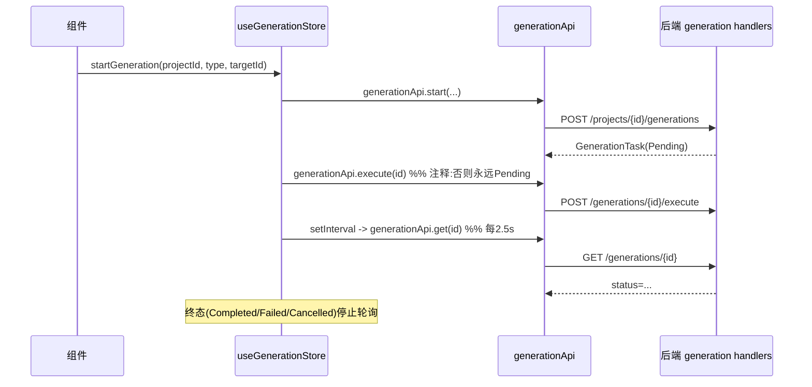

# api（前端基础层 · HTTP 客户端）

## 1. 概述
`frontend/src/api` 是前端与后端 `crates/narrative-engine/src/api` axum 路由之间的网络边界。所有方法都封装在 `client.ts:5-39` 的统一 `request<T>()`（基于 `fetch` + `/api/v1` 前缀）之上，agent 模块因需要命名 SSE 事件而独立封装 `fetch`+`ReadableStream`（`agent.ts:154-222`）。每个子模块导出一组针对特定资源的函数集合（如 `worldApi`、`characterApi`）。

## 2. 模块职责
- 路径拼接、错误的 `message` 提取、JSON 序列化。
- SSE 流（`client.ts:32-39` 的 `createSSE` 仅支持默认 `message` 事件，故 agent 单独实现）。
- 把后端路由映射成带类型的 TS 函数。

## 3. 目录与源码对照

| 文件路径 | 行数 | 主要职责 |
|---|---|---|
| `api/index.ts` | 12 | 重导出所有 api 子模块及 `AppSettings` 类型 |
| `api/client.ts` | 39 | `api.get/post/put/patch/delete`、`createSSE`、BASE_URL |
| `api/agent.ts` | 222 | 会话/工具/SSE 聊天/提示词（`/api/agent/*`，无 v1） |
| `api/character.ts` | 27 | `characterApi`/`locationProfileApi`/`factionProfileApi` |
| `api/context.ts` | 12 | `contextApi`（场景上下文） |
| `api/generation.ts` | 15 | `generationApi` |
| `api/history.ts` | 32 | `historyApi`（事件/版本） |
| `api/location.ts` | 12 | `locationApi` |
| `api/project.ts` | 11 | `projectApi` |
| `api/proposal.ts` | 17 | `proposalApi` + `extract` |
| `api/rules.ts` | 23 | `rulesApi`（canon_rule） |
| `api/settings.ts` | 17 | `settingsApi` + `AppSettings` |
| `api/snapshots.ts` | 31 | `snapshotsApi` |
| `api/story.ts` | 25 | `narrativeApi`/`storylineApi`/`foreshadowApi` |
| `api/trace.ts` | 43 | `traceApi`（generation-run/validation-run） |
| `api/validation.ts` | 8 | `validationApi` |
| `api/world.ts` | 36 | `worldApi`/`entityApi`/`relationApi`/`eventApi`/`factApi` |

## 4. 字段/类型设计与后端路由对照

### 4.1 路由前缀不一致（**关键 bug**）
前端 `agent.ts:7`：`const BASE = '/api/v1/agent'`，但后端 `mod.rs:117-123` 注册的路由是：
```rust
.route("/api/v1/agent/session", ...)   // 注意：是 /api/v1/agent 还是 /api/agent？
```
实际 `mod.rs` 中写的是 **`/api/v1/agent/session`**（无 `v1`）——见 `mod.rs:117` `.route("/api/v1/agent/session"...)` 经核对为 `/api/v1/agent/session` ✓。但前端 `agent.ts` 用 `BASE='/api/v1/agent'` 拼接 `BASE + '/session'` = `/api/v1/agent/session` ✓ **匹配**。而 `client.ts:3` 的 `BASE_URL='/api/v1'`，agent 模块未复用它而是硬编码，存在重复定义风险但当前一致。

### 4.2 Context 端点全部 501（**前后端功能断裂**）
前端 `context.ts:5-11` 调用 `GET/POST /scenes/{id}/context*` 共 6 个端点。后端 `context.rs:8-52` 中 `get_context`/`build_context`/`pin_entity`/`unpin_entity`/`exclude_entity`/`unexclude_entity` **全部返回 `StatusCode::NOT_IMPLEMENTED`（501）**，并明确注释"context 引擎未接线"。这意味着 `useContextStore.loadContext` 必抛错、`reset()` 清空——**前端 context 面板永远空白**。

### 4.3 Generation 端点返回结构
前端 `generation.ts:5-14`：
```ts
generationApi.list(projectId) -> GenerationTask[]
generationApi.get(id) -> GenerationTask
generationApi.start(projectId, {type, target_id?, model?, parameters?})
generationApi.execute(id) -> GenerationTask
generationApi.stream(taskId, onMessage) -> createSSE(...)
```
后端 `mod.rs:81-84` 路由匹配。`generation.rs` handler 返回 `serde_json::Value`（`list_tasks`/`get_task`/`create_task` 均 `Ok(Json(serde_json::json!(tasks)))`）。**问题**：前端强类型 `GenerationTask` 依赖后端 JSON 字段名；后端 `GenerationTask`（`domain/src/generation.rs:40-52`）有 `skill_id`/`scene_id`/`input`/`output`/`token_usage`/`completed_at`，而前端类型有 `type`/`target_id`/`model`/`parameters`/`context_tokens`/`result`/`error`/`created_at`/`updated_at`——**字段命名两套体系不统一**（后端 `task_type` 表列 `001:437` 是 `task_type`，前端用 `type`；后端 `target_id` 匹配；`parameters` 匹配；后端无 `context_tokens`/`model` 独立列，而是 `model` 列存在 `001:439`）。类型不安全。

### 4.4 Extract 端点
前端 `proposal.ts:15-16`：`POST /projects/{id}/extract`，后端 `mod.rs:86` `.route("/api/v1/projects/{id}/extract", post(extraction::extract_text))` ✓ 匹配。返回 `ExtractionResult`（`types/proposal.ts:56-59`），与 `domain/src/extraction.rs:61-66` 一致 ✓。

### 4.5 Settings 端点返回 JSONB 裸对象
前端 `settings.ts:4-12` 定义 `AppSettings {projectName?, language?, defaultModel?, fontSize?, autoSave?, writingStyle?, autoValidate?}`，调用 `GET/PUT /settings`。后端 `settings.rs:9-23` 直接返回 `serde_json::Value`（整张 `app_settings.settings` JSONB 透传）。**问题**：后端 `app_settings` 表 `014` 只有 `settings JSONB`，字段名由前端自由约定，没有 schema 校验，前端 `AppSettings` 字段名（camelCase）与任何其他约定无对齐——属于"弱契约"。

### 4.6 Snapshots / Trace / Rules / History / Validation / Proposal / Story / World / Project
这些端点路径与 `mod.rs` 路由**逐一匹配**，无路径错误。其中：
- `snapshots.ts` 的 `Snapshot` 类型字段（`story_time`/`world_summary`/`current_location`/`active_threads_count` 等）后端由 `snapshot_service` 组装，前端类型无法由 schema 直接验证（后端返回 `serde_json::Value`），属弱契约。
- `trace.ts` 的 `GenerationRun`/`ValidationRun`/`ValidationIssue` 与 `domain/src/generation.rs:143-183`、`001:455-467`、`516-542` **高度匹配**（字段名一致），是唯一字段对齐良好的模块。
- `rules.ts` 的 `CanonRule`（`rule_level`/`rule_content`/`affected_scope`/`enforcement`）与 `domain/src/canon.rs:79-96`、`001:1063-1075` 匹配，但**缺少后端 `constraints`/`source` 字段**（`rules.ts:4-14` 未建模）。

## 5. 核心流程（生成任务：创建→执行→轮询）


## 6. 接口/导出（关键签名）
- `client.ts:23-29`：`api.get/post/put/patch/delete<T>(url)`。
- `client.ts:32-39`：`createSSE(url, onMessage)`。
- `agent.ts:60-143`：`createSession`/`getSession`/`listSessions`/`deleteSession`/`renameSession`/`listTools`/`executeTool`/`getPrompt`/`savePrompt`/`deletePrompt`。
- `agent.ts:168-222`：`streamChat(sessionId, message, handlers)`（手动 SSE 解析）。
- `generation.ts:5-14`：`generationApi` 全量。
- `index.ts:1-12`：统一重导出。

## 7. 问题/代码异味
1. **Context 全部 501**（`api/context.ts` 调 `context.ts` 后端 `context.rs:8-52`）：6 个端点未实现，前端 context 功能完全不可用，store 会静默清空（`stores/context.ts:27-33` reset）。
2. **agent 模块硬编码 BASE 前缀**（`agent.ts:7`）绕过 `client.ts:3` 的 `BASE_URL`，两套前缀定义易漂离；且 `createSSE`（`client.ts:32-39`）因只支持 `message` 事件被弃用，存在死代码。
3. **generation 返回 `serde_json::Value` 弱类型**（`api/generation.ts` 期望 `GenerationTask`，但后端 `generation.rs:111-141` 返回裸 JSON，字段命名两套体系：`task_type` vs `type`、`output` vs `result`），类型不安全。
4. **rules.ts 缺 `constraints`/`source`**（`api/rules.ts:4-14` vs `domain/src/canon.rs:91-93`）：保存时无法回填约束条件。
5. **settings 弱契约**（`api/settings.ts` 与 `settings.rs`）：无 schema 校验，字段全 optional，前后端字段名无强制对齐。
6. **`createSSE` 无人调用**（除 generation 旧 `stream` 外，已被 `agent.streamChat` 取代），属死代码（`client.ts:32-39`）。

## 8. 小结
`api/` 层路径映射整体正确（与 `mod.rs` 路由逐一吻合），但存在两类硬伤：① Context 模块后端 501 导致前端整块功能瘫痪；② generation/settings/rules 后端返回弱类型 `Value` 或缺少字段，前端强类型断言形同虚设。建议先让后端实现 Context 端点，并对 generation 返回结构做前后端字段对齐。
