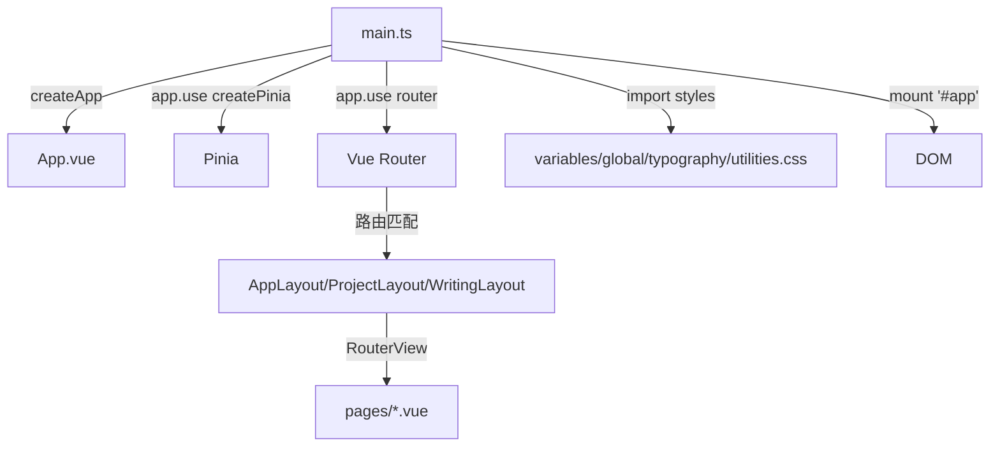
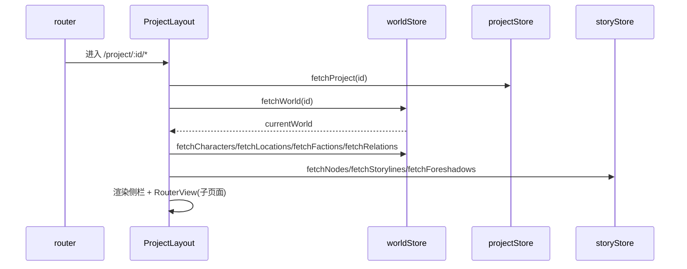

# 前端应用装配层（App / Router / Layouts / main）

## 1. 概述

`frontend/src/app` 与 `frontend/src/layouts` 共同构成前端的「装配层」：负责创建 Vue 应用实例、挂载 Pinia 与 Vue Router、声明全局路由表、并提供嵌套布局骨架。本区域文件极少但处于调用链顶端——`main.ts` 启动应用，`App.vue` 仅渲染 `<RouterView/>`，`router.ts` 定义全部路由与懒加载边界，`AppLayout` 与 `ProjectLayout` 提供外层 UI 容器（命令面板、侧边导航、全局 Toast），`WritingLayout` 提供写作器专用三栏布局。布局与页面之间以 `RouterView` 插槽衔接，store 在布局层预取数据后由子页面消费。

## 2. 模块职责

- **`main.ts`**：应用入口。创建 Vue 应用、安装 Pinia 与 Router、引入 4 个全局样式表，挂载到 `#app`。
- **`App.vue`**：根组件，仅放置 `<RouterView/>`，是所有路由视图的渲染出口。
- **`router.ts`**：声明路由表，使用 `createWebHistory`，以 `AppLayout` 为根布局，嵌套 `ProjectLayout`（项目域）与 `WritingLayout`（写作域），所有页面组件懒加载。
- **`AppLayout.vue`**：顶层布局。提供 `<RouterView/>` 主区，挂载全局 `CommandPalette`（⌘/Ctrl+K 唤起）与 `Toast`，监听键盘快捷键。
- **`ProjectLayout.vue`**：项目域布局。左侧固定导航栏（创作引导/概览/世界/故事/工具/系统），`onMounted` + `watch(params.id)` 预取项目、世界、人物/地点/势力/关系、叙事节点/剧情线/伏笔；右侧 `<RouterView/>` 渲染世界域与故事域页面。
- **`WritingLayout.vue`**：写作布局。三栏（故事树 / 编辑器 / 辅助），含可拖拽分隔条与「返回项目」按钮，消费 `storyStore.tree` 与 `editorStore`。

## 3. 目录与源码对照

| 文件路径 | 行数 | 主要职责 |
| --- | --- | --- |
| `frontend/src/main.ts` | 13 | 创建应用、装 Pinia/Router、引样式、挂载 |
| `frontend/src/app/App.vue` | 7 | 根视图出口 `<RouterView/>` |
| `frontend/src/app/router.ts` | 46 | 路由表与懒加载定义 |
| `frontend/src/layouts/AppLayout.vue` | 26 | 顶层容器 + 命令面板 + Toast + 快捷键 |
| `frontend/src/layouts/ProjectLayout.vue` | 318 | 项目导航 + 数据预取 + 子视图出口 |
| `frontend/src/layouts/WritingLayout.vue` | 935 | 写作器三栏布局（含 editorStore 消费） |

> 注：`main.ts` 实际位于 `frontend/src/main.ts`（非 `app/` 内），`app/` 仅含 `App.vue` 与 `router.ts`。

## 4. 功能要点

| 区域/文件 | 主要功能 | 依赖 store/api |
| --- | --- | --- |
| `main.ts` | 应用引导 | `createPinia`、`router`、`styles/*` |
| `App.vue` | 路由出口 | `vue-router` 的 `RouterView` |
| `router.ts` | 路由与懒加载 | 全部 `pages/*.vue`、`layouts/*.vue` |
| `AppLayout` | 命令面板(⌘K)、Toast、Esc 关闭 | `uiStore`（`openCommandPalette`/`closeCommandPalette`/`commandPaletteOpen`） |
| `ProjectLayout` | 侧边导航 + 进入即预取 | `projectStore.fetchProject`、`worldStore.fetchWorld/fetchCharacters/fetchLocations/fetchFactions/fetchRelations`、`storyStore.fetchNodes/fetchStorylines/fetchForeshadows` |
| `WritingLayout` | 写作三栏、场景树、AI 生成入口 | `storyStore.tree`、`editorStore`（需进一步读 components/editor） |

## 5. 核心流程

### 5.1 应用启动

### 5.2 项目域进入与预取

## 6. 接口/导出

- **`main.ts:1-13`**：`createApp(App)` → `app.use(createPinia())` → `app.use(router)` → `mount('#app')`，并 `import` 四个样式模块（`variables.css`/`global.css`/`typography.css`/`utilities.css`）。
- **`App.vue:2`**：`<RouterView />` 是全局路由出口；`App.vue:6` `import { RouterView } from 'vue-router'`。
- **`router.ts:3-4`**：`createRouter({ history: createWebHistory(), routes })`。
- **`router.ts:8`**：根布局 `AppLayout`；`router.ts:13-39`：`ProjectLayout` 嵌套子路由；`router.ts:40`：写作路由 `WritingLayout`，`path: 'project/:id/write/:sceneId?'`，`name: 'Writing'`，`sceneId` 可选。
- **`AppLayout.vue:4`**：`<CommandPalette v-if="uiStore.commandPaletteOpen" @close="uiStore.closeCommandPalette()"/>` 与 `<Toast />`；`AppLayout.vue:15-17` 绑定 ⌘K/Ctrl+K 打开、Esc 关闭。
- **`ProjectLayout.vue:15-105`**：左侧导航 `router-link` 列表（创作引导/概览/世界各子页/故事各子页/工具/系统），`ProjectLayout.vue:139-164` `loadData()` 与 `watch(params.id)` 预取。
- **布局插槽**：`AppLayout.vue:3` 与 `ProjectLayout.vue:111` 与 `WritingLayout.vue` 均通过 `<RouterView/>` 向 `pages` 暴露命名/默认插槽（本应用未使用命名视图）。

## 7. 问题/代码异味

1. **`ProjectLayout.vue` 与子页面重复取数**：`ProjectLayout.vue:143-160` 已预取 world/characters/locations/factions/relations/nodes/storylines/foreshadows，但多个子页面 `onMounted` 再次调用相同 fetch（如 `World.vue:245-247`、`Characters.vue` 经 `worldStore` 已就绪但仍 `worldStore.characters`；`Items.vue:92` 用 `watch` 补偿；`Graph.vue:262-275` 又重新 `fetchCharacters/fetchLocations/fetchFactions/fetchRelations`）。同一份数据被多处拉取，存在冗余请求与潜在竞态（代码异味/重复逻辑）。

2. **`ProjectLayout.vue:166-170` `navigateToNode` 未被使用**：定义了 `navigateToNode(node)` 处理 `Scene` 跳转，但侧栏渲染的是 `router-link` 而非调用它，该函数实际未被任何模板/逻辑引用（死代码）。

3. **`WritingLayout.vue` 消费 `editorStore` 但 store 未在本次读取清单内**：`WritingLayout` 引用 `editorStore.currentSceneId`/`isDirty`/`saveContent()`（`WritingLayout.vue:26,50,55,58`），对应 `stores/editor.ts`（`frontend/src/stores/editor.ts`）未被本任务要求通读，装配层与编辑 store 的契约需另行核对（缺失功能/未覆盖）。

4. **全局样式依赖未校验**：`main.ts:5-8` 引入 4 个 css，但页面大量使用 `var(--space-*)`/`var(--color-*)`，若其中任一变量未在 `variables.css` 定义，会在运行时静默降级（本次未读 styles，属范围外但提示风险）。

5. **`AppLayout.vue` 与 `ProjectLayout` 导航项不一致**：`AppLayout` 系统区把「搜索/命令面板/设置」放在左侧栏底部（`ProjectLayout.vue:96-104`），而搜索本身是顶层路由（`/search`），从项目域深链进入时 `/search` 没有 `:id`，与 `Search.vue` 的回退逻辑耦合（见 pages 区问题 6）。

## 8. 小结

装配层体量小但位置关键：`main.ts` 以标准 Vue3 + Pinia + Router 方式启动；`App.vue` 仅作路由出口；`router.ts` 用单一嵌套结构把 23 个页面与 3 个布局串起来，懒加载边界清晰。`AppLayout` 负责全局命令面板与 Toast，`ProjectLayout` 负责项目域导航与进入即预取（提升首屏体验），`WritingLayout` 提供写作器专用结构。主要改进点：消除 `ProjectLayout` 与子页面的重复预取、清理 `navigateToNode` 死代码、补全对 `editorStore` 与全局样式变量的核对，并理顺 `/search` 在项目域内的导航一致性。
