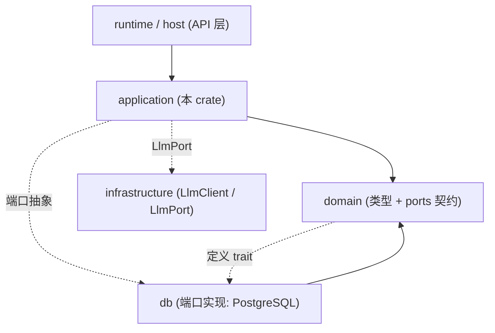
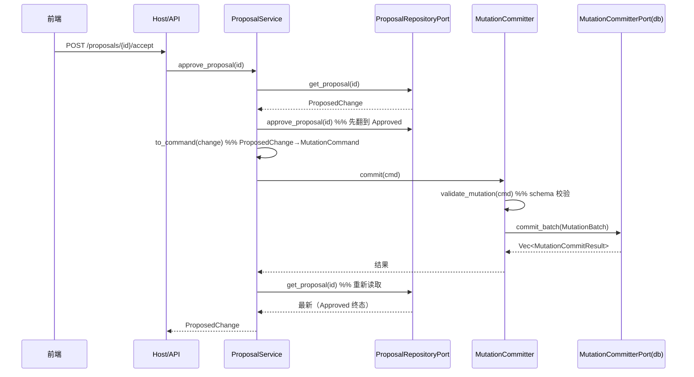
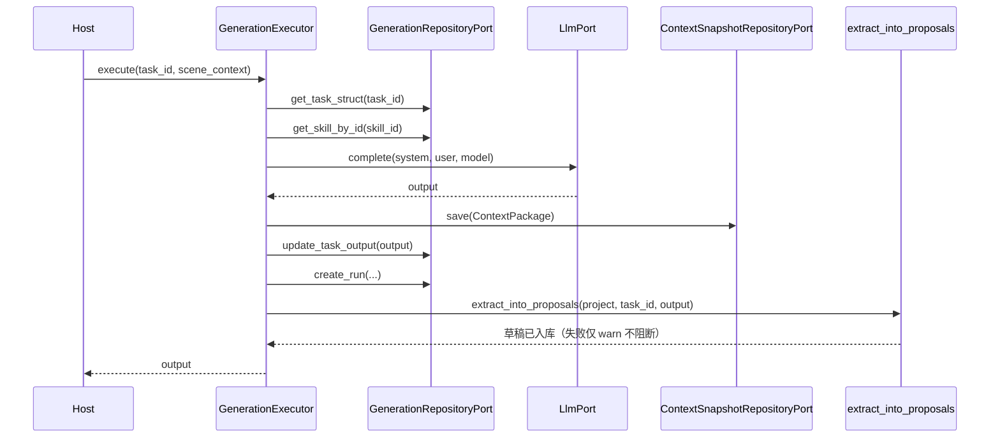

# application（应用服务层）

## 1. 概述（职责、在分层中的位置）

`application` crate 是系统的**应用服务层**（application services），位于 `domain`（领域模型与端口契约）与 `db`/基础设施（PostgreSQL 实现、LLM 客户端）之间。它本身**不直接依赖 `db` 或 `sqlx`**，所有存储访问都通过 `domain::ports` 中定义的抽象仓储端口（`*RepositoryPort` / `*Port`）完成，具体实现在组合根（composition root）注入（见 `crates/application/src/lib.rs:1-5` 的模块注释）。

核心职责可归纳为三类：

1. **编排业务逻辑**：把多个仓储端口调用组装成有业务语义的操作。例如 `ProjectService::create_project` 先建项目再 `ensure_main_world`（`project_service.rs:34-49`）；`GenerationExecutor::execute` 串联「加载任务 → 组装 Prompt → 调 LLM → 存快照 → 记 Run → 抽取提案」（`generation_executor.rs:59-182`）。
2. **统一 Canon 写入边界**：所有对 World Canon 的修改都必须经由 `MutationCommitter`（`mutation/committer.rs`），Repository 不再被 Application 用于 mutation（见 `mutation/committer.rs:1-7`）。
3. **AI 安全隔离**：AI 只通过 `ProposedChange` 草稿提案，落库由人工批准时经 `MutationCommitter` 完成（`extraction_executor.rs:1-9`、`proposal_service.rs:1-9`）。

分层位置：`runtime/host` → `application`（服务编排）→ `domain`（类型 + 端口契约）→ `db`（端口实现）。`lib.rs` 仅做模块声明，不含任何逻辑（`lib.rs:6-23`）。

## 2. 模块职责（逐条列出各 service 能力）

逐文件能力与源码位置如下：

- **`world_service`**：世界 / 实体 / 关系 / 事实 / 状态 / 资源 / 事件的管理。注意：写入（create_entity、set_entity_state、record_event 等）直接走 `WorldRepositoryPort` 落 Canon，属于"系统级"写入，与 AI 提案路径不同（`world_service.rs:1-13`，端口注释见 `ports.rs:380-491`）。提供 `ensure_main_world` / `get_or_create_main_world` 供项目层复用（`world_service.rs:56-63`）。
- **`entity_service`**：实体 / 关系 / 角色子数据的 JSON 形态读写。其**写操作（create/update/delete 实体、delete 关系）统一经 `MutationCommitter`**（`entity_service.rs:50-167`），读操作（list/get、角色档案/状态/知识/关系）直读 `EntityRepositoryPort`（`entity_service.rs:38-207`）。内含 `extract_project_id` / `extract_version` 两个乐观锁辅助函数（`entity_service.rs:210-224`）。
- **`narrative_service`**：叙事节点 CRUD；update/delete 经 `MutationCommitter`，create 直读 repo（`narrative_service.rs:43-95`）。
- **`snapshot_service`**：`novel_state_snapshot` 读写与**恢复**（`restore_snapshot` 把快照宏观状态幂等回写 `narrative_state` 的 World 维度，`snapshot_service.rs:52-102`）。
- **`approval_service`**：人工审批闸门，submit/approve/reject/get_pending 直读 `ApprovalRepositoryPort`（`approval_service.rs:22-58`）。
- **`generation_service`**：生成任务管理（list/get/create/cancel），直读 `GenerationRepositoryPort`（`generation_service.rs:23-49`）。
- **`generation_executor`**：完整生成执行链编排（`generation_executor.rs:59-182`）。
- **`extraction_executor`**：M1 文本→实体/关系抽取闭环，产出 `ProposedChange` 草稿（绝不直写 Canon，`extraction_executor.rs:49-124`）。
- **`history_service`**：event/fact 的业务层读写，version 相关为占位（`history_service.rs:1-5`、`22-49`）。
- **`mutation`（committer/validator/result/mod）**：Canon 统一写入口编排层。`commit` / `commit_batch` / `commit_with_worlds`（`committer.rs:23-63`）；第一层 schema 校验（`validator.rs:8-52`）；`MutationResultExt` 仅做占位（`result.rs:6-14`）。
- **`project_service`**：项目管理，建项目自动 ensure 主世界（`project_service.rs:34-49`）。
- **`narrative_service`** 见上。
- **`rule_service`**：`canon_rule` 规则 CRUD（`rule_service.rs:21-53`）。
- **`timeline_service`**：按时间排序事件 + 同时间点冲突检测（应用层逻辑，`timeline_service.rs:23-53`）。
- **`storyline_service`**：剧情线查询/过滤/CRUD（`storyline_service.rs:24-77`）。
- **`foreshadow_service`**：伏笔 CRUD（`foreshadow_service.rs:21-50`）。
- **`proposal_service`**：提案 CRUD + `approve_proposal`（批准即提交 Canon，`proposal_service.rs:43-62`）+ `to_command` 把 `ProposedChange` 转为 `MutationCommand`（`proposal_service.rs:65-111`）。
- **`trace_service`**：AI 可追溯只读视图（generation_run / validation_run，`trace_service.rs:17-23`）。
- **`command`（command/mod）**：仅再导出 `domain::mutation` 的命令类型，保持目录结构（`command/command.rs:1-8`、`command/mod.rs:1-10`）。

## 3. 依赖关系（依赖 domain/db 等；文字 + mermaid graph TD）

`application` 依赖：
- `domain`（类型、端口契约、`MutationCommand` 构造器）—— 所有 service 均 `use domain::ports::*` 或 `domain::mutation::*`。
- `anyhow`、`serde_json`、`uuid`、`async_trait`、`chrono`、`tracing` 等通用库。
- **不依赖** `db` / `sqlx` 直接调用（除 `tests/` 集成测试直接用 `db` crate 验证契约）。



关键依赖细节：
- `EntityService` / `NarrativeService` / `ProposalService` 持有 `Arc<MutationCommitter>` 与 `Arc<dyn ProjectResolverPort>`（`entity_service.rs:19-23`、`narrative_service.rs:16-20`、`proposal_service.rs:20-23`）。
- `ProjectService` 持有 `Arc<WorldService>`，建项目时复用（`project_service.rs:18`）。
- `GenerationExecutor` 持有 `GenerationRepositoryPort` + `ContextSnapshotRepositoryPort` + `ProposalRepositoryPort` + `LlmPort`，并复用 `extraction_executor::extract_into_proposals`（`generation_executor.rs:24-29`、`22`）。

## 4. 目录与源码对照（表格）

| 文件路径 | 大约行数 | 主要职责 |
|---|---|---|
| `src/lib.rs` | 24 | 模块声明，无业务逻辑 |
| `src/world_service.rs` | 269 | 世界/实体/关系/事实/状态/资源/事件管理（系统级直写 Canon） |
| `src/entity_service.rs` | 224 | 实体/关系/角色子数据；写操作经 MutationCommitter |
| `src/narrative_service.rs` | 96 | 叙事节点 CRUD；update/delete 经 MutationCommitter |
| `src/snapshot_service.rs` | 103 | 快照读写 + 幂等恢复回写 narrative_state |
| `src/approval_service.rs` | 59 | 人工审批闸门 |
| `src/generation_service.rs` | 50 | 生成任务管理 |
| `src/generation_executor.rs` | 183 | 完整生成执行链编排 |
| `src/extraction_executor.rs` | 279 | 文本抽取为 ProposedChange 草稿（含单测） |
| `src/history_service.rs` | 50 | event/fact 读写（version 占位） |
| `src/mutation/committer.rs` | 64 | Canon 统一提交入口（编排层） |
| `src/mutation/validator.rs` | 53 | 第一层 schema 校验 |
| `src/mutation/result.rs` | 14 | MutationResultExt 占位（conflict_to_409 无效） |
| `src/mutation/mod.rs` | 14 | 再导出 domain mutation 类型 |
| `src/project_service.rs` | 64 | 项目管理 + 自动建主世界 |
| `src/rule_service.rs` | 54 | canon_rule 规则 CRUD |
| `src/timeline_service.rs` | 54 | 事件排序 + 同时间点冲突检测 |
| `src/storyline_service.rs` | 78 | 剧情线查询/过滤/CRUD |
| `src/foreshadow_service.rs` | 51 | 伏笔 CRUD |
| `src/proposal_service.rs` | 132 | 提案 CRUD + 批准即提交 + to_command |
| `src/trace_service.rs` | 24 | AI 可追溯只读视图 |
| `src/command/command.rs` | 8 | 再导出 MutationCommand 等 |
| `src/command/mod.rs` | 10 | 再导出 + 目录结构 |
| `tests/commit_contract_tests.rs` | 151 | MutationCommitter 契约测试（world_version 推进 + command_id 幂等） |
| `tests/snapshot_restore.rs` | 161 | SnapshotService::restore_snapshot 幂等恢复契约测试 |

## 5. 字段设计（三源对照）

### 5.1 service 内部关键结构体 / 入参出参

| 类型 | 字段 | 含义 | 源码位置 |
|---|---|---|---|
| `EntityService` | `repo: Arc<dyn EntityRepositoryPort>` | 实体读端口 | `entity_service.rs:20` |
| | `committer: Arc<MutationCommitter>` | Canon 提交器 | `entity_service.rs:21` |
| | `resolver: Arc<dyn ProjectResolverPort>` | project 解析端口 | `entity_service.rs:22` |
| `MutationCommitter` | `port: Arc<dyn MutationCommitterPort>` | 底层提交端口 | `committer.rs:15` |
| `SnapshotService` | `repo` / `state_writer` | 快照端口 + 状态写端口 | `snapshot_service.rs:14-15` |
| `GenerationExecutor` | `repo`/`snapshots`/`proposals`/`llm` | 四个端口（见 §3） | `generation_executor.rs:25-28` |
| `ProposedChange`（domain） | `id`/`project_id`/`task_id`/`change_type`/`target_entity_id`/`payload`/`status` | 提案模型 | `validation.rs:17-29` |
| `MutationCommand`（domain） | `command_id`/`project_id`/`target`/`target_type`/`expected_version`/`source`/`payload` | Canon 写命令 | `mutation.rs:126-137` |

### 5.2 三源对照：domain ↔ application ↔ frontend 不一致

**不一致点 A — 快照恢复字段**：`restore_snapshot` 写入 5 个键（`story_time` / `world_summary` / `main_character_state` / `current_location` / `snapshot_state_data`，`snapshot_service.rs:65-94`），而前端 `Snapshot` 接口（`frontend/src/api/snapshots.ts:4-16`）还声明了 `active_threads_count` / `unresolved_foreshadows_count` / `known_characters_count` / `known_locations_count` / `progress` 等字段——这些字段在 `SnapshotService` 创建/恢复流程中**并未产生或回写**（测试仅验证了 5 个键，`snapshot_restore.rs:94-113`）。即前端类型比后端实际能力更宽，存在 schema 漂移。

**不一致点 B — 实体创建入口分裂**：`world_service.rs:83-104` 的 `create_entity` 直写 `WorldRepositoryPort`（系统路径），而 `entity_service.rs:51-91` 的 `create_entity` 走 `MutationCommitter`（应用路径）。两者签名不同（前者接收 `attributes: serde_json::Value`，后者不接收 attributes）；前端 `entityApi.create`（`world.ts:14`）走 `/worlds/{id}/entities`，与 `EntityService`（按 world_id 列实体）对应，但前端并没有对应 `WorldService::create_entity` 的调用入口——即 `WorldService` 的实体创建方法目前**面向系统内部/主世界**，前端实体写由 `EntityService` 经提交器完成。两条写路径并存，职责边界需文档澄清。

**不一致点 C — 提案接受语义**：前端 `proposalApi.accept` → `/proposals/{id}/accept`（`proposal.ts:8`），对应后端 `ProposalService::approve_proposal`（`proposal_service.rs:43`），但**提案状态终态停留在 `Approved` 而非 `Committed`/`Applied`**（`proposal_service.rs:55` 注释明确"提案停留在 Approved 终态"），与 domain `ProposedChangeStatus` 状态机（`validation.rs:153-184`，`Approved→Committed→Applied`）不一致——提交后状态机未继续推进。

**不一致点 D — 角色/位置/阵营创建**：前端有 `createCharacter`/`createLocation`/`createFaction`（`world.ts:15-17`），但后端 `EntityService::create_entity` 只有 `entity_type_name` 单一参数（`entity_service.rs:51`），不存在按类型的专用方法；类型区分完全依赖前端传入 `entity_type_name` 字符串，后端无枚举约束。

**不一致点 E — 生成执行模型**：前端 `generationApi.execute`（`generation.ts:12`）与 `stream`（`generation.ts:13`）存在，但 `GenerationExecutor::execute` 只接收 `task_id` + `scene_context`，**不返回流式**；SSE 流在应用层由 `LlmPort::stream_complete`（`ports.rs:212-220`）提供默认回退实现，而 `GenerationExecutor` 实际调用的是非流式的 `complete`（`generation_executor.rs:108`）。即前端 streaming 能力在 `GenerationExecutor` 中并未被使用。

## 6. 核心流程（一次 写 / 生成 / 审批 流程，时序图）

### 6.1 提案批准 → 落库（Canon 写）流程


注意：与 `domain::validation` 状态机（`Approved→Committed→Applied`）相比，批准流程在提交成功后**没有**把提案推进到 `Committed`/`Applied`（`proposal_service.rs:43-62`）。

### 6.2 生成执行链


## 7. 接口/类型签名（关键 pub fn，附 文件:行号）

```rust
// entity_service.rs
pub async fn create_entity(&self, world_id: Uuid, entity_type_name: &str, name: &str, summary: Option<&str>, description: Option<&str>) -> Result<Value>  // :51
pub async fn delete_relation(&self, id: Uuid) -> Result<()>  // :158

// mutation/committer.rs
pub async fn commit(&self, cmd: MutationCommand) -> Result<Vec<MutationCommitResult>, MutationError>  // :23
pub async fn commit_with_worlds(&self, cmd: MutationCommand, affected_worlds: Vec<Uuid>) -> Result<Vec<MutationCommitResult>, MutationError>  // :49

// proposal_service.rs
pub async fn approve_proposal(&self, id: Uuid) -> Result<ProposedChange>  // :43
fn to_command(&self, change: &ProposedChange) -> Result<MutationCommand>  // :65

// generation_executor.rs
pub async fn execute(&self, task_id: Uuid, scene_context: Option<String>) -> Result<String>  // :59

// extraction_executor.rs
pub async fn extract(&self, project_id: Uuid, text: &str) -> Result<ExtractionResult>  // :49
pub fn parse_extraction_json(raw: &str) -> Result<ExtractionResult>  // :130

// snapshot_service.rs
pub async fn restore_snapshot(&self, id: Uuid) -> Result<Value>  // :52

// narrative_service.rs
pub async fn update_node(&self, id: Uuid, title/description/content/status: Option<&str>) -> Result<Value>  // :57

// timeline_service.rs
pub async fn check_time_conflicts(&self, project_id: Uuid) -> Result<Vec<String>>  // :34

// storyline_service.rs
pub async fn get_storylines_for_volume(&self, project_id: Uuid, volume_id: Uuid) -> Result<Vec<Storyline>>  // :33

// trace_service.rs
pub async fn list_generation_runs(&self, project_id: Uuid, limit: i64) -> Result<Vec<Value>>  // :17
```

## 8. 问题 / 代码异味（逐条，附 文件:行号）

1. **`MutationResultExt::conflict_to_409` 是无效占位**：`result.rs:6-14` 的 `conflict_to_409` 直接 `self`，什么都不做，承诺的"HTTP 状态码映射"未实现，且 API 层无从使用——纯死代码/未完成契约。

2. **提案批准终态与状态机不一致**：`proposal_service.rs:55` 注释说提案停留在 `Approved` 终态，但 `domain::validation`（`validation.rs:194-217`）要求 `Approved→Committed→Applied`，且 `MutationCommitterPort` 注释强调"任何 Canon 写都经过此边界"（`mutation.rs:281-286`）。批准即落库却不分发 `Committed`/`Applied`，导致状态机后半段形同虚设，审计语义缺失。

3. **两套实体创建写路径并存**：`WorldService::create_entity`（`world_service.rs:83`）直写 `WorldRepositoryPort`（系统路径），`EntityService::create_entity`（`entity_service.rs:51`）走 `MutationCommitter`（提案路径）。前者带 `attributes`、后者不带；两者对 `world_version` 推进语义不同（`EntityService` 经 `commit_with_worlds` 显式推进，`world_service` 是否推进取决于 repo 实现）。路径分裂易引发一致性 bug。

4. **`MutationCommand` 默认 `source = User`**：domain 构造器（如 `create_entity`，`mutation.rs:320-343`）硬编码 `MutationSource::User`，但 `EntityService::create_entity` 在 AI 抽取/生成链路之外被用户调用尚可，而 `ProposalService::to_command` 把 AI 提案转为命令时（`proposal_service.rs:81`）同样落到 `User` 来源——AI 提案落库后 `source` 字段丢失 AI 归因，违背"AI 只能提案"的可追溯设计。

5. **`HistoryService` version 占位与 `TimelineService` 重复/重叠**：`history_service.rs:4` 注释称 version 为占位仍由 host 层返回 stub；而 `timeline_service.rs` 也做事件排序与冲突检测，且端口 `TimelineRepositoryPort::list_events_by_project`（`ports.rs:329-331`）与 `HistoryRepositoryPort::list_events`（`ports.rs:544-551`）语义高度重叠（都按 project 拉事件），存在 service/端口冗余。

6. **`validate_mutation` 仅第一层 schema**：`validator.rs:8-52` 只校验非空/至少一个字段，注释声明第二层 domain 强约束（如"关系双方必须存在""时间线不能倒退"）在"提案二十五"接入却尚未实现；`DeleteEntity` 要求 `expected_version`（`validator.rs:42-49`）而 `EntityService::delete_entity` 确实传入（`entity_service.rs:136`），但 `MutationCommand::delete_entity` 构造器（`mutation.rs:369`）要求 `expected_version: i32` 而非 `Option`，与 `update_entity` 的 `Option<i32>` 不对称，调用方必须永远提供版本号。

7. **`extract_into_proposals` 关系端点依赖名字映射**：`extraction_executor.rs:79-122` 用 `HashMap<String, Uuid>` 按实体名映射关系端点；若 LLM 抽取的 relation 端点名不在 entities 中则静默跳过（`extraction_executor.rs:100-106`），仅保留在返回结果供预览——但提交时可能留下"孤儿"关系提案（端点 id 来自 `eid`，实际指向某个实体，而非真实关系端点），存在引用语义隐患。

8. **`GenerationExecutor` 模型来源硬编码环境变量**：`generation_executor.rs:104-105` 用 `std::env::var("OPENCODE_MODEL")` 且默认 `"mimo-v2.5"`，绕过了通用配置注入；与 `generation_service::create_task` 的 `model: Option<&str>` 参数（`generation_service.rs:33`）未对齐——任务级 `model` 覆盖（注释称 P1）实际未被 `execute` 读取。

9. **`ProjectResolverPort` 未覆盖全部 target 类型**：`ports.rs:661-666` 只提供 entity/world/relation/narrative_node 的 project 解析，而 `MutationTargetType` 还含 `Fact`/`Event`/`Storyline`/`Foreshadow`/`State`（`mutation.rs:37-46`）。`NarrativeService` 用 resolver 拿 project（`narrative_service.rs:65-69`），但 `WorldService` 系统写路径不经过 resolver，跨 world 场景的 project 归因可能缺失。

10. **`command/` 模块为空壳**：`command/command.rs` 与 `command/mod.rs` 仅 `pub use` 再导出 domain 类型，无任何逻辑（共 18 行）。保留是为"提案要求目录结构"，但是纯转发层，增加导航噪音。

11. **`storyline_service` 过滤逻辑脆弱**：`get_storylines_for_volume`（`storyline_service.rs:33-44`）用 `created_volume_id.map(|v| v == volume_id).unwrap_or(true)`——`None` 时一律视为"属于该卷"，会误包含未绑定卷的剧情线，语义易错。

## 9. 小结

`application` crate 已成型为清晰的应用服务层：以 `MutationCommitter` 为唯一 Canon 写入口（`mutation/`），各 `*_service` 通过 `domain::ports` 抽象端口编排业务，AI 路径严格走 `ProposedChange` 草稿（`extraction_executor` / `proposal_service`），并补充了 `GenerationExecutor`（生成链路）、`SnapshotService`（幂等恢复）与 `TraceService`（审计）等能力。集成测试（`tests/`）锁定了两条关键契约：world_version 随 affected_worlds 推进、command_id 幂等。

然而仍存在若干需主代理核对的短板：（1）`MutationResultExt` 与 domain 状态机后半段（`Committed`/`Applied`）是未完成/不一致的死区；（2）`WorldService` 与 `EntityService` 两套实体写路径并存且 version 语义不同；（3）`MutationCommand` 默认 `source=User` 使 AI 提案丢失归因；（4）前端 `snapshots.ts` 的 `active_threads_count` 等字段后端未实现，存在 schema 漂移；（5）`HistoryService`/`TimelineService` 事件端口重叠。建议优先统一 Canon 写路径、补全状态机推进、对齐前后端快照字段，再考虑合并冗余端口。
