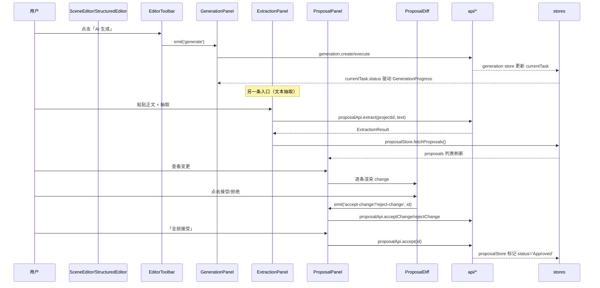

# components（前端组件层）

## 1. 概述

`frontend/src/components` 是 Novel 项目前端（Vue 3 + `<script setup>` + Pinia + vue-router）的视图组件层，按业务域分为 **17 个分组**、共 **56 个 `.vue` 文件**（`frontend/src/utils` 另有 1 个 `markdown.ts` 工具模块，为聊天 Markdown 渲染提供支持）。组件层不持有业务数据本身，而是通过 `stores/*`（Pinia）与 `api/*`（REST/SSE 封装）消费后端数据，并以 `props/emits` 与父级（页面/布局）通信。

整体职责分层如下：

- **基础 UI（ui/）**：`NeButton`、`NeDialog`、`NeInput`、`NeSelect`、`NeTextarea`、`NeTabs`、`NeDropdown`、`NeTooltip`、`StatusBadge`、`Toast`、`EntityCard`、`CommandPalette` 等为无业务语义的通用控件，仅依赖样式变量（`var(--space-*)`、`var(--color-*)`）与少量 store（`Toast` 依赖 `useUiStore`）。
- **领域面板**：`context/`、`constraint/`、`knowledge/`、`extraction/`、`proposal/`、`event/`、`version/`、`graph/` 直接对接对应 store/api，承担世界模型、提案、事件、版本等实体的增删改查与展示。
- **编辑器（editor/）**：`StructuredEditor`、`SceneEditor`、`ChapterEditor`、`EditorToolbar`、`SelectionActions`、`EntityHighlight` 构成写作体验，其中 `StructuredEditor` 是核心的 `contenteditable` 块状编辑器。
- **故事结构（story/）**：`StoryTree` / `StoryNode` 递归渲染叙事节点树。
- **检视器（inspector/）**：`InspectorPanel` 提供统一的带 Tab 的检视外壳，被 `CharacterInspector`、`LocationInspector`、`SceneInspector`、`EventInspector`、`ProposalInspector`、`ContextInspector`、`HistoryInspector` 复用。
- **Agent（agent/）与活动（activity/）**：`ChatMessage`、`PromptEditor` 支撑对话与提示词调优；`ActivityCenter` 为活动流占位。

## 2. 目录与源码对照

| 组件路径 | 分组 | 行数 | 主要职责 |
|---|---|---|---|
| `activity/ActivityCenter.vue` | activity | 52 | 活动中心，展示/清除/取消活动（**数据为硬编码 mock**） |
| `agent/ChatMessage.vue` | agent | 372 | 渲染用户/助手/工具/选择题气泡，解析 `<<ASK_QUESTION>>`/`<<TOOL_RESULT>>` 标记 |
| `agent/PromptEditor.vue` | agent | 157 | 全局提示词调优弹窗，读写 `PromptView` |
| `constraint/ConstraintPanel.vue` | constraint | 214 | 世界约束（CanonRule）列表与增删改 |
| `context/ContextItem.vue` | context | 39 | 单条 Context 实体，支持 pin/exclude |
| `context/ContextPanel.vue` | context | 45 | Context 实体与项目元信息聚合面板 |
| `editor/ChapterEditor.vue` | editor | 49 | 章节内场景列表与切换 |
| `editor/EditorToolbar.vue` | editor | 55 | 编辑器工具栏：保存/生成/撤销重做 |
| `editor/EntityHighlight.vue` | editor | 39 | 文本中实体高亮（**openInspector 仅 console.log，疑似未接入**） |
| `editor/SceneEditor.vue` | editor | 67 | 单场景编辑器外壳，包裹 `StructuredEditor` |
| `editor/SelectionActions.vue` | editor | 69 | 选区浮动操作条（重写/扩展/续写等） |
| `editor/StructuredEditor.vue` | editor | 280 | 核心块状 contenteditable 编辑器，DB 驱动实体高亮 |
| `event/EventLog.vue` | event | 85 | 事件日志时间线 |
| `extraction/ExtractionPanel.vue` | extraction | 98 | 文本抽取 → 生成提案草稿 |
| `generation/GenerationPanel.vue` | generation | 46 | AI 生成任务面板 |
| `generation/GenerationProgress.vue` | generation | 34 | 生成四阶段进度条 |
| `graph/GraphControls.vue` | graph | 67 | 关系图谱缩放/过滤控件 |
| `inspector/CharacterInspector.vue` | inspector | 91 | 角色检视（概览/知识/关系/历史，**知识/关系/历史为硬编码**） |
| `inspector/ContextInspector.vue` | inspector | 43 | 上下文统计检视（**仓库内无引用**） |
| `inspector/EventInspector.vue` | inspector | 29 | 事件检视 |
| `inspector/HistoryInspector.vue` | inspector | 40 | 通用版本历史检视（**仓库内无引用**，且 `versions` 默认值覆盖 prop） |
| `inspector/InspectorPanel.vue` | inspector | 71 | 带 Tab 的检视外壳，提供 `slot` 与作用域 `activeTab` |
| `inspector/LocationInspector.vue` | inspector | 65 | 地点检视（相关实体/事件**硬编码**） |
| `inspector/ProposalInspector.vue` | inspector | 63 | 提案检视（概览/变更/验证） |
| `inspector/SceneInspector.vue` | inspector | 40 | 场景检视（出场角色取 `characters_present` id） |
| `knowledge/KnowledgePanel.vue` | knowledge | 105 | 角色知识状态列表（批量拉取 `characterApi.getKnowledge`） |
| `proposal/ProposalDiff.vue` | proposal | 44 | 单条变更 diff，含接受/拒绝 |
| `proposal/ProposalPanel.vue` | proposal | 54 | 提案面板（变更/验证/整体接受拒绝） |
| `story/StoryNode.vue` | story | 47 | 单叙事节点，支持展开/选中/写作 |
| `story/StoryTree.vue` | story | 45 | 递归叙事树 |
| `version/VersionDiff.vue` | version | 163 | 实体版本对比（getVersions/compareVersions） |
| `ui/CommandPalette.vue` | ui | 87 | 命令面板，路由跳转（正则从 path 取 pid） |
| `ui/EntityCard.vue` | ui | 113 | 实体卡片，点击/删除 |
| `ui/EntityDialog.vue` | ui | 159 | 实体新建/编辑弹窗 |
| `ui/NeButton.vue` | ui | 55 | 通用按钮（variant/size/loading） |
| `ui/NeDialog.vue` | ui | 63 | 通用对话框（Teleport + Transition） |
| `ui/NeDropdown.vue` | ui | 65 | 下拉菜单（`icon` 为字符串却用 `<component :is>`） |
| `ui/NeInput.vue` | ui | 52 | 输入框（v-model） |
| `ui/NeSelect.vue` | ui | 42 | 选择器（v-model） |
| `ui/NeTabs.vue` | ui | 47 | Tab 切换（v-model） |
| `ui/NeTextarea.vue` | ui | 42 | 多行输入（v-model） |
| `ui/NeTooltip.vue` | ui | 32 | Tooltip（**`tooltipStyle` 恒为 `{}`，position 未生效**） |
| `ui/StatusBadge.vue` | ui | 32 | 状态徽章（多状态 class） |
| `ui/Toast.vue` | ui | 68 | Toast 容器（依赖 `useUiStore`） |
| `utils/markdown.ts` | utils | 44 | `renderMarkdown`/`prettyJson`（marked + DOMPurify） |

## 3. 各组组件功能要点

### activity

| 组件 | 功能 | 关键 props/emits | 依赖 store/api |
|---|---|---|---|
| `ActivityCenter` | 展示活动列表，支持清除/取消 | props: 无（内部 `activities` 硬编码）；emits: 无 | **无**（数据为写死 mock，未接 store/api） |

### agent

| 组件 | 功能 | 关键 props/emits | 依赖 store/api |
|---|---|---|---|
| `ChatMessage` | 渲染气泡，解析 ASK/TOOL 标记 | props: `role`、`content`、`streaming?`；emits: `select(text)`、`retry({name,input})` | `utils/markdown` |
| `PromptEditor` | 提示词调优弹窗 | props: `modelValue:boolean`；emits: `update:modelValue` | `api/agent`（`getPrompt`/`savePrompt`/`deletePrompt`）、`stores/agent`（`tools`） |

### constraint

| 组件 | 功能 | 关键 props/emits | 依赖 store/api |
|---|---|---|---|
| `ConstraintPanel` | CanonRule 增删改 | props: `worldId?`；emits: 无 | `api/rules`、`stores/world`（`fetchWorld`） |

### context

| 组件 | 功能 | 关键 props/emits | 依赖 store/api |
|---|---|---|---|
| `ContextItem` | 单条 Context 实体（pin/exclude） | props: `item:ContextEntity`；emits: `pin`、`exclude` | `types` |
| `ContextPanel` | Context 聚合面板（透传 pin/exclude） | props: `entities`、`items`、`totalTokens`；emits: `pin`、`exclude` | `types` |

### editor

| 组件 | 功能 | 关键 props/emits | 依赖 store/api |
|---|---|---|---|
| `ChapterEditor` | 章节场景列表 | props: `chapter`、`scenes`、`activeSceneId`；emits: `select-scene`、`add-scene` | `types` |
| `EditorToolbar` | 工具栏 | props: `wordCount`、`isDirty`；emits: `save`、`generate`、`command` | — |
| `EntityHighlight` | 实体高亮 span | props: `entityId`、`entityType`、`entityName`；emits: **无** | — |
| `SceneEditor` | 场景外壳 | props: `scene`、`content`、`isDirty`；emits: `save`、`generate`、`update:content` | `types` |
| `SelectionActions` | 选区操作条 | props: 无；emits: `action` | `composables/useSelection`、`composables/useGeneration` |
| `StructuredEditor` | 块状编辑器（核心） | props: `modelValue`；emits: `update:modelValue`、`entity-click(name)` | `stores/world`（`fetchWorld/fetchCharacters/fetchLocations/fetchFactions`） |

### event

| 组件 | 功能 | 关键 props/emits | 依赖 store/api |
|---|---|---|---|
| `EventLog` | 事件时间线 | props: 无；emits: 无 | `api/history`（`getEvents`） |

### extraction / generation / graph

| 组件 | 功能 | 关键 props/emits | 依赖 store/api |
|---|---|---|---|
| `ExtractionPanel` | 文本抽取 | props: `projectId`；emits: 无 | `api/proposal`（`extract`）、`stores/proposal` |
| `GenerationPanel` | 生成任务面板 | props: `currentTask`、`isGenerating`；emits: `start` | `types` |
| `GenerationProgress` | 阶段进度 | props: `status`；emits: 无 | — |
| `GraphControls` | 图谱控件 | props: `zoom`、`activeFilter`；emits: `zoom-in`/`zoom-out`/`zoom-reset`/`fit`/`center`/`filter` | — |

### inspector

| 组件 | 功能 | 关键 props/emits | 依赖 store/api |
|---|---|---|---|
| `InspectorPanel` | 检视外壳 | props: `entityType`、`entityName`、`tabs?`；emits: `close` | — |
| `CharacterInspector` | 角色检视 | props: `character:Entity`；emits: `close` | `types`（知识/关系/历史硬编码） |
| `LocationInspector` | 地点检视 | props: `entity:Entity`；emits: `close` | `types`（相关实体/事件硬编码） |
| `SceneInspector` | 场景检视 | props: `scene:NarrativeNode`；emits: `close` | `types` |
| `EventInspector` | 事件检视 | props: `event:Event`；emits: `close` | `types` |
| `ProposalInspector` | 提案检视 | props: `proposal:Proposal`；emits: `close` | `ui/StatusBadge`、`types` |
| `ContextInspector` | 上下文检视 | props: `entities`、`totalTokens`；emits: `close` | `types`（**未引用**） |
| `HistoryInspector` | 版本历史检视 | props: `entityName`、`versions?`；emits: `close` | —（**未引用**，`versions` 默认掩盖 prop） |

### knowledge / proposal / story / version / ui

| 组件 | 功能 | 关键 props/emits | 依赖 store/api |
|---|---|---|---|
| `KnowledgePanel` | 角色知识状态 | props: 无；emits: 无 | `api/character`（`getKnowledge`）、`stores/world` |
| `ProposalDiff` | 单条变更 diff | props: `change`、`showActions?`；emits: `accept`、`reject` | `types` |
| `ProposalPanel` | 提案面板 | props: `proposal`；emits: `accept`/`reject`/`accept-change`/`reject-change` | `ui/StatusBadge`、`types` |
| `StoryNode` | 叙事节点 | props: `node`、`expanded?`、`hasChildren?`；emits: `select`/`toggle`/`write` | `types` |
| `StoryTree` | 叙事树（递归） | props: `nodes`、`expanded`、`depth`；emits: `select`/`write`/`toggle` | `types` |
| `VersionDiff` | 版本对比 | props: 无；emits: 无 | `api/history`、`stores/world` |
| `CommandPalette` | 命令面板 | props: 无；emits: `close` | `vue-router` |
| `EntityCard` | 实体卡片 | props: `entity`、`type`；emits: `click`、`delete` | `types` |
| `EntityDialog` | 实体弹窗 | props: `modelValue`、`title?`、`entityType?`、`editData?`；emits: `update:modelValue`、`submit` | — |
| `NeButton`/`NeDialog`/`NeInput`/`NeSelect`/`NeTextarea`/`NeTabs`/`NeDropdown`/`NeTooltip`/`StatusBadge`/`Toast` | 通用控件 | 见第 5 节 | `Toast` 依赖 `stores/ui` |

## 4. 核心交互流程

以「编辑器 → 提案 diff → 审批」为主链路，辅以抽取与生成：



另一条关键链路是 **ChatMessage 与 AgentStore 的标记协议**：`stores/agent.ts:167` 将选择题持久化为 `<<ASK_QUESTION>>{...}<<END>>`、工具结果持久化为 `<<TOOL_RESULT>>{...}<<END>>`，`ChatMessage.vue:81-119` 用相同的 `ASK/END/TOOL` 常量反向解析——前后端持久化格式通过这组硬编码字符串耦合，需严格保持一致。

## 5. 接口/导出

**`ChatMessage.vue:70-79`**
```vue
const props = defineProps<{
  role: 'user' | 'assistant' | 'tool'
  content: string
  streaming?: boolean
}>()
const emit = defineEmits<{
  select: [text: string]
  retry: [payload: { name: string; input: unknown }]
}>()
```

**`PromptEditor.vue:46-47`**
```vue
const props = defineProps<{ modelValue: boolean }>()
const emit = defineEmits<{ 'update:modelValue': [boolean] }>()
```

**`StructuredEditor.vue:48-55`**
```vue
const props = defineProps<{ modelValue: string }>()
const emit = defineEmits<{
  (e: 'update:modelValue', value: string): void
  (e: 'entity-click', name: string): void
}>()
```

**`ConstraintPanel.vue:80`** `props: { worldId?: string }`（无 emits，直接调 `api/rules`）

**`ContextItem.vue:21-22`**
```vue
defineProps<{ item: ContextEntity }>()
defineEmits(['pin', 'exclude'])
```

**`ProposalPanel.vue:32-33`**
```vue
defineProps<{ proposal: Proposal }>()
defineEmits(['accept', 'reject', 'accept-change', 'reject-change'])
```

**`ProposalDiff.vue:19-23`**
```vue
defineProps<{ change: ProposalChange; showActions?: boolean }>()
defineEmits(['accept', 'reject'])
```

**`StoryTree.vue:30-35`**
```vue
defineProps<{ nodes; expanded: Record<string,boolean>; depth: number }>()
const emit = defineEmits(['select', 'write', 'toggle'])
```

**`VersionDiff.vue`** 无 props/emits，内部通过 `useRoute()` 取 `projectId` 并直接调 `historyApi.getVersions`/`compareVersions`（耦合路由，无法独立复用）。

**通用控件（ui/）关键签名：**
- `NeButton`：`variant?: 'primary'|'secondary'|'ghost'|'danger'`，`size?`、`disabled?`、`loading?`，emit `click`（`NeButton.vue:14-20`）
- `NeDialog`：`modelValue:boolean`、`title?`、`size?`，emit `update:modelValue`（`NeDialog.vue:23-28`）
- `NeInput`/`NeTextarea`：`modelValue?`、`placeholder?`、`label?`、`disabled?`、`error?`（textarea 多 `rows?`），emit `update:modelValue`（`NeInput.vue:21-29`、`NeTextarea.vue:16-23`）
- `NeSelect`：`modelValue?`、`options:{value,label}[]`、`placeholder?`、`label?`、`disabled?`，emit `update:modelValue`（`NeSelect.vue:17-24`）
- `NeTabs`：`modelValue:string`、`tabs:{id,label,badge?}[]`，emit `update:modelValue`（`NeTabs.vue:22-26`）
- `NeDropdown`：`items:{id,label,icon?,danger?,disabled?}[]`、`align?`，emit `select`（`NeDropdown.vue:25-29`）
- `StatusBadge`：`status:string`、`label:string`（`StatusBadge.vue:8-11`）
- `Toast`：无 props，直接使用 `useUiStore().toasts`（`Toast.vue:18-20`）

**工具导出（`utils/markdown.ts:20,27`）**
```ts
export function renderMarkdown(src: string): string
export function prettyJson(v: unknown): string
```

## 6. 问题/代码异味

1. **未使用组件（死代码）**：`EntityHighlight.vue`、`NeTooltip.vue`、`ContextInspector.vue`、`HistoryInspector.vue` 在 `src` 全仓库无任何引用（`grep` 无匹配）。其中 `ContextInspector`/`HistoryInspector` 虽设计完善但从未挂载，`EntityHighlight`/`NeTooltip` 亦未被使用，徒增维护成本与打包体积。

2. **硬编码/ mock 数据掩盖真实接口**：
   - `ActivityCenter.vue:25-29` 的 `activities` 为写死的三条记录，`cancelActivity` 仅本地过滤数组，未接任何 store/api，活动中心功能实际为空壳。
   - `CharacterInspector.vue:50-68` 的 `knowledge`/`relations`/`versions`、`LocationInspector.vue:43-49` 的 `relatedEntities`/`relatedEvents` 均为硬编码小说人物（林凡/王家/苏晚晴），未读取 `characterApi.getState`/`getRelationships` 等真实接口，检视器展示内容与后端不一致。
   - `HistoryInspector.vue:25-30` 定义了默认 `versions`，即使父级传入 `versions` prop，模板遍历的是局部常量而非 prop（`:key/v-for` 绑定的是脚本内 `versions`），导致 prop 完全失效。

3. **props/emits 混乱 / 事件未接出**：
   - `EntityHighlight.vue:22-25` 的 `openInspector()` 仅 `console.log`，且组件 `defineEmits` 缺失——父级无法感知点击（与 `StructuredEditor` 的 `entity-click` 机制重复且未打通）。
   - `SelectionActions.vue:28-35` 中 `shorten`（精简）与 `rewrite`（重写）共用 `type: 'RewriteSelection'`，`continue` 用 `GenerateScene`，`analyze` 用 `AnalyzeCharacter`；`shorten` 类型标注与 `rewrite` 完全相同，语义错误（应区分或新增 `ShortenSelection` 类型）。
   - `VersionDiff.vue`、`EventLog.vue`、`ActivityCenter.vue`、`KnowledgePanel.vue` 等通过 `useRoute()` 直接取 `projectId` 并内部调 api，而非通过 props 注入，破坏组件复用性与可测试性。

4. **与后端字段/类型的不一致风险**：
   - `NeDropdown.vue:15` 的 `item.icon?: string` 在模板 `:is="item.icon"`（`NeDropdown.vue:15`）中以字符串作组件名，但 `lucide` 图标是组件对象而非字符串；若外部真的传字符串会解析失败（当前因无调用方而未暴露）。
   - `StoryNode.vue:28` 的 `statusLabels` 含 `Archived`，但 `StatusBadge.vue:28` 使用 `archived`/`abandoned` 小写 class，而 `StoryNode` 直接把 `node.status` 拼进 `:class`（`:class="node.status"`，`StoryNode.vue:2`），状态类名体系在「节点树」与「徽章」两处不统一（如 `InProgress` vs `in_progress`）。
   - `SelectionActions.vue` 依赖 `composables/useSelection` 与 `composables/useGeneration`，但 `useGeneration.startGeneration` 接受 `GenerationTaskType` 与 `SelectionActions` 中 action.type 字符串一致（`generation.ts:3-13`），此处对接正确，无需改动。

5. **代码异味 / 未生效逻辑**：
   - `NeTooltip.vue:18` 的 `tooltipStyle` 恒为 `{}`，`position` prop（top/bottom/left/right）在模板/样式中**从未被使用**（`:class="position"` 缺失），Tooltip 定位永远跟随父级 `inline-flex`，非 fixed 计算位置，功能名不副实。
   - `StructuredEditor.vue:174-179` 的 `onBlockBlur` 为空函数体（仅注释「保留」），`blur` 事件绑定了无副作用逻辑；同时 `blockCounter` 用模块级 `let` 累加，组件复用/重建时 id 可能冲突或无限增长。
   - `ConstraintPanel.vue:84` 的 `projectId = route.params.id` 与 `worldId` 计算属性并存，且 `onMounted` 同时 `fetchWorld(projectId)`，当 `props.worldId` 传入时仍可能重复拉取。
   - `EntityCard.vue` 展示 `entity.source_generation_id`/`entity.version`/`entity.updated_at`，与 `types/world.ts:26-29` 的 `Entity` 接口一致（对接正确），但 `entity_type_id` 仅以 `type` prop 透传，未在卡片内消费，存在冗余 prop 语义。

## 7. 小结

`components` 层已按业务域形成清晰分组，基础 UI 控件（`ui/`）设计一致、复用度高，`InspectorPanel`/`StoryTree` 的复合模式也较规范。但存在明显的两类问题：

- **交付完整度**：`ActivityCenter`、多个 Inspector 的知识/关系/历史、以及 `EntityHighlight`/`NeTooltip`/`ContextInspector`/`HistoryInspector` 仍处于 mock 或未接入状态，部分组件甚至从未被引用，属于可清理的死代码或待补实现的占位。
- **接口契约一致性**：组件与 `stores`/`api` 的对接在「编辑器/提案/抽取/生成/版本」主链路上是健康且类型对齐的；但 `StatusBadge` 与 `StoryNode` 的状态类名大小写不统一、`NeDropdown.icon` 字符串误用 `<component :is>`、`SelectionActions.shorten` 类型标注错误、`VersionDiff`/`EventLog` 等内部耦合路由取参，属于需要统一收敛的契约异味，建议在接入真实数据前优先修正，避免后续联调时字段错配。
