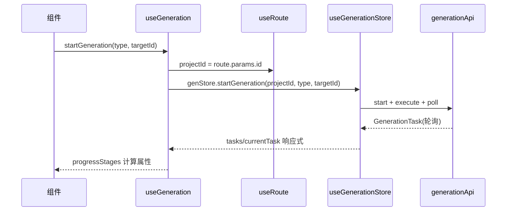

# composables（前端基础层 · 组合式函数）

## 1. 概述
`frontend/src/composables` 是"视图无关的 UI 逻辑封装层"，用 Vue 3 `composables` 模式把 store 与 `vue-router`/`DOM` 事件薄薄包一层，供组件 `setup` 中调用。它不发起网络请求（除间接通过 store），只做：路由参数提取、计算属性派生、键盘/选区 DOM 监听、store 方法转发。`index.ts:1-5` 统一重导出。

## 2. 模块职责
- 从 `route.params` 提取 `projectId`（`useProject`/`useGeneration`）。
- 把 store 状态/动作暴露成更易用的 computed + 方法。
- 封装 DOM 事件监听（`useKeyboard`/`useSelection`）并在卸载时清理。

## 3. 目录与源码对照

| 文件路径 | 行数 | 主要职责 |
|---|---|---|
| `composables/index.ts` | 5 | 重导出 5 个 composable |
| `composables/useProject.ts` | 18 | 提取 route.params.id → currentProject |
| `composables/useGeneration.ts` | 43 | 项目内生成任务封装 + 进度阶段 |
| `composables/useContext.ts` | 29 | 上下文实体按 policy 分组 + toggle 转发 |
| `composables/useKeyboard.ts` | 22 | 全局 keydown 组合键分发 |
| `composables/useSelection.ts` | 33 | 文本选区监听（selectedText/rect） |

## 4. 字段/类型设计与后端对照

composables 本身不定义领域类型，全部复用 `types/*` 与 store。因此"前后端字段对照"实质是间接继承上文问题：
- `useGeneration.ts:19-22` 调 `genStore.startGeneration(projectId, type, targetId)`，`type` 为 `GenerationTaskType`（`types/generation.ts:3-13`，含 `GenerateScene` 等 9 种）。后端 `create_task`（`generation.rs:126-141`）接收 `r#type: String` 自由字符串透传给 `GenerationService::create_task`，**无枚举白名单校验**——前端枚举与后端生成逻辑实际接受的 skill 名是否一致未验证（如 `GenerateArc` 后端是否有对应 skill）。
- `useContext.ts:11-19` 把实体按 `policy` 分 `Pinned`/`Excluded`/`Automatic`，与 `types/context.ts:3` 一致；但这些数据来自 501 端点，故 composable 永远返回空数组。
- `useProject.ts:9` `projectId = route.params.id`，与 `useProjectStore` 的 `currentProject` 关联，未直接触碰后端字段。

## 5. 核心流程（useGeneration 触发生成）

## 6. 接口/导出（关键签名）
- `useProject.ts:5-18`：返回 `{ projectId, currentProject, isLoading, loadProject }`。
- `useGeneration.ts:6-43`：返回 `{ tasks, currentTask, isGenerating, isCompleted, startGeneration, progressStages }`。`progressStages`（`:24-40`）由 `status` 映射到 `BuildingContext→Generating→Validating→Completed` 四阶段——**但后端状态是 `Pending→Running→Completed`**，阶段标签与真实状态不对应。
- `useContext.ts:4-29`：返回 `{ entities, items, totalTokens, pinnedEntities, excludedEntities, autoEntities, togglePin, toggleExclude }`。
- `useKeyboard.ts:5-22`：返回无状态，仅注册 `keydown`；handler key 形如 `mod+shift+k`。
- `useSelection.ts:3-33`：返回 `{ selectedText, selectionRect, hasSelection, clearSelection }`，监听 `selectionchange`。

## 7. 问题/代码异味
1. **progressStages 阶段与后端状态机不符**（`composables/useGeneration.ts:24-40`）：前端硬编码 `BuildingContext/Generating/Validating/Completed`，后端是 `Pending/Running/Completed`，阶段条永远停在第一步或闪跳。
2. **useContext 永远空**（`composables/useContext.ts` 依赖 501）：三分组 computed 全空，是 dead UI 分支。
3. **useKeyboard 未提供解绑外的语义**（`composables/useKeyboard.ts`）：`handlers` 以 `"mod+shift+k"` 拼接，但未处理 `e.preventDefault` 在非注册键时的默认行为，且未暴露"移除单个 handler"，多实例叠加监听需注意（已 `onUnmounted` 清理，OK）。
4. **useProject 未监听 route 变化**（`composables/useProject.ts:9`）：`projectId` 仅在调用时取值，组件若在同一挂载内切换路由参数不会自动更新，需依赖 `watch`——但 composable 未提供。
5. **useGeneration 与 useGenerationStore 重复暴露**（`composables/useGeneration.ts:11-12`）：`tasks`/`currentTask` 直接 mirror store，增加一层无附加价值的转发；`isGenerating`/`isCompleted` 又因状态枚举错位而失真（见上文）。

## 8. 小结
composables 作为薄封装总体可用，但 `useGeneration` 的进度阶段、`useContext` 的数据源都因后端契约（状态机、501 端点）问题而失效，属于"上游 bug 在视图层的暴露"。建议与 stores/api/types 同步修复 generation 状态枚举与 context 后端实现后，composables 可自然恢复。
