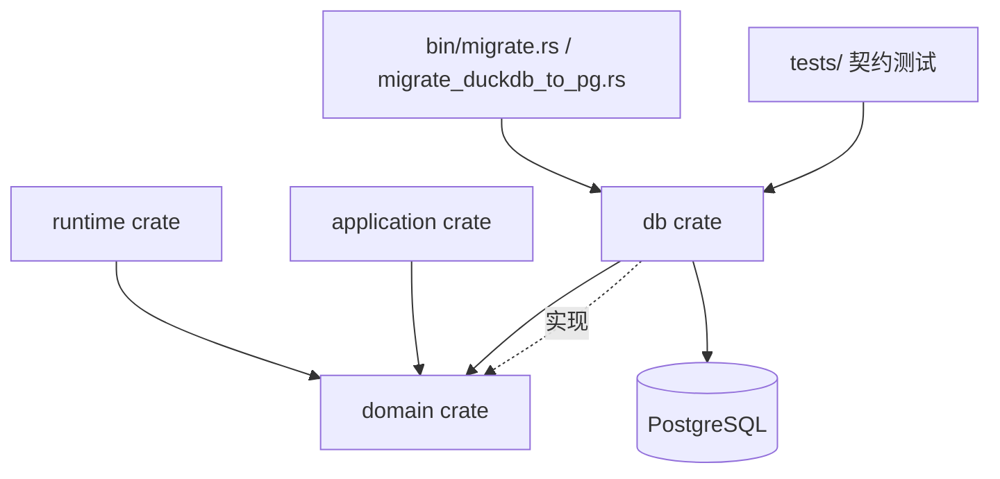
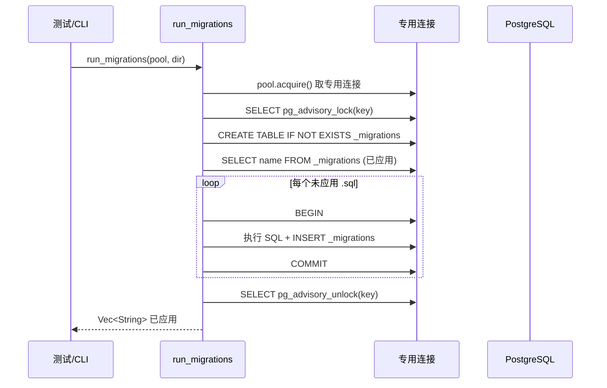
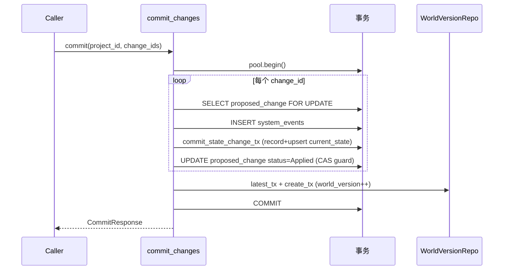

# db（持久化层）

## 1. 概述

`db` crate 是 Novel Engine 的**唯一持久化层**，负责 PostgreSQL 的所有读写，使用 `sqlx`（异步、`Postgres` 驱动、编译期 `query_as!` 风格但本项目实际大量用运行时 `query_as::<_, Tuple>`）对接 Postgres。

- **分层位置**：位于 `domain` 之下、`runtime`/`application` 之上。`domain` 仅声明 traits（见 `crates/domain/src/ports.rs`），`db` 通过 `runtime_ports.rs`、`application_ports.rs`、`mutation_committer.rs`、`project_resolver.rs` 实现这些 trait，并在组合根（composition root）注入。runtime crate 不直接依赖 `db`，只依赖 `domain::ports`（见 `crates/db/src/runtime_ports.rs:1-6` 注释）。
- **设计约束**：Canonical 状态只允许经两个提交入口写入——`DbMutationCommitter`（mutation pipeline，见 `crates/db/src/mutation_committer.rs`）与 `DbStateCommitterPort::commit`（approved→applied 流转，见 `crates/db/src/runtime_ports.rs:279-437`）。业务层禁止物理 DELETE：`relation` 用 `valid_until` 软结束、`fact` 用 `status`（Superseded/Invalid）、`entity`/`narrative_node` 用 `status='Deleted'`（见 `crates/db/src/mutation_committer.rs:271-294, 574-592`）。
- **连接管理**：基于 `sqlx::PgPool`，支持多写入者并发（不再需要 Mutex 串行化，见 `crates/db/src/connection.rs:10-16`）。

## 2. 模块职责

逐条列出：

| 职责 | 实现位置 | 说明 |
|------|----------|------|
| 连接池管理 | `connection.rs` | `Database` 包装 `PgPool`，`from_env`/`open`/`open_with_config`，含 `health_check`、`execute_batch` |
| 迁移运行 | `migration.rs` | 顺序应用 `migrations/*.sql`，用 advisory lock 防并发；自建 `_migrations` 追踪表 |
| Schema 校验 | `schema.rs` | `list_tables`/`describe_table`/`validate_schema`（核对约 90 张期望表） |
| 仓储（repos/） | `repos/*.rs` | 每个业务域一个 repo（entity、world、state、narrative、generation、knowledge、character、validation 等 36 个），提供 CRUD 与 `_tx` 事务版本 |
| Mutation 提交 | `mutation_committer.rs` | `MutationCommitterPort` 实现：幂等 ledger + CAS + 投影 + 事件 + world_version |
| 状态提交（approved→applied） | `runtime_ports.rs::commit_changes` | canonical commit 的另一条路径，共享 `WorldVersionRepo` |
| 运行时端口 | `runtime_ports.rs` | `NarrativePort`/`EntityPort`/`StatePort`/`RelationPort`/`EventPort`/`CanonRulePort`/`ContextSnapshotPort`/`ValidationPort`/`ApprovalPort`/`ProposedChangeQueryPort`/`StateCommitterPort` |
| 应用端口（P3 下移） | `application_ports.rs` | `GenerationRepositoryPort`/`ProjectRepositoryPort`/`WorldRepositoryPort`/`EntityRepositoryPort`/`RuleRepositoryPort`/`HistoryRepositoryPort`/`SnapshotRepositoryPort`/`TraceQueryPort`/`NarrativeStateWritePort`/`ContextSnapshotRepositoryPort`/`SettingsRepositoryPort` 等 |
| 项目解析 | `project_resolver.rs` | `ProjectResolverPort` 低层 `project_id` 解析（entity/world/relation/narrative_node） |
| 序列化工具 | `ser.rs` | enum↔VARCHAR 字符串互转（narrative_node_type、proposed_change_type、skill_type 等） |
| 时间工具 | `time_utils.rs` | 字符串↔`DateTime<Utc>` 解析，兼容旧数据 |
| CLI | `bin/migrate.rs`、`bin/migrate_duckdb_to_pg.rs` | 迁移执行 + DuckDB→PG 校验/统计 |
| 离线契约测试 | `tests/schema_consistency.rs`、`tests/transaction_invariants.rs` | schema 漂移静态校验；提交事务不变量 |

## 3. 依赖关系

- `db` 依赖 `domain`（引入 `domain::*` 类型与 `domain::ports::*` trait），以及 `sqlx`、`uuid`、`chrono`、`serde_json`、`async-trait`、`anyhow`、`tracing`。
- `db` 被 `runtime`、`application`、测试与 CLI bin 依赖；`runtime` 仅通过 `domain::ports` 间接使用 `db` 的实现。

## 4. 目录与源码对照

| 文件路径 | 大约行数 | 主要职责 |
|----------|----------|----------|
| `src/lib.rs` | 10 | 模块声明 |
| `src/connection.rs` | 120 | `Database`/`PgPool` 连接管理 |
| `src/migration.rs` | 188 | 顺序迁移 + advisory lock + `_migrations` 追踪 + 已废弃 `rollback_last` |
| `src/schema.rs` | 151 | 表/列查询与 `validate_schema` |
| `src/project_resolver.rs` | 57 | `ProjectResolverPort` |
| `src/time_utils.rs` | 66 | 时间戳字符串解析 |
| `src/ser.rs` | 348 | 各 enum↔字符串互转函数 |
| `src/mutation_committer.rs` | 677 | `MutationCommitterPort` 实现 |
| `src/runtime_ports.rs` | 479 | 运行时端口实现 + `commit_changes` |
| `src/application_ports.rs` | 2595 | 应用端口实现（大量 `serde_json::json!` 投影） |
| `src/repos/mod.rs` | 37 | 37 个 repo 模块声明 |
| `src/repos/entity_repo.rs` | 909 | Entity/EntityType/Relation/Fact 仓储 |
| `src/repos/character_repo.rs` | 935 | 角色 R2 全表仓储（profile/state/drive/conflict/relationship/secret/capability/arc/extension） |
| `src/repos/state_repo.rs` | 525 | current_state/state_change/resource_state，CAS upsert |
| `src/repos/generation_repo.rs` | 319 | Task/Skill/Run 仓储 |
| `src/repos/narrative_repo.rs` | 364 | narrative_node/scene 仓储 |
| `src/repos/validation_repo.rs` | 427 | proposed_change/validation_run/issue |
| `src/repos/knowledge_repo.rs` | 251 | knowledge_state/revelation |
| `src/repos/world_repo.rs` | 169 | world 仓储 |
| `src/repos/world_version_repo.rs` | 137 | 世界版本（canonical 版本拥有者） |
| `src/repos/outbox_repo.rs` | 184 | 事件 outbox（收发） |
| `src/repos/{其他 24 个}.rs` | 75–372 不等 | 各业务域仓储 |
| `src/bin/migrate.rs` | 43 | 迁移 CLI |
| `src/bin/migrate_duckdb_to_pg.rs` | 90 | DuckDB→PG 校验/统计 CLI |
| `tests/schema_consistency.rs` | 468 | 离线 schema 漂移校验 |
| `tests/transaction_invariants.rs` | 431 | 提交事务不变量契约 |

## 5. 数据库 Schema 与字段设计

### 5.1 迁移演进总览

| 迁移号 | 文件 | 做了什么 |
|--------|------|----------|
| 001 | `001_canonical_schema.sql` | 权威 canonical schema（90+ 表），统一 UUID/TIMESTAMPTZ/JSONB/version 约定；种子 `standard_relation_type`；末尾自建 `_migrations` 兜底 |
| 002 | `002_cascade_delete_fks.sql` | 引用 project/entity/world 的外键改为 `ON DELETE CASCADE`，使 `delete_project` 可用 |
| 003 | `003_mutation_ledger.sql` | 新增 `mutation_ledger`（幂等 command_id） |
| 004 | `004_fact_lifecycle.sql` | `fact` 增加 `status`/`superseded_by`，事实生命周期 |
| 005 | `005_context_snapshot_reproducibility.sql` | `context_snapshot` 增加 `reproducibility_meta` |
| 006 | `006_generation_run_reproducibility.sql` | `generation_run` 增加 `reproducibility_meta` |
| 007 | `007_world_version.sql` | 新增 `world_version`（git-commit 式版本） |
| 008 | `008_entity_type_schema_json.sql` | `entity_type.schema` 重命名为 `schema_json`（对齐代码） |
| 009 | `009_system_event_plural.sql` | `system_event` 重命名为 `system_events`（对齐 `schema.rs`） |
| 010 | `010_state_change_event_fk.sql` | `state_change.event_id` FK 改指向 `system_events` |
| 011 | `011_approval_reviewer_id_text.sql` | `approval_record.reviewer_id` 改 `VARCHAR`（原 UUID） |
| 012 | `012_character_state_align.sql` | `character_state` 增加 `resources`/`current_status`/`emotion` |
| 013 | `013_narrative_node_content.sql` | `narrative_node` 增加 `content`（场景正文） |
| 014 | `014_app_settings.sql` | 新增 `app_settings`（单全球行设置） |
| 015 | `015_proposed_change_task_nullable.sql` | `proposed_change.task_id` 改为可空 |
| 016 | `016_generation_task_skill_columns.sql` | `generation_task` 增加 `skill_id`/`scene_id` |
| 017 | `017_character_r2_refactor.sql` | Character R2 重构：`real_name→name`、`background→background_origin`、`age→age_range TEXT`、`health→physical_state`；删 `nickname`/`social_status`/`cultivation`/`money`/`wanted`；新增 drive/conflict/relationship/secret/capability/arc_potential/extension 等表；删 `character_goal` |
| 018 | `018_agent_prompts.sql` | 新增 `agent_prompts` |
| 019 | `019_agent_persistence.sql` | 新增 `agent_sessions`/`agent_messages`/`agent_memory` |
| 020 | `020_agent_memory_session.sql` | `agent_memory` 改会话级（project_id 可空、加 session_id） |
| 021 | `021_bind_session_to_project.sql` | 反向 020：`agent_sessions.project_id` 改 `NOT NULL`，清孤儿会话，`agent_memory` 回项目级 |

### 5.2 核心表字段（按业务域分组）

**项目 / 世界**：

| 表名 | 字段 | 类型 | 含义 | 源码位置 |
|------|------|------|------|----------|
| `project` | id | UUID PK | 项目主键 | `001:19-33` |
| `project` | status | VARCHAR DEFAULT 'Concept' | 项目状态 | `001:30`；`ser::project_status_str` `ser.rs:252` |
| `project` | config | JSONB | 项目配置 | `001:29`；前端 `project.ts:23` |
| `world` | is_main | BOOLEAN | 是否主世界 | `001:45`；`runtime_ports.rs:362` 取主世界 |
| `world` | world_rules | TEXT | 世界规则 | `001:43` |
| `entity` | status | VARCHAR DEFAULT 'Active' | 软删除标记 | `001:80`；`application_ports.rs:2027-2047` 软删 |
| `entity` | version | INTEGER DEFAULT 1 | 乐观锁版本 | `001:76`；CAS `entity_repo.rs:278` |
| `entity_type` | schema_json | JSONB | schema（008 重命名） | `008`；`entity_repo.rs:49` |

**状态 / 事实**：

| 表名 | 字段 | 类型 | 含义 | 源码位置 |
|------|------|------|------|----------|
| `current_state` | (project,entity,key) unique where effective_to IS NULL | — | 每 key 唯一活跃行 | `001:212-214` |
| `current_state` | version | INTEGER | 状态版本 | `state_repo.rs:172` |
| `state_change` | event_id | FK→system_events | 审计事件 | `010` |
| `fact` | status | VARCHAR DEFAULT 'Active' | 生命周期 | `004`；`mutation_committer.rs:467-514` |

**角色（R2）**：

| 表名 | 字段 | 类型 | 含义 | 源码位置 |
|------|------|------|------|----------|
| `character_profile` | name | TEXT | 真名（017 由 real_name 重命名） | `017`; `character_repo.rs:24` |
| `character_profile` | age_range | TEXT | 叙事年龄区间 | `017`; domain `character.rs:284` |
| `character_state` | physical_state | TEXT | 身体状态（替代 health） | `012/017`; domain `character.rs:315` |
| `character_state` | mental_state/resource_state/social_state | TEXT | R2 状态维度 | `017`; domain `character.rs:317-321` |
| `character_state` | flags | JSONB | 状态标记 | `017`; domain `character.rs:323` |
| `character_drive` / `character_conflict` / `character_relationship` / `character_secret` / `character_capability` / `character_arc_potential` / `character_extension` | 各异 | — | R2 子表 | `017`; `character_repo.rs` |

**生成 / 可追溯**：

| 表名 | 字段 | 类型 | 含义 | 源码位置 |
|------|------|------|------|----------|
| `generation_task` | status | VARCHAR | 任务状态 | `001:441`; `ser::task_status_str` `ser.rs:63` |
| `generation_task` | context_tokens | INTEGER | 上下文 token 数 | `001:443`; `application_ports.rs:35` |
| `generation_run` | reproducibility_meta | JSONB | 可复现元数据 | `006` |
| `world_version` | (world_id, version) UNIQUE | — | 版本链 | `007`; `world_version_repo.rs` |
| `system_events` | event_type/data/source | — | 领域事件 | `009`; `mutation_committer.rs:660` |

**提交 / 校验 / 代理**：

| 表名 | 字段 | 类型 | 含义 | 源码位置 |
|------|------|------|------|----------|
| `proposed_change` | task_id | UUID（可空） | 关联任务 | `015`; `application_ports.rs:458` |
| `proposed_change` | status | VARCHAR | 提案状态 | `ser::proposed_change_status_str` `ser.rs:277` |
| `approval_record` | reviewer_id | VARCHAR | 审核人用户名 | `011`; `runtime_ports.rs:261` |
| `agent_sessions` | project_id | UUID NOT NULL | 会话绑定项目 | `021` |
| `app_settings` | settings | JSONB | 全局设置 | `014`; `application_ports.rs:2569` |

### 5.3 三源对照：db 表字段 ↔ domain struct 字段 ↔ 前端 types 字段

| 主题 | db（迁移 + repo 实际读写） | domain struct | 前端 types | 一致性 |
|------|------|------|------|--------|
| 角色档案名 | `character_profile.name`（`017` 重命名 real_name→name；`character_repo.rs:24`） | `CharacterProfile.name`（`character.rs:281`） | `CharacterProfile.real_name`（`character.ts:8`） | **不一致**：前端仍用 `real_name`，未随 017 更新（前端唯一引用，见 `grep` 仅 `character.ts`） |
| 角色档案年龄 | `age_range TEXT` | `age: Option<AgeRange>` | `age?: string`（`character.ts:11`） | **不一致**：前端用旧 `age` 且类型为 string，domain/db 为 `age_range` |
| 角色社会位 | `social_position JSONB` | `social_position: Option<SocialPosition>` | `social_status?: string`（`character.ts:15`） | **不一致**：前端 `social_status` 已被 017 删除 |
| 角色昵称 | 列已删（`017 DROP nickname`） | 无 | `nickname?: string`（`character.ts:9`） | **不一致**：死字段，db 无对应列 |
| 角色状态-身体 | `physical_state`（`012/017`） | `physical_state` | `health?: string`（`character.ts:24`） | **不一致**：前端 `health` 已被 017 改名 |
| 角色状态-资源/社会 | `resource_state`/`social_state` | 同 | `cultivation?`/`money?`/`wanted?`（`character.ts:25-27`） | **不一致**：全部为 017 删除的旧列 |
| 角色状态-心理 | `mental_state`、`flags JSONB` | 同 | 无对应 | 前端缺失 |
| 项目状态 | `status VARCHAR DEFAULT 'Concept'` | `ProjectStatus`（`ser.rs:252`） | `ProjectStatus` 含 Concept…Archived（`project.ts:5-12`） | 一致 |
| 世界 | `world(is_main, world_rules, config)` | `World` | `World`（`world.ts:6-14`） | 一致 |
| 事实确定性 | `fact.certainty DEFAULT 'CANON'` | `Fact.certainty` | `FactCertainty: 'Confirmed'|'Likely'|'Rumor'|'Uncertain'`（`world.ts:69`） | **不一致**：db 默认值是 `CANON`，前端枚举是 Confirmed/Likely/Rumor/Uncertain，取值集合不匹配（db 另有 Active/Superseded/Invalid 是 lifecycle status，与 certainty 混用需注意） |
| 生成任务状态 | `generation_task.status`（Pending/Running/Completed/Failed/Cancelled） | `TaskStatus` | `GenerationTaskStatus` 含 BuildingContext/Generating/Validating（`generation.ts:14-21`） | **不一致**：db 仅 5 态，前端多出 BuildingContext/Generating/Validating（应用层自行映射，db 未持久化这些中间态） |
| 叙事节点 | `narrative_node.content`（013 加） | `NarrativeNode` | `NarrativeNode.content?`（`narrative.ts:31`） | 一致 |
| 故事线状态 | `storyline.status DEFAULT 'Active'` | `StorylineStatus` | `StorylineStatus` 含 Planned/Active/Resolved/Abandoned（`narrative.ts:87`） | 一致（db 无 Default 冲突） |

## 6. 核心流程

### 6.1 连接建立

`bin/migrate.rs:15` 用 `PgPoolOptions` 建立池 → `migration::run_migrations`（`migration.rs:20`）→ 在**专用连接**上取 advisory lock（`migration.rs:26`）→ apply 每个未执行迁移于单事务（`migration.rs:104-117`）→ 释放锁 → `schema::validate_schema` 校验。

### 6.2 迁移执行（并发安全）

### 6.3 一次写操作的事务边界（canonical commit）

以 `DbStateCommitterPort::commit`（`runtime_ports.rs:300`）为例：

要点：所有 `system_events`/`state_change`/`current_state`/`world_version`/`proposed_change` 在同一 `BEGIN…COMMIT` 内；批内同 `(entity,state_key)` 冲突在 `runtime_ports.rs:308-344` 直接报错回滚；失败整体回滚（契约测试 `tests/transaction_invariants.rs` 锁定不变量 A/B/C）。

`DbMutationCommitter::commit_batch`（`mutation_committer.rs:53`）结构类似：`ledger_try_insert` 幂等 → `apply`（CAS on version）→ `ledger_mark_done` → 每受影响 world 调 `WorldVersionRepo::create_tx`。

## 7. 接口/类型签名（关键 repo 的 pub fn，附文件:行号）

| 类型/函数 | 签名（节选） | 位置 |
|-----------|--------------|------|
| `Database` | `pub async fn open(database_url: &str) -> Result<Self>` | `connection.rs:27` |
| `Database` | `pub fn pool(&self) -> &PgPool` | `connection.rs:69` |
| `run_migrations` | `pub async fn run_migrations(pool: &PgPool, migrations_dir: &str) -> Result<Vec<String>>` | `migration.rs:20` |
| `DbMutationCommitter` | `impl MutationCommitterPort { async fn commit(&self, cmd) -> Result<MutationCommitResult, MutationError> }` | `mutation_committer.rs:39` |
| `StateRepo` | `pub async fn commit_state_change_tx(conn, project_id, event_id, change_type, target_entity_id, state_key, new_value, committed_by) -> Result<(StateChangeRecord, i32)>` | `state_repo.rs:261` |
| `StateRepo` | `pub async fn upsert_state_tx(conn, project_id, entity_id, state_key, state_value, expected_version) -> Result<CurrentState>` | `state_repo.rs:163` |
| `EntityRepo` | `pub async fn update_tx<'c>(executor, entity) -> Result<usize>`（WHERE version=$6 CAS） | `entity_repo.rs:387` |
| `EntityRepo` | `pub async fn delete_tx<'c>(executor, project_id, id, expected_version) -> Result<bool>` | `entity_repo.rs:410` |
| `WorldVersionRepo` | `pub async fn latest_tx(&self, executor, world_id) -> Result<Option<WorldVersion>>` | `world_version_repo.rs:65` |
| `WorldVersionRepo` | `pub async fn create_tx(&self, executor, v: &WorldVersion) -> Result<()>` | `world_version_repo.rs:82` |
| `ValidationRepo` | `pub async fn update_status_with_guard_tx(executor, id, new, expected) -> Result<i64>` | `validation_repo.rs:172` |
| `NarrativeRepo` | `pub async fn soft_delete_node_tx(&self, id) -> Result<usize>` | `narrative_repo.rs:208` |
| `OutboxRepo` | `pub async fn enqueue_tx(conn, project_id, event_type, aggregate_type, aggregate_id, payload) -> Result<OutboxEvent>` | `outbox_repo.rs:68` |
| `DbStateCommitterPort` | `async fn commit(&self, project_id, change_ids) -> Result<CommitResponse>` | `runtime_ports.rs:283` |
| `DbGenerationRepositoryPort` | `async fn create_task(&self, project_id, task_type, target_id, model, parameters) -> Result<Value>` | `application_ports.rs:73` |
| `DbProjectRepositoryPort` | `async fn create_project(&self, name, description, language) -> Result<Value>` | `application_ports.rs:1206` |

`Connection/Pool` 类型统一为 `sqlx::postgres::PgPool`（`connection.rs:15`）与 `sqlx::PgConnection`（事务内 `&mut`）。仓库统一构造 `pub fn new(pool: PgPool) -> Self`。

## 8. 问题/代码异味

1. **前后端字段不一致（角色）**：前端 `character.ts` 仍用 `real_name/nickname/age/social_status/health/cultivation/money/wanted`，而 db 经 017/012 已重命名为 `name/age_range/social_position/physical_state/mental_state/resource_state/social_state/flags` 并删除旧列。证据：`frontend/src/types/character.ts:8-27` vs `migrations/017_character_r2_refactor.sql` & `application_ports.rs:2246,2341`。`grep` 显示 `character.ts` 是仓库内**唯一**引用这些旧字段的文件，且未被任何转换层引用 —— 前端按此类型解析会得到 `undefined`。建议：更新 `character.ts` 到 R2 字段，或增加 API 响应→前端的映射层。

2. **事实 certainty 取值域不一致**：`fact.certainty` 默认 `'CANON'`（`001:121`），但前端 `FactCertainty` 为 `Confirmed|Likely|Rumor|Uncertain`（`world.ts:69`），两端取值集合无交集；此外 `fact.status`（Active/Superseded/Invalid，004）与 `certainty` 是两个不同维度却都叫“状态类”，易混淆。证据：`001:121`、`004`、`world.ts:69`。

3. **生成任务状态枚举漂移**：前端 `GenerationTaskStatus` 含 `BuildingContext/Generating/Validating`（`generation.ts:14-21`），但 db `generation_task.status` 仅 `Pending/Running/Completed/Failed/Cancelled`（`ser.rs:63`）。中间态未持久化，刷新会丢失。证据：`generation.ts:14-21` vs `ser.rs:63`。

4. **重复 SQL 与接近重复的提交路径**：`runtime_ports.rs::commit_changes`（`runtime_ports.rs:300`）与 `mutation_committer.rs::commit_batch`（`mutation_committer.rs:53`）都手写“SELECT 主世界 → 写 system_events → 推进 world_version”，仅 `world_version` 复用 `WorldVersionRepo`。两条 canonical 路径并存，注释 `runtime_ports.rs:288-299` 解释二者“不是 adapter 关系”。风险：逻辑分叉、未来漂移。

5. **`application_ports.rs` 大量重复 SQL 字面量**：例如 `list_entities` 的 SELECT 在 `application_ports.rs:1872` 与 `1881` 两份（仅一个 WHERE 条件差异），以及 `get_character_profile` 单表 UPDATE 14 列（`application_ports.rs:2246`）与 INSERT（`application_ports.rs:2265`）——可提取为 repo 方法（部分已抽到 `character_repo`，但 `update_character_profile` 仍在此处手写）。`update_project`/`update_world` 的多个独立 `UPDATE` 也不在一个事务内（`application_ports.rs:1249-1269`）。

6. **死代码 / 已废弃 API**：`migration.rs:130-153` `rollback_last` 标注 `#[deprecated]` 且只删记录不回滚 schema（注释承认是“fake rollback”），应删除或替换为 reset 工具。`entity/relation/fact/timeline` 等 repo 同时存在非 `_tx` 与 `_tx` 两套方法，调用侧混用（如 `application_ports.rs` 多处用非事务 `new` 再单条执行）。

7. **迁移 001 自建 `_migrations` 与 runner 重复**：`migration.rs:53-62` runner 已 `CREATE TABLE IF NOT EXISTS _migrations`，001 末尾又 `CREATE TABLE IF NOT EXISTS _migrations`（`001:1680-1684`），靠 `IF NOT EXISTS` 兜底，属历史遗留冗余。

8. **`event_timestamp` 字段：domain `Event.timestamp` 始终为 `None`**：`runtime_ports.rs:68` `to_event` 设 `timestamp: None`，`application_ports.rs:1078` 同理；而 `event` 表有 `timestamp`/`event_time`/`duration` 列（`001:151-153`）。`timestamp` 列几乎不被写（仅 `HistoryRepositoryPort::list_events` 读 `timestamp` 列 `application_ports.rs:1455`）。证据：`runtime_ports.rs:68`、`001:151`。

9. **`proposed_change.task_id` 可空但 `DbProposalRepositoryPort::create_proposal` 仍按 `NOT NULL` 历史写 `DEFAULT 'Pending'`？**：`application_ports.rs:458` INSERT 未强制 task_id（用 `Option` 绑定），与 015 对齐；但 `proposed_change` 原始 DDL `001:498` 为 `task_id UUID NOT NULL REFERENCES generation_task(id)`，015 改为可空前若库未迁移会冲突——属迁移顺序依赖，已被 015 覆盖，但历史 DDL 注释（“NOT NULL”）已过时。

10. **N+1 风险 / 缺失索引**：`application_ports.rs:1811-1818` `list_validation_runs` 在循环内对每个 run 单独 `SELECT validation_issue`（1+N 查询）。`get_character_profile` 把 8 个子 repo 串行查询（`application_ports.rs:2140-2164`），无批量。建议：批量预取或 JOIN。此外 `entity.attributes`/`current_state.state_value` 为 JSONB 但无 GIN 索引，按属性查询会全表扫。

11. **`agent_memory` 列反复改动（019→020→021）**：`project_id` 在 019 `NOT NULL` → 020 改可空并加 `session_id` → 021 又删 `session_id` 并恢复 `NOT NULL`，三次迁移形成“摇摆”。`agent_sessions.project_id` 在 019 可空、021 改 `NOT NULL`（先 `DELETE` 孤儿）。属设计反复，建议归档为单一确定 schema。

12. **`ser.rs` 注释称“DuckDB 存储”但 crate 已无 DuckDB**：`ser.rs:1-4` 注释“Serialization utilities for DuckDB”，而迁移已全量 PostgreSQL（`migration.rs` 标题“PostgreSQL migration runner”）。文档漂移。证据：`ser.rs:1-4` vs 实际 Postgres 使用。

13. **`project_resolver.rs` 引用 `world` 表解析 world_id**：`project_resolver.rs:31` `SELECT project_id FROM world WHERE id=$1`，但 `world` 经 002 已是 `ON DELETE CASCADE` 子表，world 被删时 project 仍在，解析可能返回已 orphan 的 world（无 FK 反向约束）。属弱一致性点。

14. **`migrate_duckdb_to_pg.rs` 与 `ser.rs` 暗示的 DuckDB 路径实际未使用**：该 bin 仅 `--verify`/`--export-pg` 做统计（`migrate_duckdb_to_pg.rs:45-91`），无任何 DuckDB 读取逻辑，名不副实，疑似遗留工具。

## 9. 小结

`db` crate 是一个**以 sqlx + PostgreSQL 为中心、按业务域分 repo、通过实现 `domain::ports` 注入**的成熟持久化层。其最关键的架构约束是“**Canonical 状态仅由两条提交路径写入，且 world_version 由唯一拥有者 `WorldVersionRepo` 推进**”，该约束已被 `tests/transaction_invariants.rs` 以不变量 A/B/C 锁定。迁移体系（001 权威 schema + 002–021 增量）采用 advisory lock 防并发、`_migrations` 追踪、大量 `IF NOT EXISTS`/DO 块保证幂等，并配有离线 `schema_consistency.rs` 漂移检测。

主要技术债集中在三处：**(a) 前端 `character.ts` 与 R2 重构后的 db/domain 字段严重脱节**（旧列已删除，前端仍引用）；**(b) 两条 canonical 提交路径与 `application_ports.rs` 中大量手写重复 SQL** 带来的维护分叉；**(c) `ser.rs`/`migrate_duckdb_to_pg.rs` 等命名与注释的 DuckDB 残留**以及 `agent_memory` 列的三次摇摆迁移。建议优先修复前端角色类型对照（影响线上数据正确性）与 `list_validation_runs` 的 N+1 查询。
