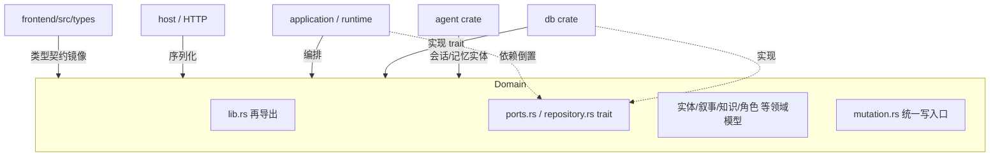
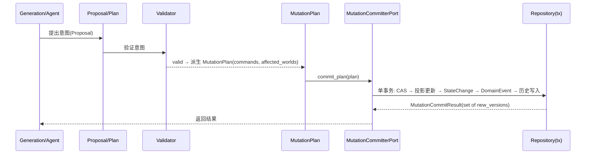

# domain（领域模型层）

## 1. 概述

`domain` 是整个小说生成引擎的**领域模型层（Domain Layer）**，位于分层架构的核心位置。它定义了小说创作系统中所有跨进程共享的纯领域概念：世界（World）、实体（Entity）、叙事结构（NarrativeNode 树）、知识/信息差（Knowledge/Revelation）、角色认知（Character Mind）、规则宪法（Canon）、变更提案与验证（ProposedChange/Validator）、统一写入口（Mutation）、生成运行时（Skill/GenerationTask/ContextPackage）等。

- **分层位置**：`domain` 处于 `runtime`（执行编排）、`application`（服务编排）、`db`（持久化）、`infrastructure`（LLM/检索）等上层之下，是被依赖的"地基"。它本身**不依赖**任何数据库、HTTP 或 LLM 库（除 `async_trait`、`serde`、`chrono`、`uuid`、`sha2`、`anyhow`、`thiserror`、`serde_json` 等基础 crate），因此可被任意上层安全引用而不会产生循环依赖。
- **依赖倒置边界**：`ports.rs` 与 `repository.rs` 中定义的 trait 是应用层与持久层之间的依赖反转边界——`runtime`/`application` 只依赖这些 trait，具体实现（Postgres/sqlx）由 `db` crate 在组合根注入（见 `crates/domain/src/ports.rs:1-9`）。
- **被谁依赖**：`host`（HTTP 层）、`application`/`runtime`（服务编排）、`db`（仓储实现）、`agent`（会话与记忆实体）、`frontend` 通过 `frontend/src/types` 中的 TypeScript 类型与 domain 的 Rust 类型形成契约镜像（见第 5 节对照）。

## 2. 模块职责（逐条列出对外提供的能力/类型）

按文件（模块）逐一列出 domain 对外暴露的核心类型与能力：

| 模块文件 | 对外提供的主要类型 / 能力 |
|---|---|
| `entity.rs` | `EntityType`/`EntityType` 常量（CHARACTER/LOCATION/...）、`Entity`、`Relation`、`Fact`、`Event`、`StateChange`、`StateChangeType`（统一实体模型，见 `crates/domain/src/entity.rs:17` 起） |
| `world.rs` | `World`（世界顶层容器，含 `Default` 实现，`crates/domain/src/world.rs:12`） |
| `character.rs` | `CharacterProfile`、`CharacterState`、`CharacterTrait`、`CharacterDrive`、`CharacterConflict`、`CharacterRelationship`、`CharacterSecret`、`CharacterCapability`、`CharacterArcPotential`、`CharacterExtension`（题材扩展）及 `AgeRange`/`Gender`/`StoryRole`/`ConflictType`/`TraitType` 枚举（`crates/domain/src/character.rs:1`） |
| `faction.rs` | `FactionProfile`（`crates/domain/src/faction.rs:11`） |
| `state.rs` | `CurrentState`（只读投影）、`StateChangeRecord`（append-only 历史）、`ResourceState`（`crates/domain/src/state.rs:14`） |
| `narrative.rs` | `NarrativeNode`、`NarrativeNodeType`、`NarrativeNodeStatus`、`VolumeAttributes`/`ArcAttributes`/`SceneAttributes`/`BeatAttributes`、`Scene`、`SceneEntity`、`SceneRequirement`/`RequirementPriority`、`CharacterArc`、`NarrativeState`、`StateDimension`（统一叙事树 + 叙事状态，`crates/domain/src/narrative.rs:39`） |
| `knowledge.rs` | `KnowledgeState`、`KnowledgeLevel`、`KnowledgeSubjectType`、`Revelation`、`RevelationTarget`、`CharacterKnowledgeItem`（`crates/domain/src/knowledge.rs:25`） |
| `ports.rs` | 全部仓储端口 trait：`NarrativePort`/`EntityPort`/`StatePort`/`KnowledgePort`/`RelationPort`/`EventPort`/`CanonRulePort`/`ContextSnapshotPort`/`ValidationPort`/`ApprovalPort`/`ProposedChangeQueryPort`/`StateCommitterPort`/`GenerationRepositoryPort`/`LlmPort`/`PromptRepositoryPort`/`ContextSnapshotRepositoryPort`/`NarrativeRepositoryPort`/`ApprovalRepositoryPort`/`ProposalRepositoryPort`/`TimelineRepositoryPort`/`StorylineRepositoryPort`/`ForeshadowRepositoryPort`/`WorldRepositoryPort`/`ProjectRepositoryPort`/`RuleRepositoryPort`/`HistoryRepositoryPort`/`SnapshotRepositoryPort`/`NarrativeStateWritePort`/`TraceQueryPort`/`EntityRepositoryPort`/`ProjectResolverPort`，及 `AgentPromptConfig`（`crates/domain/src/ports.rs:33` 起） |
| `generation.rs` | `Skill`、`GenerationTask`/`TaskStatus`、`TokenUsage`、`ContextPackage`/`ContextLayer`、`RetrievedDocRef`、`ReproducibilityMeta`、`GenerationRun`（`crates/domain/src/generation.rs:15`） |
| `validation.rs` | `ProposedChange`、`ProposedChangeType`、`ChangePayload`、`ProposedChangeStatus`（含状态机 `can_transition_to`）、`ValidationRun`/`ValidationStatus`、`ValidationIssue`、`CommitResult`/`CommitResponse`、`ValidationIssueType`、`IssueSeverity`（`crates/domain/src/validation.rs:17`） |
| `skill.rs` | `SkillDefinition`、`ContextPolicy`/`ContextPolicyConfig`/`ContextLayerType`、`SkillType`/`SkillStatus`、`SkillVersion`、`SkillTemplates`（13 种预定义 Skill）、`SkillTemplate`（`crates/domain/src/skill.rs:1`） |
| `project.rs` | `Project`、`ProjectStatus`（`crates/domain/src/project.rs:11`） |
| `canon.rs` | `RuleLevel`、`EnforcementAction`、`CanonRule`、`FactCertainty`、`SourceType`（`crates/domain/src/canon.rs:15`） |
| `ledger.rs` | `SceneLedger` 及 `LedgerEvent`/`LedgerItem`/`RelationshipChange`/`KnowledgeChange`/`WorldChange`/`ForeshadowingMention`/`StorylineProgress`/`CharacterGrowth`、`ContextTraceItem`/`VisibilityInfo`、`DecisionTrace`/`DecisionFactor`（叙事账本，`crates/domain/src/ledger.rs:12`） |
| `identity.rs` | `EntityAlias`/`AliasType`、`IdentityTimeline`、`TestCase`/`TestType`/`TestStatus`、`TestResult`（实体别名、身份时间线、测试集，`crates/domain/src/identity.rs:13`） |
| `storyline.rs` | `Storyline`/`StorylineStatus`/`StorylineImportance`、`StorylineScene`（`crates/domain/src/storyline.rs:38`） |
| `visibility.rs` | `VisibilityLevel`、`VisibilitySubjectType`、`FactVisibility`（`crates/domain/src/visibility.rs:12`） |
| `approval.rs` | `ApprovalStatus`、`ApprovalTargetType`、`ApprovalRecord`（人工审批门，`crates/domain/src/approval.rs:12`） |
| `foreshadowing.rs` | `ForeshadowingStatus`/`ForeshadowingImportance`/`HintLevel`、`Foreshadowing`（`crates/domain/src/foreshadowing.rs:12`） |
| `causal.rs` | `CausalRelationType`/`CausalStrength`、`CausalRelation`（因果链，`crates/domain/src/causal.rs:12`） |
| `reader.rs` | `ReaderKnowledgeLevel`/`ReaderConfidence`、`ReaderKnowledge`（`crates/domain/src/reader.rs:12`） |
| `contract.rs` | `SceneContract`（场景契约，`crates/domain/src/contract.rs:15`） |
| `quality.rs` | `QualityScore`、`QualityIssue`（`crates/domain/src/quality.rs:11`） |
| `branch.rs` | `BranchStatus`、`WorldBranch`、`NarrativeBranch`（版本分支，`crates/domain/src/branch.rs:11`） |
| `repository.rs` | trait-only 仓储定义：`EntityRepository`/`ProjectRepository`/`WorldRepository`/`NarrativeRepository`/`KnowledgeRepository`/`ValidationRepository`/`StateRepository`（`crates/domain/src/repository.rs:20` 起） |
| `events.rs` | `DomainEvent`/`DomainEventType`、`EventMetadata`、`EventDispatcher`/`EventSubscriber`、`InMemoryAuditLog`（领域事件日志，`crates/domain/src/events.rs:10`） |
| `mutation.rs` | `MutationSource`/`MutationTargetType`/`MutationPayload`、`MutationCommand`、`MutationCommitResult`、`MutationPlan`、`MutationBatch`、`MutationError`、`MutationCommitterPort`（统一写入口，ChatGPT 评审 P0，`crates/domain/src/mutation.rs:19` 起） |
| `story_contract.rs` | `StoryContract`/`CreateStoryContractRequest`（卷/弧完成条件，`crates/domain/src/story_contract.rs:12`） |
| `narrative_budget.rs` | `NarrativeBudget`（含 `usage_ratio`/`should_warn`/`add_words`）、`PacingWarning`（`crates/domain/src/narrative_budget.rs:12`） |
| `narrative_thread.rs` | `NarrativeThreadStatus`/`NarrativeThreadImportance`、`NarrativeThread`、`NarrativeThreadParticipant`（`crates/domain/src/narrative_thread.rs:21`） |
| `novel_snapshot.rs` | `NovelStateSnapshot`（整本小说宏观快照，`crates/domain/src/novel_snapshot.rs:18`） |
| `character_mind.rs` | `Belief`、`MemoryType`/`Memory`、`CharacterGoalMind`/`GoalStatus`、`CharacterFear`、`EmotionState`（角色认知模型，`crates/domain/src/character_mind.rs:14`） |
| `state_mgmt.rs` | `StateSnapshot`、`KnowledgeGap`/`GapStatus`、`ChapterSummary`/`ArcSummary`/`VolumeSummary`/`GlobalStoryState`（回滚/知识缺口/多级记忆，`crates/domain/src/state_mgmt.rs:13`） |
| `repair.rs` | `RepairType`/`RepairStatus`、`PlotRepair`（剧情修复，`crates/domain/src/repair.rs:11`） |
| `world_version.rs` | `WorldVersionKind`、`WorldVersion`（Canon 版本边界，`crates/domain/src/world_version.rs:13`） |
| `util.rs` | `sha256_hex`、`deterministic_uuid`（跨进程可复现哈希工具，`crates/domain/src/util.rs:10`） |
| `extraction.rs` | `EntityCandidate`/`RelationCandidate`/`ExtractionResult`（M1 文本抽取候选，`crates/domain/src/extraction.rs:21`） |
| `agent_store.rs` | `ChatMessage`/`AgentSession`、`SessionStore` trait、`MemoryItem`/`AgentMemory` trait（Agent 会话与记忆实体/端口，`crates/domain/src/agent_store.rs:15` 起） |
| `lib.rs` | 模块声明 + 全部类型的 `pub use` 扁平再导出（`crates/domain/src/lib.rs:1`） |

## 3. 依赖关系

**依赖的 crate（domain 自身引入）**：`serde`（含 `serde_json`）、`chrono`、`uuid`、`async_trait`、`anyhow`、`thiserror`、`sha2`、`futures`（仅 `ports.rs` 的 `LlmPort::stream_complete` 用到 `Pin<Box<dyn Stream>>`）。这些是纯库依赖，**不含任何 sqlx/postgres/axum/reqwest/LLM 客户端**，因此 domain 是强可复用、可单测的纯领域层（验证：所有文件未出现 `sqlx::`、`PgPool`、`reqwest`、`axum` 等符号）。

**被谁依赖**：`db`（实现 `ports.rs`/`repository.rs` 中的 trait）、`application`/`runtime`（消费领域类型与 trait，编排生成/验证/提交）、`host`（HTTP 层序列化领域类型到 JSON）、`agent`（使用 `agent_store.rs` 的 `AgentSession`/`MemoryItem`）、`frontend`（通过 `frontend/src/types` 镜像领域契约）。



## 4. 目录与源码对照

| 文件路径 | 大约行数 | 主要职责 |
|---|---|---|
| `crates/domain/src/lib.rs` | 76 | 模块声明 + 全量 `pub use` 扁平再导出 |
| `crates/domain/src/entity.rs` | 156 | 实体/关系/事实/事件/状态变更统一模型 |
| `crates/domain/src/world.rs` | 40 | 世界容器（含 Default） |
| `crates/domain/src/character.rs` | 357 | 通用人物设定模型与子结构 |
| `crates/domain/src/faction.rs` | 38 | 势力档案 |
| `crates/domain/src/state.rs` | 56 | 世界当前状态投影 / 状态历史 / 资源状态 |
| `crates/domain/src/narrative.rs` | 258 | 统一叙事树 + 叙事状态维度 |
| `crates/domain/src/knowledge.rs` | 93 | 知识状态 / 揭示 / 角色已知事实 |
| `crates/domain/src/ports.rs` | 666 | 全部仓储端口 trait（依赖反转边界） |
| `crates/domain/src/generation.rs` | 183 | 生成任务 / 上下文包 / 可复现元数据 |
| `crates/domain/src/validation.rs` | 345 | 提案 / 验证运行 / 提交结果 / 状态机 |
| `crates/domain/src/skill.rs` | 830 | Skill 定义 + 13 种预定义模板 + 上下文策略 |
| `crates/domain/src/project.rs` | 49 | 项目顶层模型 |
| `crates/domain/src/canon.rs` | 182 | 世界规则宪法 / 事实确定性 / 来源类型 |
| `crates/domain/src/ledger.rs` | 160 | 场景叙事账本 + 上下文/决策追踪 |
| `crates/domain/src/identity.rs` | 181 | 实体别名 / 身份时间线 / 测试集 |
| `crates/domain/src/storyline.rs` | 62 | 跨卷剧情线 |
| `crates/domain/src/visibility.rs` | 47 | 事实可见性控制 |
| `crates/domain/src/approval.rs` | 64 | 人工审批闸门 |
| `crates/domain/src/foreshadowing.rs` | 70 | 伏笔系统 |
| `crates/domain/src/causal.rs` | 48 | 事件因果链 |
| `crates/domain/src/reader.rs` | 52 | 读者认知状态 |
| `crates/domain/src/contract.rs` | 34 | 场景契约 |
| `crates/domain/src/quality.rs` | 42 | 六维质量评分 |
| `crates/domain/src/branch.rs` | 47 | 世界/叙事版本分支 |
| `crates/domain/src/repository.rs` | 95 | trait-only 仓储定义 |
| `crates/domain/src/events.rs` | 281 | 领域事件 + 分发器 + 内存审计日志 |
| `crates/domain/src/mutation.rs` | 552 | 统一 Canon 写入口（P0） |
| `crates/domain/src/story_contract.rs` | 196 | 卷/弧完成条件契约 |
| `crates/domain/src/narrative_budget.rs` | 85 | 字数预算与节奏预警 |
| `crates/domain/src/narrative_thread.rs` | 77 | 活跃剧情线推进追踪 |
| `crates/domain/src/novel_snapshot.rs` | 68 | 整本小说宏观快照 |
| `crates/domain/src/character_mind.rs` | 178 | 角色认知模型（信念/记忆/目标/恐惧/情绪） |
| `crates/domain/src/state_mgmt.rs` | 138 | 回滚快照 / 知识缺口 / 多级记忆 |
| `crates/domain/src/repair.rs` | 43 | 剧情修复记录 |
| `crates/domain/src/world_version.rs` | 72 | 世界（Canon）版本边界 |
| `crates/domain/src/util.rs` | 51 | sha256 / 确定性 UUID 工具 |
| `crates/domain/src/extraction.rs` | 72 | LLM 文本抽取候选结构 |
| `crates/domain/src/agent_store.rs` | 77 | Agent 会话与记忆端口/实体 |
| `crates/domain/tests/change_payload_property.rs` | 68 | payload↔change_type 契约回归测试 |

## 5. 字段设计

### 5.1 核心 struct 字段表（节选最关键者）

**`NarrativeNode`（`crates/domain/src/narrative.rs:39`）**

| Rust 类型 | 字段 | 含义 | 源码位置 |
|---|---|---|---|
| `Uuid` | `id` | 节点唯一 ID | `narrative.rs:40` |
| `Uuid` | `project_id` | 所属项目 | `narrative.rs:41` |
| `Uuid` | `world_id` | 所属世界 | `narrative.rs:42` |
| `NarrativeNodeType` | `node_type` | 层级（卷/弧/场景…） | `narrative.rs:43` |
| `Option<Uuid>` | `parent_id` | 父节点（树形关系） | `narrative.rs:44` |
| `String` | `title` | 标题 | `narrative.rs:45` |
| `Option<String>` | `description` | 描述 | `narrative.rs:46` |
| `Option<String>` | `content` | 正文草稿 | `narrative.rs:48` |
| `serde_json::Value` | `attributes` | 类型特有扩展属性 | `narrative.rs:50` |
| `i32` | `sort_order` | 排序 | `narrative.rs:51` |
| `NarrativeNodeStatus` | `status` | 节点状态 | `narrative.rs:52` |

**`Entity`（`crates/domain/src/entity.rs:46`）**

| Rust 类型 | 字段 | 含义 | 源码位置 |
|---|---|---|---|
| `Uuid` | `id` | 实体 ID | `entity.rs:47` |
| `Uuid` | `world_id` | 所属世界 | `entity.rs:49` |
| `Uuid` | `entity_type_id` | 实体类型 ID | `entity.rs:50` |
| `serde_json::Value` | `attributes` | 自由属性 | `entity.rs:55` |
| `i32` | `version` | 乐观锁版本号 | `entity.rs:57` |
| `String` | `created_by` | 创建者 | `entity.rs:59` |

**`MutationCommand`（`crates/domain/src/mutation.rs:126`）**

| Rust 类型 | 字段 | 含义 | 源码位置 |
|---|---|---|---|
| `Uuid` | `command_id` | 幂等键 | `mutation.rs:128` |
| `Uuid` | `target` | 目标对象 ID | `mutation.rs:131` |
| `MutationTargetType` | `target_type` | 被修改对象类型 | `mutation.rs:132` |
| `Option<i32>` | `expected_version` | 乐观锁版本（CAS） | `mutation.rs:134` |
| `MutationSource` | `source` | 变更来源 User/AI/System | `mutation.rs:135` |
| `MutationPayload` | `payload` | 具体变更内容 | `mutation.rs:136` |

**`Skill`（generation 层，`crates/domain/src/generation.rs:15`）** 关键字段：`id`/`name`/`skill_type: SkillType`/`version: i32`/`prompt_template: String`/`input_schema`/`output_schema`/`default_params`/`status: SkillStatus`，见 `generation.rs:16-31`。

### 5.2 domain ↔ 前端 types 三源对照（逐条列出字段名/结构不一致）

下表以"前端 `frontend/src/types/*.ts`"为对照基准，逐条列出与 domain 领域模型**字段名或结构不一致**的位置（一致项不赘述）：

1. **`CharacterProfile` 字段大量不一致**：前端 `character.ts:5-18` 使用 `real_name`/`nickname`/`age: string`/`social_status: string`/`background`；domain 的 `character.rs:278-305` 使用 `name`/`aliases: Vec<String>`/`age: Option<AgeRange>`（枚举）/ `social_position: Option<SocialPosition>`（结构化）/ `background_origin`。→ 前端仍停留在旧版"真人档案"形态，未对齐 R2 通用人物模型（`character.rs:1-7`）。
2. **`CharacterState` 不一致且倒退**：前端 `character.ts:20-29` 仍用 `health?`/`cultivation?`/`money?`/`wanted?: boolean`；domain `character.rs:309-328` 已改为 `physical_state`/`mental_state`/`resource_state`/`social_state`/`flags`/`extra`。→ 前端为玄幻特化旧字段，domain 已抽象去题材化（`character.rs:308`）。
3. **`Fact.certainty` 枚举值冲突**：前端 `world.ts:69` 为 `'Confirmed' | 'Likely' | 'Rumor' | 'Uncertain'`；domain `canon.rs:100-115` 为 `Canon`/`Probable`/`Rumor`/`Belief`/`Speculation`/`FalseBelief`/`Unknown`，且 `as_str` 输出 `'CANON'` 等大写（`canon.rs:118`）。→ 关键字完全错位（`Confirmed` vs `Canon`、`Uncertain` 不存在）。
4. **`KnowledgeLevel` 枚举值不一致**：前端 `knowledge.ts:6` 为 `'Unknown'|'Hearsay'|'Partial'|'Complete'|'Misunderstood'|'FalseBelief'`；domain `knowledge.rs:44-55` 多一个 `Partial`/`Hearsay`/`Complete`/`Misunderstood` 但**缺少 `FalseBelief`**（domain 的 `FalseBelief` 在 `canon.rs:111` 属 `FactCertainty`，不在 `KnowledgeLevel`）。→ 两处枚举语义错位（`knowledge.ts:6` vs `knowledge.rs:44`）。
5. **`Foreshadowing` 字段不一致**：前端 `narrative.ts:106-117` 为 `planted_scene_id?`/`revealed_scene_id?`/`related_entity_ids: string[]`；domain `foreshadowing.rs:53-69` 为 `storyline_id?`/`introduced_at?`/`expected_reveal_at?`/`actual_reveal_at?`，**无 `related_entity_ids`**。→ 字段命名与集合语义均不同（`narrative.ts:114-116` vs `foreshadowing.rs:56-67`）。
6. **`ApprovalRecord` 字段命名不一致**：前端 `approval.ts:15-24` 用 `reviewer?`/`review_notes?`；domain `approval.rs:48-63` 用 `reviewer_id?`/`reviewer_comment?`。→ 序列化键不匹配（`approval.ts:21-22` vs `approval.rs:59-61`）。
7. **`StoryContract` 前端完全缺失**：domain `story_contract.rs:12` 定义了完整结构（mission/objectives/required_events/completion_progress…），但 `frontend/src/types` 下**无任何 `StoryContract` 类型**（`index.ts:1-13` 未导出）。→ 前端未建模卷/弧完成契约。
8. **`GenerationTask.status` 不一致**：前端 `generation.ts:14-21` 为 `'Pending'|'BuildingContext'|'Generating'|'Validating'|'Completed'|'Failed'|'Cancelled'`；domain `generation.rs:55-62` 为 `Pending|Running|Completed|Failed|Cancelled`，**无 `BuildingContext`/`Validating`**。→ 状态集合不同步（`generation.ts:15` vs `generation.rs:56`）。
9. **`GenerationTask` 字段差异**：前端 `generation.ts:23-35` 含 `type: GenerationTaskType`/`target_id`/`parameters`/`context_tokens?`/`result?`；domain `generation.rs:40-52` 为 `skill_id?`/`scene_id?`/`input`/`output?`/`token_usage?`/`error?`/`completed_at?`。→ 字段名与结构均不同。
10. **`EntityCandidate`/`RelationCandidate` 大致一致**：前端 `proposal.ts:42-54` 与 domain `extraction.rs:21-46` 字段对齐（含 `default` 默认 `"Character"`），是唯一成对同步良好的契约（`proposal.ts:41` 注释亦明言对应 `domain::extraction::ExtractionResult`）。
11. **`StateChangeType` 前端用 `{Custom: string}` 但不含 `Custom` 字符串分支细节**：前端 `world.ts:101-108` 与 domain `entity.rs:141-155` 枚举变体一致，但 domain 的 `Custom(String)` 在 serde 下为 `{"Custom":"..."}` 形式，需确认前端 `Custom` 元组变体解析一致。
12. **`Project` 的 `CreateProjectInput`/`UpdateProjectInput` 部分缺失**：前端 `project.ts:27-34` 仅支持 `name`/`description`，但 domain `Project`（`project.rs:11-32`）含 `language`/`world_setting`/`system_setting`/`default_model` 等丰富字段，`ProjectRepositoryPort::create_project`（`ports.rs:501-506`）亦接收 `language`。→ 创建项目时前端未传递 language 等字段。
13. **`CharacterKnowledgeItem` 无前端类型**：domain `knowledge.rs:87-92` 定义了 `CharacterKnowledgeItem`（供 Context Engine 渲染），`frontend/src/types` 无对应镜像。
14. **`ReproducibilityMeta`/`GenerationRun` 可复现字段前端未建模**：domain `generation.rs:124-182` 含 `world_version`/`temperature`/`retrieval_strategy`/`prompt_hash`/`retrieved_documents` 等 AI 追溯字段，前端 `generation.ts` 仅有 `result?`/`error?`，无法渲染 AI Trace 页（`ports.rs:591-601` 的 `TraceQueryPort` 亦无前端对应）。
15. **`World` 的 `config` 一致**（`world.ts:12` 与 `world.rs:20` 均为 `serde_json::Value`/`Record`），但前端 `World` 缺 `updated_at` 之外的 `description` 已存在，基本对齐。

## 6. 核心流程

### 6.1 统一 Canon 写入口流程（P0，最核心收口逻辑）

domain 通过 `mutation.rs` 强制"任何 Canon 写操作都经过唯一边界"：



关键代码：`MutationCommitterPort` 默认实现 `commit_plan` 将 `MutationPlan` 展开为 `MutationBatch` 并提交（`crates/domain/src/mutation.rs:305-316`）；`MutationBatch` 携带 `affected_worlds` 以在同一事务推进 `world_version`（`mutation.rs:249-256`）；`MutationCommand::new` 默认 `source = User`（`mutation.rs:333` 等）。

### 6.2 上下文组装与可复现性流程

`ContextPackage` 按 L0–L6 分层（`generation.rs:76-101`），`ReproducibilityMeta` 记录 `world_version`/`model`/`temperature`/`retrieval_strategy`/`prompt_hash`/`retrieved_documents`（`generation.rs:124-139`）。`GenerationRepositoryPort::create_run`（`ports.rs:186-198`）与 `LlmPort::complete`/`stream_complete`（`ports.rs:205-221`）构成生成运行时契约，使"为何两次生成结果不同"可被审计。

## 7. 接口/类型签名（关键 pub trait / pub fn / pub struct 签名）

```rust
// 统一 Canon 写入口（crates/domain/src/mutation.rs:287）
#[async_trait]
pub trait MutationCommitterPort: Send + Sync {
    async fn commit(&self, cmd: MutationCommand) -> Result<MutationCommitResult, MutationError>;
    async fn commit_batch(&self, batch: MutationBatch) -> Result<Vec<MutationCommitResult>, MutationError>;
    async fn commit_plan(&self, plan: MutationPlan) -> Result<Vec<MutationCommitResult>, MutationError> {
        // 默认展开为 batch
    }
}

// 叙事状态回写端口（crates/domain/src/ports.rs:580）
#[async_trait]
pub trait NarrativeStateWritePort: Send + Sync {
    async fn upsert_state(&self, project_id: Uuid, dimension: StateDimension,
                          state_key: &str, state_value: serde_json::Value) -> Result<()>;
}

// LLM 端口（crates/domain/src/ports.rs:205）
#[async_trait]
pub trait LlmPort: Send + Sync {
    async fn complete(&self, system_prompt: &str, user_prompt: &str, model: &str) -> Result<String>;
    async fn stream_complete(&self, system_prompt: &str, user_prompt: &str, model: &str)
        -> Result<Pin<Box<dyn Stream<Item = Result<String>> + Send>>> { /* 默认回退 complete */ }
}

// 提案状态机（crates/domain/src/validation.rs:194）
impl ProposedChangeStatus {
    pub fn can_transition_to(&self, new_status: &ProposedChangeStatus) -> bool { /* matches! 状态机 */ }
}

// StoryContract 完成度（crates/domain/src/story_contract.rs:147）
impl StoryContract {
    pub fn new(request: CreateStoryContractRequest) -> Self;
    pub fn mark_event_completed(&mut self, event: &str);
    pub fn check_exit_conditions(&self) -> Vec<String>;
    pub fn is_complete(&self) -> bool;
}

// NarrativeBudget 节奏预警（crates/domain/src/narrative_budget.rs:57）
impl NarrativeBudget {
    pub fn new(project_id: Uuid, narrative_node_id: Uuid, allocated_words: i32) -> Self;
    pub fn usage_ratio(&self) -> f64;
    pub fn should_warn(&self) -> bool;
    pub fn add_words(&mut self, words: i32);
}

// 确定性工具（crates/domain/src/util.rs:10）
pub fn sha256_hex(s: &str) -> String;
pub fn deterministic_uuid(label: &str) -> Uuid;

// 事件分发器（crates/domain/src/events.rs:159）
impl EventDispatcher {
    pub fn new() -> Self;
    pub fn add_subscriber(&mut self, subscriber: Box<dyn EventSubscriber>);
    pub fn dispatch(&self, event: &DomainEvent) -> Result<()>; // 单 subscriber 失败不中断
}

// Skill 模板转定义（crates/domain/src/skill.rs:774）
impl SkillTemplate { pub fn to_definition(self) -> SkillDefinition; }
```

## 8. 问题/代码异味

1. **前后端类型严重不同步（职责/契约风险）**：`CharacterProfile`/`CharacterState`/`Fact.certainty`/`KnowledgeLevel`/`Foreshadowing`/`ApprovalRecord` 等前端类型与 domain 模型字段名和枚举值错位（见第 5.2 节条目 1–9，证据 `frontend/src/types/character.ts:5-29`、`world.ts:69`、`knowledge.ts:6`、`narrative.ts:106-117`、`approval.ts:21-22`）。会导致序列化反序列化失败或前端渲染错乱。
2. **`StoryContract` 等关键模型前端完全没有类型**（`frontend/src/types/index.ts:1-13` 未导出，domain 侧 `crates/domain/src/story_contract.rs:12` 已定义）。前端可能无法编辑卷/弧完成条件。
3. **两套并行 Repository 抽象，职责重叠**：`ports.rs`（运行时端口，偏 JSON 返回值）与 `repository.rs`（trait-only，偏领域类型）同时存在，且各自定义 `WorldRepository`（前者 `ports.rs:391`，后者 `repository.rs:42`），命名冲突且职责不清（`crates/domain/src/ports.rs:391` vs `crates/domain/src/repository.rs:42`）。同一概念两份 trait 易引发实现混乱。
4. **`WorldRepositoryPort` 自述为"系统级写入"与统一写入口矛盾**：注释称 `set_entity_state`/`record_event` 直接写 Canon，与 `mutation.rs:281-285` 宣称的"只有 MutationCommitter 能决定 Canon 写语义"相矛盾（`crates/domain/src/ports.rs:386-389`）。属于收口不彻底（ChatGPT 评审 P3 遗留）。
5. **`ContextPolicy` 与 `ContextPolicyConfig` 冗余双表示**：`skill.rs:27` 定义强类型 `ContextPolicy`（含 `ContextLayerType` 枚举），`skill.rs:102` 又定义可序列化 `ContextPolicyConfig`（层用 `String`）。`from_policy`（`skill.rs:112`）用 `format!("{:?}", l)` 把枚举变成 `"L0Essential"` 字符串——一旦枚举调试名变化即破坏序列化稳定性，且层名与 `generation.rs:83-95` 的 `ContextLayer` 字段命名（如 `l0_essential`）不一致（`skill.rs:115` vs `generation.rs:83`）。
6. **`ChangePayload`（`validation.rs:62`）与 `MutationPayload`（`mutation.rs:51`）功能重叠**：两者都描述"状态变更/实体创建/关系创建/知识更新"等，但分别服务于旧（ProposedChange）与新（Mutation）两条写路径，存在重复建模，是迁移期双轨制的典型异味（`validation.rs:62-92` vs `mutation.rs:51-119`）。
7. **`StoryContract` 的 `update_progress` 忽略 `required_revelations`/部分字段**：`completion_progress` 计算（`story_contract.rs:109-117`）仅统计 `required_events`/`required_character_changes`/`required_world_changes`，但结构体同时有 `required_revelations`（`:24`）却不被计入进度，语义不完整。
8. **`validation.rs` 引用 `crate::StateChangeRecord` 但不知其定义位置**：`validation.rs:10` `use crate::StateChangeRecord;` 实际定义在 `state.rs:30`（非 validation 模块），靠 `lib.rs` 全局 `pub use` 扁平导出才能解析（`crates/domain/src/state.rs:30`、`lib.rs:68`）。跨模块隐含依赖，可读性差。
9. **`ForeshadowingImportance`/`ForeshadowingStatus`/`HintLevel` 在前端枚举值一致但 `Foreshadowing` 实体字段错位**（见第 5.2 条目 5）：枚举对齐、结构体未对齐，属于部分迁移。
10. **`generation.rs` 的 `GenerationTask.output` 与前端 `result` 字段名不一致**：domain `output: Option<Value>`（`generation.rs:46`），前端 `result?: string`（`generation.ts:31`），且类型（JSON vs string）不同。
11. **`Skill`（`generation.rs:15`）与 `SkillDefinition`（`skill.rs:79`）几乎重复**：两者字段高度重合（name/description/skill_type/version/prompt_template/input_schema/output_schema/default_params/status），分别位于 generation 与 skill 两个模块，是拆分粒度问题（`generation.rs:15-32` vs `skill.rs:78-98`）。
12. **`repository.rs` 的 `WorldRepository` 缺少 `create_world`/`ensure_main_world` 等**：与 `ports.rs:391` 的丰富接口相比，`repository.rs:42` 的 trait 功能不全，且二者语义（运行时 JSON vs 领域实体）未区分清楚。
13. **`AgentSession.current_step` 默认 `"项目初始化"` 硬编码中文**（`agent_store.rs:44`），且注释称"P1 仅记录，Workflow 引擎在 P2/P3 驱动"，属半成品状态标记（`crates/domain/src/agent_store.rs:30-44`）。
14. **未使用的导出/潜在死代码**：`util.rs` 被 `lib.rs:40` 再导出 `deterministic_uuid`/`sha256_hex`，但 `extraction.rs` 与多数模块未使用（仅 `generation.rs` 的 `RetrievedDocRef` 注释提及 hash），需确认是否被 db 层消费；`contract.rs::SceneContract` 与 `narrative::SceneAttributes` 字段大量重叠（required_events/forbidden_events/required_facts/world_changes），存在重复建模（`contract.rs:15-33` vs `narrative.rs:117-134`）。

## 9. 小结

`domain` crate 是整套小说生成系统的领域模型与契约中枢，覆盖世界/实体/叙事/知识/角色认知/规则宪法/变更提案与验证/统一写入口/生成运行时/上下文与可复现性/剧情修复与分支等完整概念，并通过 `ports.rs`/`repository.rs` 的 trait 实现依赖反转。其设计以"AI 只能提案、统一经过 `MutationCommitterPort` 收口写 Canon、World State ≠ Narrative State ≠ Character/Reader Knowledge"为核心原则，并引入 `world_version`（git-commit 式）与 `ReproducibilityMeta` 支撑可解释性与回滚。

主要风险集中在两点：① **前后端类型契约不同步严重**（第 5.2 / 第 8 节条目 1–10），多个核心模型字段名、枚举值甚至是否存在都错位，落地 `docs/modules/domain.md` 后应优先推动前端 `frontend/src/types` 与 domain 对齐；② **内部存在双轨制与重复建模**（`ports.rs` 与 `repository.rs` 两套 Repository、`ChangePayload` 与 `MutationPayload`、`Skill` 与 `SkillDefinition`、`SceneContract` 与 `SceneAttributes`），属于架构演进（P0–P3 收口）中的过渡异味，建议在文档中明确标注"哪些是已落地契约、哪些是待清理遗留"，避免主代理误判为最终形态。
