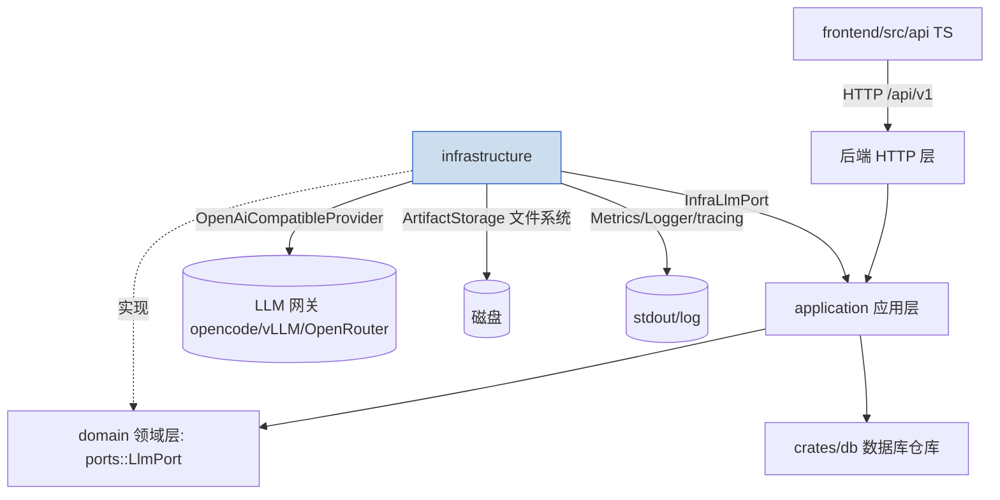
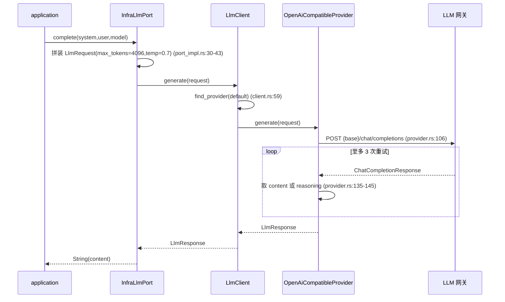

# infrastructure（基础设施层）

## 1. 概述

`infrastructure` 是分层架构中的**最底层实现层**（infrastructure layer），位于 `domain`（领域层，定义 port 与实体）与 `application`（应用层，编排用例）之下，负责把领域端口落到具体技术实现上。其模块根 `lib.rs` 的文档注释明确其职责边界：`//! Infrastructure Layer - Database, LLM abstraction, artifact storage, observability`，并指明数据库访问使用 `sqlx::PgPool`（`lib.rs:1-3`）。

本 crate 内部按四个子域组织：`database`（数据库封装）、`llm`（LLM 抽象与 HTTP 实现）、`artifacts`（大文本/产物磁盘存储）、`observability`（结构化日志、指标、tracing）。`lib.rs:5-11` 通过 `pub mod` 暴露这些子模块，并 re-export 了统一错误类型 `NovelError` 及其三个分层错误变体。

需要特别指出：当前 `database` 模块**没有任何实际实现**（`database/mod.rs:6-7` 注释说明核心仓库已迁至 `crates/db`，此模块仅保留为基础设施专用封装的占位），因此"数据库实现"在本 crate 中实际为空壳。真正承担"实现"职能的是 `llm`（对接领域端口 `domain::ports::LlmPort`）与 `artifacts`/`observability`。

## 2. 模块职责（逐条）

1. **统一错误模型**（`error.rs`）：定义分层错误 `DomainError`、`ApplicationError`、`InfrastructureError` 以及汇总的 `NovelError`，并提供 API 错误码常量表 `codes`（见 `error.rs:103-126`）。任意 `anyhow::Error` 可转换为 `NovelError::Internal`（`error.rs:96-100`），便于跨层错误归一。
2. **数据库封装**（`database/mod.rs`）：当前为**空模块**，仅保留注释说明职责已迁移至 `crates/db/src/repos/`；本模块预留给连接、事务、写队列等基础设施级封装。
3. **LLM 抽象与实现**（`llm/`）：定义 `LlmProvider` trait（`provider.rs:17`）、`LlmClient` 多 provider 管理器（`client.rs:12`）、请求/响应类型（`types.rs`）、以及一个真实可用的 OpenAI 兼容 HTTP provider（`provider.rs:37`）和对接领域端口 `LlmPort` 的 `InfraLlmPort`（`port_impl.rs:17`）。
4. **artifact 存储**（`artifacts/`）：定义 `Artifact`/`ArtifactType`（`types.rs`）与基于本地文件系统的 `ArtifactStorage`（`storage.rs:11`），用于把 LLM 大输出、快照、草稿等存到磁盘并以 `content_hash` 做完整性校验。
5. **可观测性**（`observability/`）：提供 `init_tracing()` 初始化 tracing（`tracing_setup.rs:6`）、`Logger` 包装（`logging.rs:6`）与进程内原子计数器 `Metrics`（`metrics.rs:9`）。

## 3. 依赖关系

- **对 `domain` 的依赖（仅单向接口耦合）**：`port_impl.rs:10` 直接 `use domain::ports::LlmPort;`，说明本 crate 是实现方，依赖领域层定义的端口契约。
- **对外部 crate 的依赖**：`sqlx`（数据库，见 `lib.rs:3` 注释）、`reqwest`（HTTP 客户端，`provider.rs:38`）、`async-trait`、`futures`、`async-stream`（流式 SSE 解析，`provider.rs:6-8`）、`sha2`（哈希，`storage.rs:5`）、`chrono`/`uuid`/`serde`（公共类型），`anyhow`/`thiserror`（错误处理，`provider.rs:3-4`、`error.rs:3`）。
- **实现哪些 port**：当前仅实现 `domain::ports::LlmPort`（由 `InfraLlmPort` 实现，`port_impl.rs:27-28`）。`LlmProvider` 是 infrastructure 内部自己的 trait，不是领域端口。
- **被依赖方向**：`application`/`api` 等上层通过 `InfraLlmPort` 间接使用本层；前端（`frontend/src/api`）通过 HTTP 协议与后端通信，不直接引用本 crate。



## 4. 目录与源码对照

| 文件路径 | 大约行数 | 主要职责 |
|---|---|---|
| `src/lib.rs` | 11 | 模块声明、re-export 错误类型；标注本层职责与 `sqlx::PgPool` |
| `src/error.rs` | 155 | 分层错误枚举 `DomainError/ApplicationError/InfrastructureError/NovelError` 及 `codes` 错误码表、单测 |
| `src/database/mod.rs` | 7 | 空壳占位，核心仓库已迁至 `crates/db` |
| `src/artifacts/mod.rs` | 7 | 声明 `storage`/`types` 子模块并 re-export |
| `src/artifacts/types.rs` | 29 | `ArtifactType` 枚举与 `Artifact` 结构体（含 `content_hash`/`storage_path`） |
| `src/artifacts/storage.rs` | 90 | 基于本地磁盘的 `ArtifactStorage`：store/retrieve/delete + SHA-256 校验 |
| `src/llm/mod.rs` | 13 | 声明 `provider/client/types/port_impl` 并 re-export 关键类型 |
| `src/llm/types.rs` | 34 | `LlmRequest`/`Message`/`LlmResponse`/`LlmUsage` 定义 |
| `src/llm/client.rs` | 136 | `LlmClient` 多 provider 管理：generate/stream_generate/generate_with_provider/health_check |
| `src/llm/provider.rs` | 236 | `LlmProvider` trait + `OpenAiCompatibleProvider` 真实 HTTP 实现（含重试与 SSE 流式） |
| `src/llm/port_impl.rs` | 72 | `InfraLlmPort` 实现 `domain::ports::LlmPort` 的 `complete`/`stream_complete` |
| `src/observability/mod.rs` | 9 | 声明 `logging/metrics/tracing_setup` 并 re-export |
| `src/observability/tracing_setup.rs` | 13 | `init_tracing()`：基于 `EnvFilter` + `fmt()` 初始化 |
| `src/observability/logging.rs` | 20 | `Logger` 包装，仅打印初始化日志 |
| `src/observability/metrics.rs` | 36 | 进程内 `AtomicU64` 计数器集合 `Metrics`（requests/errors/llm_calls） |

## 5. 字段/配置设计

### 5.1 LLM 请求/响应类型（`types.rs`）

| 类型 | 字段 | 说明（文件:行号） |
|---|---|---|
| `LlmRequest` | `messages: Vec<Message>`、`max_tokens: u32`、`temperature: f32` | `types.rs:7-11`；注意**没有** `model` 字段，模型由 provider 决定 |
| `Message` | `role: String`、`content: String` | `types.rs:14-18` |
| `LlmResponse` | `content: String`、`usage: LlmUsage`、`model: String` | `types.rs:21-26` |
| `LlmUsage` | `prompt_tokens` / `completion_tokens` / `total_tokens: u32` | `types.rs:29-33` |

### 5.2 `OpenAiCompatibleProvider` 配置（`provider.rs:37-55`）

| 字段 | 类型 | 说明 |
|---|---|---|
| `client` | `reqwest::Client` | 构造时固定 `timeout(120s)`（`provider.rs:48`），构建失败 `unwrap_or_default()` |
| `base_url` | `String` | 兼容端点前缀（不含 `/chat/completions`） |
| `api_key` | `Option<String>` | Bearer 鉴权，可选 |
| `model` | `String` | 实际请求的模型名 |

### 5.3 `Artifact` / `ArtifactType`（`types.rs`）

| 类型 | 字段 / 变体 | 说明（文件:行号） |
|---|---|---|
| `ArtifactType` | `LlmResponse` / `ContextSnapshot` / `Draft` / `Prompt` / `Image` / `Other(String)` | `types.rs:8-15` |
| `Artifact` | `id: Uuid`、`project_id: Uuid`、`artifact_type`、`content_hash: String`、`storage_path: String`、`mime_type: String`、`size_bytes: u64`、`metadata: serde_json::Value`、`created_at: DateTime<Utc>` | `types.rs:19-29` |

### 5.4 `Metrics` 计数器（`metrics.rs:16-18`）

| 计数器名 | 初始值 | 说明 |
|---|---|---|
| `requests_total` | 0 | 请求总数 |
| `errors_total` | 0 | 错误总数 |
| `llm_calls_total` | 0 | LLM 调用总数 |

## 6. 核心流程

### 6.1 一次 LLM 调用链路（非流式 `complete`）



要点：领域端口 `complete` 在 `port_impl.rs:29-47` 固定写死 `max_tokens: 4096`、`temperature: 0.7`，并显式 `let _ = model;` 丢弃了调用方传入的 `model` 参数（`port_impl.rs:44`）。`OpenAiCompatibleProvider::generate` 内置 3 次重试、2s 间隔、仅对 5xx 与网络错误重试（`provider.rs:115-174`）。

### 6.2 流式生成（`stream_generate`）

`LlmClient::stream_generate`（`client.rs:41-47`）→ `provider.rs:177-227` 发送 `stream: true` 请求，随后用 `stream!` 宏按行解析 `data:` SSE 分片，取出 `delta.content` 逐个 `yield`。遇到 `[DONE]` 结束（`provider.rs:212`）。`InfraLlmPort::stream_complete` 直接转发该 `TokenStream`（`port_impl.rs:49-71`）。

### 6.3 artifact 存取

`ArtifactStorage::store`（`storage.rs:22-38`）：生成 UUID → 计算 SHA-256 → 建 `base/project_id/` 目录 → 按 mime 扩展名写文件 → 返回含 `content_hash`/`storage_path` 的 `Artifact`。`retrieve`（`storage.rs:40-47`）读取后**重新计算哈希并与 `content_hash` 比对**，不一致则报错 `Artifact hash mismatch`。`delete` 仅在文件存在时 `remove_file`（`storage.rs:49-54`）。

### 6.4 日志/追踪初始化

`main`/启动处调用 `init_tracing()`（`tracing_setup.rs:6-13`）：优先读环境变量 `RUST_LOG`，缺失则默认 `info`；使用 `fmt()` 输出到 stdout。注意 `Logger::init`（`logging.rs:17-19`）只是用 `tracing::info!` 打印一句"已初始化"，与 `init_tracing` 功能重叠。

## 7. 接口/类型签名（关键 `pub` 成员，附 文件:行号）

| 签名 | 位置 | 说明 |
|---|---|---|
| `pub enum NovelError { Domain, Application, Infrastructure, Internal }` | `error.rs:82-94` | 统一错误；含 `#[from]` 转换 |
| `pub fn new(base_path: &str) -> Self`（`ArtifactStorage`） | `storage.rs:16` | 构造即 `create_dir_all` 且 `expect` 失败 |
| `pub fn store(...) -> Result<Artifact>` | `storage.rs:22` | 写磁盘 + 哈希 |
| `pub fn retrieve(&self, artifact: &Artifact) -> Result<Vec<u8>>` | `storage.rs:40` | 读 + 哈希校验 |
| `pub fn delete(&self, artifact: &Artifact) -> Result<()>` | `storage.rs:49` | 删文件 |
| `pub struct LlmClient { providers, default_provider }` | `client.rs:12-15` | 多 provider 管理 |
| `pub async fn generate(&self, request: LlmRequest) -> Result<LlmResponse>` | `client.rs:32` | 默认 provider 生成 |
| `pub async fn stream_generate(&self, request: LlmRequest) -> Result<TokenStream>` | `client.rs:41` | 默认 provider 流式 |
| `pub async fn health_check(&self) -> Result<Vec<(String, bool)>>` | `client.rs:64` | 全 provider 健康检查 |
| `pub type TokenStream = Pin<Box<dyn Stream<Item = Result<String>> + Send>>` | `provider.rs:13` | 流式类型别名 |
| `pub trait LlmProvider: Send + Sync` | `provider.rs:17` | `generate`/`stream_generate`(默认报错)/`name`/`health_check` |
| `pub struct OpenAiCompatibleProvider { client, base_url, api_key, model }` | `provider.rs:37` | OpenAI 兼容实现 |
| `pub fn new(base_url, api_key, model) -> Self` | `provider.rs:45` | 构造，固定 120s 超时 |
| `#[async_trait] impl LlmProvider for OpenAiCompatibleProvider` | `provider.rs:103-235` | 真实 HTTP 调用 + SSE 流式 |
| `pub struct InfraLlmPort { client: LlmClient }` | `port_impl.rs:17` | |
| `#[async_trait] impl LlmPort for InfraLlmPort` | `port_impl.rs:27` | `complete`/`stream_complete` |
| `pub fn init_tracing()` | `tracing_setup.rs:6` | 初始化 tracing |
| `pub struct Metrics { counters }` | `metrics.rs:9` | `new`/`increment`/`get`（`metrics.rs:14/24/30`） |

```rust
// port_impl.rs:27-47 —— 端口实现固定了生成参数
#[async_trait]
impl LlmPort for InfraLlmPort {
    async fn complete(&self, system_prompt: &str, user_prompt: &str, model: &str) -> Result<String> {
        let request = LlmRequest { /* max_tokens: 4096, temperature: 0.7 */ };
        let _ = model; // 模型参数被丢弃
        let response = self.client.generate(request).await?;
        Ok(response.content)
    }
}
```

## 8. 问题/代码异味（逐条，附证据）

1. **`database` 模块为空壳**：`database/mod.rs:6-7` 明确说明所有数据库功能已迁至 `crates/db`，但模块仍被 `lib.rs:6` 声明为 pub 模块且无任何实现，属于"声称提供数据库实现却无实现"的文档/实现不一致。
2. **未实现的 provider / 默认方法直接报错**：`LlmProvider::stream_generate` 默认实现 `anyhow::bail!("该 provider 未实现 stream_generate")`（`provider.rs:22-24`）。若未来新增 provider 却忘记覆盖，调用会直接失败——属于"未实现即报错"的隐性陷阱。同时已删除的 `LocalProvider` 仅由测试用 `MockProvider` 替代（`client.rs:80-106` 注释说明），真实本地离线 provider 缺失。
3. **硬编码生成参数，丢弃调用方 model**：`port_impl.rs:41-44` 将 `max_tokens=4096`、`temperature=0.7` 写死，并对传参 `model` 执行 `let _ = model;`，使领域端口 `complete(system, user, model)` 的 `model` 形同虚设。前端 `settings.ts` 的 `defaultModel`、`generation.ts` 的 `model?: string` 与 agent 提示词能力无法真正影响底层请求模型。
4. **`health_check` 永远返回 `true`**：`OpenAiCompatibleProvider::health_check`（`provider.rs:233-235`）直接 `Ok(true)`，并未探测实际端点可达性；`LlmClient::health_check`（`client.rs:64-71`）据此上报的"健康"不可信。
5. **可观测性缺口**：`Metrics`（`metrics.rs`）只提供内存计数器，**没有任何导出通道**（无 Prometheus、无日志、无 tracing span），`increment` 也从未在 `llm` 模块中被调用（仅定义了 `llm_calls_total`）。前端 `trace.ts` 期望后端上报 `latency_ms`/`token_usage`/`provider` 等字段，但 `provider.rs` 调用的结果未经任何 span 记录或指标埋点，无法支撑 `traceApi` 的"AI 可追溯"契约。
6. **与前端 API 契约不一致（流式协议）**：前端 `agent.ts` 的 `streamChat`（`agent.ts:154-221`）按**命名事件**（`event: token`/`status`/`done`/`error`/`tool`/`question`）解析 SSE `data:`，且后端走 POST + `fetch` `ReadableStream`（`agent.ts:168-177`）；而 `createSSE`/`client.ts` 的 `EventSource` 仅支持 GET + 默认 `message` 事件（`client.ts:32-38`）。`provider.rs` 的 SSE 输出是**裸 `data:` 行（无 `event:` 前缀）且基于 GET 语义的 OpenAI 流**（`provider.rs:210-217`），与 agent 的命名事件协议不是同一套，说明后端 agent 流与 infrastructure 层 LLM 流之间**缺少一层协议适配**。`generation.ts:13-14` 的 `stream` 也使用 `createSSE` GET 语义，与 `provider.rs` POST 流式不对应。
7. **错误处理不一致 / 静默转换**：`provider.rs:124` 用 `resp.text().await.unwrap_or_default()` 吞掉读取错误体时的异常；`agent.ts:13-15` 在前端对 `resp.json()` 失败用 `catch(()=>({message:...}))` 兜底。`health_check` 在 `client.rs:67` 用 `unwrap_or(false)` 吞掉所有错误，使"未知故障"被记为"不健康"。
8. **`ArtifactStorage::new` 使用 `expect`**：`storage.rs:18` 在目录创建失败时 `expect("Failed to create artifact storage directory")`，会令进程 panic，与 crate 内以 `Result` 传递错误的风格不一致，且未纳入 `InfrastructureError::ArtifactStorage` 体系。
9. **重复/冗余的可观测性组件**：`Logger`（`logging.rs`）与 `init_tracing`（`tracing_setup.rs`）职责高度重叠，`Logger::init` 仅打印一行日志，未配置任何 subscriber，属于死重代码。
10. **`LlmRequest` 与 provider 内部 body 字段不对称**：`LlmRequest`（`types.rs:7-11`）无 `model`，而 `provider.rs:108-113` 请求体需要 `model`——模型身份完全由 `OpenAiCompatibleProvider.model` 决定，领域层无法按请求级选择模型，限制了多模型路由能力。

## 9. 小结

`infrastructure` crate 在分层中定位清晰：它是 `domain::ports::LlmPort` 的**唯一实现方**（通过 `InfraLlmPort` + `LlmClient` + `OpenAiCompatibleProvider`），并提供 artifact 磁盘存储与基础可观测性原语。其 LLM 实现成熟度最高——具备 OpenAI 兼容 HTTP 调用、3 次重试、SSE 流式解析与 reasoning 字段兼容（`provider.rs:70-76`）。

但文档与实现存在多处落差：① `database` 模块为空壳，与"数据库实现"职责声明不符；② 领域端口传入的 `model` 被丢弃、生成参数硬编码（`port_impl.rs:44`）；③ 可观测性仅停留在内存计数器与 stdout 日志，既未埋点也未导出，无法支撑前端 `traceApi` 的"AI 可追溯"契约；④ infrastructure 层的 SSE 裸 `data:` 流与前端 agent 命名事件协议不是同一套，缺少适配层；⑤ `health_check` 恒真、`ArtifactStorage::new` 直接 panic 等实现降低了运行期健壮性。建议主代理落地文档时，重点标注"数据库实现缺失""model 参数被忽略""可观测性无导出/无埋点""SSE 协议与前端不一致"四项，作为后续重构的待办锚点。
