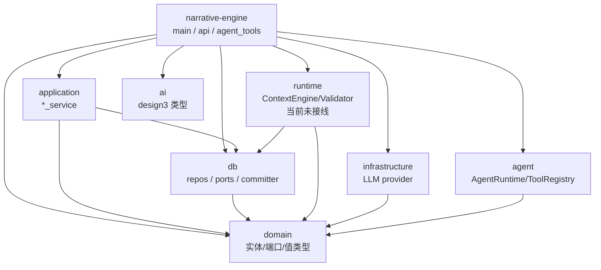
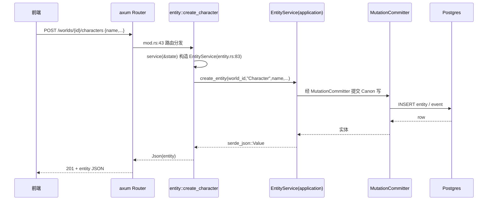

# narrative-engine（API 网关 / 顶层装配）

## 1. 概述

`narrative-engine` 是整个小说的**顶层 crate（composition root / host）**，职责有三层：

1. **HTTP API 网关**：用 `axum` 暴露 `/api/v1/*` 路由，把前端请求桥接到 `application` 层 service（src/api/mod.rs:27 `router()`）。所有 handler 都遵循「host 不直接写 SQL」约定——在 handler 内临时构造 `EntityService`/`NarrativeService` 等并调用其端口方法（例如 entity.rs:20 `fn service()`）。
2. **main 装配**：`main.rs` 负责加载 `.env`、连 PostgreSQL、跑 migrations、seed 实体类型、构造 `AgentRuntime`（LLM + 工具注册表 + 会话/记忆/提示词存储），最后 `axum::serve` 启动服务（main.rs:21-143）。
3. **agent_tools**：`agent_tools.rs` 是「组合根实现」的智能体领域工具，直接调用 `application` 层各 service，并经 `MutationCommitter` 统一 Canon 写路径（agent_tools.rs:1-15 注释）。覆盖 Entity / Narrative / Storyline / Foreshadow / Rule / Snapshot / World / History 共 8 个聚合，约 40 个工具（register_all_domain_tools 在 agent_tools.rs:1170）。

它依赖所有其他 crate：`domain`（实体/值类型/端口定义）、`application`（service）、`db`（repo/committer/resolver）、`runtime`（ContextEngine/Validator，但本 crate 当前未接线）、`infrastructure`（LLM provider）、`agent`（AgentRuntime/ToolRegistry）、`ai`（design3 类型）。

---

## 2. 模块职责

| 模块 | 职责 |
|------|------|
| `lib.rs` | 仅声明 `state` / `api` / `agent_tools` 三个子模块（lib.rs:3-5） |
| `main.rs` | 进程入口：env、DB 连接、migration、seed、Agent、serve（main.rs:21） |
| `state.rs` | `AppState`：共享 `PgPool` + `Arc<AgentRuntime>`，`Clone` 便于 axum State（state.rs:11-20） |
| `agent_tools.rs` | 全部领域工具的实现与统一注册入口（agent_tools.rs:1170） |
| `api/mod.rs` | `router()`：集中声明所有路由 + CORS + health（mod.rs:27-126） |
| `api/error.rs` | `AppError`：把 anyhow 错误转 HTTP 响应，支持 `with_status`（error.rs:19） |
| `api/*.rs` | 按聚合划分的 handler（project/world/entity/narrative/context/generation/extraction/proposal/validation/history/rules/snapshots/trace/settings/agent） |
| `tests/*` | e2e / 集成测试，验证全链路与软删除语义 |

---

## 3. 依赖关系

`narrative-engine` 处于依赖图最顶端，向下依赖全部底层 crate。但**关键异味**：`api/*` 的 handler 直接依赖 `application` 与 `db`（绕过 domain 端口的抽象），而 `agent_tools.rs` 同样直接 new 出 `db::application_ports::*` 与 `db::mutation_committer::*`，说明组合根职责被分散在 handler 与工具两处重复实现。



---

## 4. 目录与源码对照

| 文件路径 | 行数 | 职责 |
|----------|------|------|
| `src/lib.rs` | 5 | 子模块声明 |
| `src/main.rs` | 143 | 入口：env/DB/migration/seed/Agent/serve |
| `src/state.rs` | 21 | `AppState`（pool + agent） |
| `src/agent_tools.rs` | 1208 | 全部领域工具 + 统一注册 |
| `src/api/mod.rs` | 130 | `router()` 路由表 + health |
| `src/api/error.rs` | 43 | `AppError` 错误映射 |
| `src/api/agent.rs` | 208 | Agent 会话/SSE/chat/tool/prompt |
| `src/api/context.rs` | 52 | context 端点，**全部 501 未实现** |
| `src/api/entity.rs` | 205 | 实体/关系/角色/地点/势力子资源 |
| `src/api/narrative.rs` | 167 | 叙事节点/剧情线/伏笔 |
| `src/api/generation.rs` | 148 | 生成任务 + 场景上下文组装 |
| `src/api/extraction.rs` | 59 | M1 文本抽取 → Proposal |
| `src/api/proposal.rs` | 72 | 提案批准/拒绝（change 级假成功） |
| `src/api/history.rs` | 67 | event/fact/version（version 为 stub） |
| `src/api/rules.rs` | 82 | canon_rule 增删改查 |
| `src/api/snapshots.rs` | 66 | 快照增删/恢复 |
| `src/api/trace.rs` | 49 | generation/validation run 只读视图 |
| `src/api/validation.rs` | 18 | **全部返回假校验通过** |
| `src/api/world.rs` | 45 | 主世界 get/update |
| `src/api/project.rs` | 73 | 项目 CRUD |
| `src/api/settings.rs` | 24 | 全局设置 get/upsert |
| `tests/e2e_test.rs` | 326 | V2 全链路（需 DB） |
| `tests/design3_e2e_test.rs` | 326 | design3 各聚合 repo 测试（需 DB） |
| `tests/entity_tools_integration.rs` | 144 | Entity 工具软删除验证 |
| `tests/phase_b_tools_integration.rs` | 148 | Phase B 工具 CRUD/软删除 |

---

## 5. 字段设计（请求/响应结构体 + 前后端契约对照）

### 5.1 后端核心请求结构体

| 结构体 | 字段 | 位置 |
|--------|------|------|
| `CreateEntityInput` | `name`, `summary?`, `description?`, `attributes?` | entity.rs:37 |
| `CreateNodeInput` | `node_type`, `parent_id?`, `title`, `description?`, `attributes?` | narrative.rs:22 |
| `UpdateNodeInput` | `title?`, `description?`, `content?`, `status?` | narrative.rs:24 |
| `CreateStorylineInput` | `name`, `description?`, `importance?` | narrative.rs:26 |
| `CreateForeshadowInput` | `name`, `description?`, `importance?`, `hint_level?` | narrative.rs:28 |
| `CreateRuleInput` | `rule_content`, `rule_level?`, `affected_scope?`, `enforcement?`, `severity?`(dead) | rules.rs:21 |
| `UpdateRuleInput` | `rule_content?`, `rule_level?`, `severity?` | rules.rs:31 |
| `CreateSnapshotInput` | `name?`, `story_time?`, `world_summary?` | snapshots.rs:24 |
| `CreateGenerationInput` | `r#type`, `target_id?`, `model?`, `parameters?` | generation.rs:20 |
| `ExtractTextInput` | `text` | extraction.rs:23 |
| `UpdateWorldInput` | `name?`, `description?`, `world_rules?` | world.rs:21 |
| `CreateProjectInput`(dead) | `name`, `description?` | project.rs:29 |
| `UpdateProjectInput` | `name?`, `description?` | project.rs:35 |

### 5.2 前后端 API 契约对照（逐条）

前端以 `BASE_URL = '/api/v1'`（client.ts:3）拼路径；agent 单独 `BASE='/api/v1/agent'`（agent.ts:7）。后端路由定义在 mod.rs:27-126。以下是**逐端点匹配情况**：

| # | 前端调用（路径+方法） | 后端路由 | 匹配 | 字段/响应不一致说明 |
|---|----------------------|----------|------|--------------------|
| 1 | `GET /projects` | mod.rs:35 `get(project::list_projects)` | ✅ | 响应 `serde_json::json!(projects)`，结构依赖 domain Project 序列化 |
| 2 | `GET/PUT/DELETE /projects/{id}` | mod.rs:36 | ✅ | — |
| 3 | `POST /projects` | mod.rs:35 | ✅ | 前端 `CreateProjectInput` 含 `name/description`；后端 `CreateProjectInput` 同名但 `#[allow(dead_code)]`（project.rs:28），实际走 `create_project(&input.name, ...)` ✅ |
| 4 | `GET/PUT /projects/{id}/world` | mod.rs:38 | ✅ | 前端 `Partial<World>`；后端 `UpdateWorldInput.world_rules`（world.rs:21）vs 前端 `world_rules`（world.ts:7）→ 一致 ✅ |
| 5 | `GET /worlds/{id}/entities` | mod.rs:40 | ✅ | 前端 `?type=`（world.ts:8）vs 后端 `EntityTypeFilter.r#type`（entity.rs:33）→ 一致 ✅ |
| 6 | `POST /worlds/{id}/entities` | mod.rs:40 `entity::create_entity` | ⚠️ | 后端**硬编码按 `"Item"` 类型创建**（entity.rs:61 注释「默认按 Item」），前端 `entityApi.create` 期望通用实体但会被强制成 Item 类型 |
| 7 | `GET/PUT/DELETE /entities/{id}` | mod.rs:41 | ✅ | — |
| 8 | `POST /worlds/{id}/characters` | mod.rs:43 | ✅ | 后端 `create_character` 强制 `"Character"`（entity.rs:86）✅ |
| 9 | `GET /characters/{id}` | mod.rs:44 `entity::get_character`→`get_entity` | ✅ | — |
| 10 | `PUT /characters/{id}` | mod.rs:44 `entity::update_entity` | ✅ | — |
| 11 | `DELETE /characters/{id}` | mod.rs:44 `entity::delete_entity` | ✅ | — |
| 12 | `GET/PUT /characters/{id}/profile` | mod.rs:45 | ✅ | 后端返回 `serde_json::Value`（entity.rs:106），前端 `CharacterProfile` 类型未知能否对上 |
| 13 | `GET/PUT /characters/{id}/state` | mod.rs:46 | ✅ | 同上 |
| 14 | `GET /characters/{id}/knowledge` | mod.rs:47 | ✅ | — |
| 15 | `GET /characters/{id}/relationships` | mod.rs:48 | ✅ | — |
| 16 | `POST /worlds/{id}/locations` | mod.rs:50 | ✅ | 后端强制 `"Location"`（entity.rs:157）✅ |
| 17 | `GET/PUT/DELETE /locations/{id}` | mod.rs:51 | ✅ | — |
| 18 | `GET/PUT /locations/{id}/profile` | mod.rs:52 | ✅ | — |
| 19 | `GET /locations/{id}/entities` | mod.rs:53 | ⚠️ | 后端**硬编码返回空数组 `[]`**（entity.rs:162-164），前端期望 `Entity[]` |
| 20 | `GET /locations/{id}/events` | mod.rs:54 | ⚠️ | 同上，后端返回 `[]`（entity.rs:166-168）— **未接线假数据** |
| 21 | `POST /worlds/{id}/factions` | mod.rs:56 | ✅ | 后端强制 `"Faction"`（entity.rs:175）✅ |
| 22 | `GET/PUT/DELETE /factions/{id}` | mod.rs:57 | ✅ | — |
| 23 | `GET/PUT /factions/{id}/profile` | mod.rs:58 | ✅ | — |
| 24 | `POST /worlds/{id}/relations` | mod.rs:60 | ✅ | 前端 `Partial<Relation>`；后端从 `serde_json::Value` 取 `source_entity_id/target_entity_id/relation_type/description`（entity.rs:187）→ 前端 `Partial<Relation>` 需含这四个字段 |
| 25 | `DELETE /relations/{id}` | mod.rs:61 | ✅ | 后端返回 `{"deleted":true}`（entity.rs:204） |
| 26 | `GET/POST /projects/{id}/events` | mod.rs:63 | ✅ | 后端从 `Json<Value>` 取 `name/description`（history.rs:36）→ 前端 `Partial<Event>` 需含这两个字段 |
| 27 | `GET/POST /projects/{id}/facts` | mod.rs:65 | ✅ | 后端 `content/category/certainty`，默认 `CANON`（history.rs:50-53） |
| 28 | `GET/POST /projects/{id}/narrative` | mod.rs:67 | ✅ | — |
| 29 | `GET/PUT/DELETE /narrative/{id}` | mod.rs:68 | ✅ | — |
| 30 | `GET/POST /projects/{id}/storylines` | mod.rs:70 | ✅ | 后端无 `GET /storylines/{id}` 路由（仅 list/create + put/delete by id） |
| 31 | `PUT/DELETE /storylines/{id}` | mod.rs:71 | ✅ | 前端 `storylineApi.update/delete` ✅；但前端**无 getById** ✅ |
| 32 | `GET/POST /projects/{id}/foreshadows` | mod.rs:73 | ✅ | — |
| 33 | `PUT/DELETE /foreshadows/{id}` | mod.rs:74 | ✅ | — |
| 34 | `GET /scenes/{id}/context` | mod.rs:76 | ❌语义 | 后端**返回 501 Not Implemented**（context.rs:8-14），前端 `ContextSnapshot` 永远拿不到 |
| 35 | `POST /scenes/{id}/context/build` | mod.rs:77 | ❌语义 | 同上 501（context.rs:16-21） |
| 36 | `POST/DELETE /scenes/{id}/context/pin/{entity_id}` | mod.rs:78 | ❌语义 | 后端 501（context.rs:26-31） |
| 37 | `POST/DELETE /scenes/{id}/context/exclude/{entity_id}` | mod.rs:79 | ❌语义 | 后端 501（context.rs:40-51） |
| 38 | `GET/POST /projects/{id}/generations` | mod.rs:81 | ✅ | 前端 `type/target_id/model/parameters` 对齐 `CreateGenerationInput`（generation.rs:20）✅ |
| 39 | `GET /generations/{id}` | mod.rs:82 | ✅ | — |
| 40 | `POST /generations/{id}/cancel` | mod.rs:83 | ✅ | 后端返回 `{"id","status":"Cancelled"}`（generation.rs:147） |
| 41 | `POST /generations/{id}/execute` | mod.rs:84 | ✅ | 后端 `{"output":...}`（generation.rs:55） |
| 42 | `createSSE /generations/{id}/stream` | — | ❌死路由 | 前端 generation.ts:14 调 `/generations/{id}/stream`，**后端无此路由**（mod.rs 未注册）→ 404 |
| 43 | `POST /projects/{id}/extract` | mod.rs:86 | ✅ | 前端 `{text}`（proposal.ts:15）对齐 `ExtractTextInput.text`（extraction.rs:23）✅ |
| 44 | `GET /projects/{id}/proposals` | mod.rs:88 | ✅ | 后端响应**强制 `changes:[]` `validation_results:[]`**（proposal.rs:34），前端 `Proposal` 类型字段对不上且永远空 |
| 45 | `GET /proposals/{id}` | mod.rs:89 | ✅ | 同上强制空数组（proposal.rs:44） |
| 46 | `POST /proposals/{id}/accept` | mod.rs:90 | ✅ | — |
| 47 | `POST /proposals/{id}/reject` | mod.rs:91 | ✅ | — |
| 48 | `POST /proposals/{id}/changes/{cid}/accept` | mod.rs:92 | ⚠️逻辑 | 后端**直接返回假成功 `{"accepted":true}`**（proposal.rs:65-68），未真正调用 service |
| 49 | `POST /proposals/{id}/changes/{cid}/reject` | mod.rs:93 | ⚠️逻辑 | 同上假成功（proposal.rs:70-71） |
| 50 | `POST /scenes/{id}/validate` | mod.rs:95 | ❌假数据 | 后端返回**硬编码假通过** `[{severity:"Info",message:"Scene validation passed"}]`（validation.rs:9） |
| 51 | `POST /proposals/{id}/validate` | mod.rs:96 | ❌假数据 | 同上（validation.rs:13） |
| 52 | `POST /worlds/{id}/validate` | mod.rs:97 | ❌假数据 | 同上（validation.rs:17） |
| 53 | `GET /entities/{id}/versions` | mod.rs:99 | ⚠️stub | 后端返回**伪造版本** `{version:1,...}`（history.rs:58），非真实数据 |
| 54 | `GET /entities/{id}/versions/{v}` | mod.rs:100 | ⚠️stub | 伪造（history.rs:61） |
| 55 | `GET /entities/{id}/versions/compare` | mod.rs:101 | ⚠️stub | 伪造 `diff:{}`（history.rs:65-66）；前端 `?from=&to=` vs 后端 `CompareQuery{from: i32, to: i32}`（history.rs:25）→ 参数名一致 ✅ |
| 56 | `GET/POST /worlds/{id}/rules` | mod.rs:103 | ✅ | 前端 `CanonRule` 含 `project_id/world_id/...`（rules.ts:4）；后端 `rule_content/rule_level/affected_scope/enforcement` ✅ |
| 57 | `GET/PUT/DELETE /rules/{id}` | mod.rs:104 | ⚠️字段 | 后端 `UpdateRuleInput` 含 `severity?`（rules.rs:34）但 service 仅用 `rule_content/rule_level`，`severity` 被显式忽略（rules.rs:69-71）→ 前端若传 severity 静默丢弃 |
| 58 | `GET/POST /projects/{id}/snapshots` | mod.rs:106 | ✅ | 前端 `Snapshot` 含 `current_location/active_threads_count/...`（snapshots.ts:4）但后端 `create_snapshot` 仅存 `name/story_time/world_summary`（snapshots.rs:36），**响应字段少于前端类型** |
| 59 | `DELETE /snapshots/{id}` | mod.rs:107 | ✅ | — |
| 60 | `POST /snapshots/{id}/restore` | mod.rs:108 | ✅ | 后端 `restore_snapshot`（snapshots.rs:56）；前端 `RestoreResult.restored_keys`（snapshots.ts:22）依赖 service 返回 |
| 61 | `GET /projects/{id}/generation-runs` | mod.rs:110 | ✅ | 前端 `GenerationRun`（trace.ts:4）含 `provider/prompt_sent/...` → 依赖 TraceService 序列化 |
| 62 | `GET /projects/{id}/validation-runs` | mod.rs:111 | ✅ | 前端 `ValidationRun`（trace.ts:26）含 `issues` |
| 63 | `GET/PUT /settings` | mod.rs:113 | ✅ | 后端 `Json<Value>` 透传（settings.rs）；前端 `AppSettings`（settings.ts:4）仅约定字段 |
| 64 | `GET /health` | mod.rs:115 | ✅ | 返回 `"OK"`（mod.rs:128） |
| 65 | `POST /agent/session` | mod.rs:117 | ✅ | 前端 `{project_id}`（agent.ts:64）对齐 `CreateSessionRequest` |
| 66 | `GET/DELETE/PUT /agent/session/{id}` | mod.rs:118 | ✅ | PUT 体 `{title}`（agent.ts:94）对齐 `RenameSessionRequest`（agent.rs:75）✅ |
| 67 | `GET /agent/sessions?project_id=` | mod.rs:119 | ✅ | 后端 `ListSessionsQuery.project_id: String`（agent.rs:80）✅ |
| 68 | `GET /agent/tools` | mod.rs:120 | ✅ | 前端 `ListToolsResponse.tools[].input_schema`（agent.ts:23-28） |
| 69 | `POST /agent/chat` | mod.rs:121 | ✅ | 前端 `fetch`+手动 SSE（agent.ts:168）；后端 SSE 事件 `status/token/question/tool/done/error`（agent.rs:123-159）→ **完全对齐** ✅ |
| 70 | `POST /agent/tool/execute` | mod.rs:122 | ✅ | 前端 `{name,input,project_id}`（agent.ts:113）对齐 `ExecuteToolRequest` ✅ |
| 71 | `GET/PUT/DELETE /agent/prompt?scope=` | mod.rs:123 | ✅ | 前端 `PromptView`（agent.ts:50）含 `default_prompt/is_customized` |

**契约重点结论（用户最关心的痛点）：**
- ❌ **死路由**：`/generations/{id}/stream`（前端 generation.ts:14）后端未注册 → 必然 404。
- ❌ **未接线 501**：`/scenes/{id}/context*` 全部 501（context.rs），前端 contextApi 全部失效。
- ❌ **假数据**：`validation.rs` 三个端点返回硬编码通过；`history.rs` 版本接口返回伪造数据；`entity.rs` 的 `get_location_entities/get_location_events` 返回空数组。
- ⚠️ **假成功**：`proposal.rs` 的 `accept_change/reject_change` 直接返回 `{"accepted":true}` 未落库（proposal.rs:65-71）。
- ⚠️ **类型缺口**：`snapshots` 响应字段少于前端 `Snapshot` 类型；`proposal` 响应强制 `changes:[]`；`create_entity` 通用端点被强制为 Item 类型。

---

## 6. 核心流程（一次 HTTP 请求如何流经）

以 `POST /api/v1/worlds/{id}/characters` 为例，展示「handler → application service → db」的链路：



要点：handler 内每次请求都**重新 new 一个 service**（含 `DbEntityRepositoryPort` + `MutationCommitter` + `DbProjectResolverPort`，见 entity.rs:20-30），这与 `main.rs` 中 `agent_tools` 的 `register_all_domain_tools` 构造逻辑**重复**（agent_tools.rs:1170-1208），是两个组合根实现点。

---

## 7. 接口/类型签名（关键路由与 Router 装配）

Router 在 `api/mod.rs:27` 的 `router(state: AppState) -> Router` 中一次性 `.route(...)` 链式装配（mod.rs:33-125），最后 `.with_state(state).layer(cors)`（mod.rs:124-125）。CORS 为 `AllowOrigin::Any` + `AllowMethods::Any` + `AllowHeaders::Any`（mod.rs:28-31）——**生产环境过宽**。

代表性 handler 签名：

```rust
// entity.rs:83
pub async fn create_character(
    State(state): State<AppState>,
    Path(world_id): Path<String>,
    Json(input): Json<CreateEntityInput>,
) -> Result<Json<serde_json::Value>, AppError>

// narrative.rs:59
pub async fn create_node(
    State(state): State<AppState>,
    Path(project_id): Path<String>,
    Json(input): Json<CreateNodeInput>,
) -> Result<Json<serde_json::Value>, AppError>

// agent.rs:112  —— SSE 流式聊天
pub async fn chat(
    State(state): State<AppState>,
    Json(req): Json<ChatRequest>,
) -> Sse<impl Stream<Item = Result<Event, Infallible>>>
```

错误映射：`AppError` 实现 `IntoResponse`（error.rs:30-42），把 `StatusCode::as_u16()` 编码进 anyhow 消息串（error.rs:25 `format!("{}::{}", status, self.0)`），再在响应时恢复状态码。

AgentRuntime 装配（main.rs:117-125）：`AgentRuntime::new(llm, agent_tools, agent_sessions, agent_memory, prompt_store, DEFAULT_SYSTEM_PROMPT_BASE, model)`。LLM 用 `OpenAiCompatibleProvider`（main.rs:100），base_url/model 来自 `OPENCODE_*` 环境变量（main.rs:95-98）。

---

## 8. 问题/代码异味（逐条，附 文件:行号）

1. **死路由 `/generations/{id}/stream`**：前端 `generation.ts:14` 调用 `createSSE('/generations/{taskId}/stream', ...)`，但 `mod.rs` 路由表（27-125）**从未注册该路径** → 必然 404。前端 `generationApi.stream` 是废代码。

2. **context 全量未接线（501）**：`api/context.rs:8-51` 六个 handler 全部 `Err(AppError::with_status(NOT_IMPLEMENTED, ...))`。前端 `contextApi` 五个方法（context.ts:5-11）全部不可用。注释自称「显式暴露未接线」——属于有意的诚实失败，但仍是未交付功能。

3. **validation 假数据**：`api/validation.rs:9,13,17` 三个端点返回硬编码的 `{severity:"Info",message:"...passed"}`，未接 `runtime::validator::Validator`（虽 e2e_test 已验证 Validator 可用，见 e2e_test.rs:138-148）。前端 `validationApi` 拿到的永远是「通过」。

4. **history version 伪造**：`api/history.rs:58,61,65` 的 `list_versions/get_version/compare_versions` 用 `chrono::Utc::now()` 现场编造版本对象，`diff:{}` 空壳。前端 `historyApi.getVersions` 展示假数据。

5. **proposal change 级假成功**：`api/proposal.rs:65-71` 的 `accept_change/reject_change` 直接 `Ok(Json({"accepted":true}))`，**未调用任何 service**，不落库。前端 `proposalApi.acceptChange` 以为成功实则无副作用。

6. **proposal 响应强制空数组**：`api/proposal.rs:34,44` 把 `changes:[]` 与 `validation_results:[]` 写死，前端 `Proposal` 类型的这两个字段永远空。

7. **通用实体创建被强制 Item 类型**：`api/entity.rs:61` `create_entity` 注释「host 层默认按 Item 类型创建」，前端 `entityApi.create`（world.ts:14）作为通用实体入口会悄悄变成 Item，与用户预期（任意类型）不符。

8. **location 子资源返回空**：`api/entity.rs:162-168` `get_location_entities`/`get_location_events` 硬编码 `Ok(Json([]))`，未接线。前端 `locationApi.getEntities/getEvents`（location.ts:10-11）永远空。

9. **create_entity 输入结构体为 dead_code**：`api/entity.rs:37` `CreateEntityInput` 标 `#[allow(dead_code)]`，同时被 `update_entity` 复用（entity.rs:66），命名暗示「仅创建」但实际也用于更新，语义混乱。

10. **rules update 的 severity 字段冗余且静默丢弃**：`api/rules.rs:31-35` `UpdateRuleInput.severity` 与后端 schema 无关，`update_rule`（rules.rs:69-71）显式 `if input.severity.is_some() { warn! 忽略 }`。前端 `CanonRule` 类型含 `severity` 会导致传参被丢。

11. **组合根职责重复**：`api/*` 每个 handler 内 `fn service()` 现造 `DbXxxRepositoryPort + MutationCommitter + DbProjectResolverPort`（如 entity.rs:20-30、narrative.rs:31-42），与 `agent_tools.rs:1170` `register_all_domain_tools` 的构造逻辑高度重复，且 generation/extraction 还各自再 new 一遍 LLM provider（generation.rs:33-41、extraction.rs:33-41），违反 DRY。

12. **每次请求重建 service / LLM client**：handler 内每次请求都 new `LlmClient`+`OpenAiCompatibleProvider`（generation.rs:37-41），无连接复用；`main.rs` 里已构造一个 `llm` 却未注入 AppState，handler 自己再造——资源浪费。

13. **CORS 过宽**：`api/mod.rs:28-31` `AllowOrigin::Any` 允许任意源，生产不安全。

14. **命名混乱**：`agent_tools.rs` 中 `WorldTool::UpdateMainWorld` 描述写「修改主世界基础设定（名称/描述/世界规则）」但 schema 字段是 `world_rules`（agent_tools.rs:991），而后端 `UpdateWorldInput` 叫 `world_rules`（world.rs:21）——一致；但 `EntityTool::ReviseEntity` schema 有 `attributes` 而 `CreateEntityInput`(entity.rs:37) 也有 `attributes`，两者却在不同结构体，容易混淆。另有 `retire_entity`/`remove_node`/`delete_*` 语义混用（软删有的叫 retire 有的叫 remove 有的叫 delete）。

15. **测试与路由脱节**：`tests/design3_e2e_test.rs` 直接调 `db::repos::*`（如 StorylineRepo、VisibilityRepo），验证的是 repo 层而非 HTTP 层；而 `api/mod.rs` 暴露的 storyline/visibility 路由中 visibility **根本没有路由**（mod.rs 无 `/visibility`），design3 测试覆盖的 visibility/branch/causal/reader_knowledge/contract 等聚合在 HTTP API 中完全缺失。

16. **`get_world` 路由 path 用 project_id 但语义是世界**：`mod.rs:38` `/projects/{id}/world` 的 `Path(project_id)`（world.rs:23）正确，但 e2e 测试中 `WorldService.create_entity(project.id, main_world.id, ...)`（e2e_test.rs:82）签名与 API handler 路径参数不一致，说明 world 聚合同时被 test 与 api 两套上下文调用，边界模糊。

---

## 9. 小结

`narrative-engine` 作为顶层装配 crate，已搭建出**相对完整且可路由的 HTTP API 骨架**：40+ 路由覆盖 project/world/entity/narrative/storyline/foreshadow/rule/snapshot/history/generation/extraction/proposal/agent/settings/trace，且 agent 的 SSE 聊天契约（事件名 `status/token/question/tool/done/error`）与前端 `agent.ts` **完全对齐**，是本项目前后端契约最干净的部分。

但文档化暴露出几个**最该优先修复的痛点**（即用户最关心的「前后端不一致 / 死路由 / 未接线」）：

- **死路由**：`/generations/{id}/stream` 前端在调、后端没注册。
- **整片未接线**：`/scenes/{id}/context*` 六个端点全 501；`location` 的 entities/events 子资源返回空数组；`validation` 三端点与 `history` 版本接口返回硬编码/伪造数据。
- **假成功**：`proposal` 的 change 级 accept/reject 不落库；`proposal` 列表/详情强制 `changes:[]`。
- **契约缺口**：`snapshots` 响应字段少于前端类型；通用 `create_entity` 被强制成 Item 类型；`rules.update` 的 `severity` 静默丢弃。
- **设计稿3 聚合（visibility/branch/causal/reader_knowledge/contract）在 HTTP 层完全缺席**，仅 repo 测试覆盖。
- **架构异味**：组合根构造逻辑在 `api/*` handler 与 `agent_tools.rs` 两处重复，且 handler 每次请求重建 service 与 LLM client，未复用 `main.rs` 已构造的实例。

建议在落地 `docs/modules/narrative-engine.md` 前，先剿灭「死路由 + 501/假数据」两类问题（它们会直接骗过前端 UI），再统一组合根构造、补齐 design3 聚合的 HTTP 路由。
