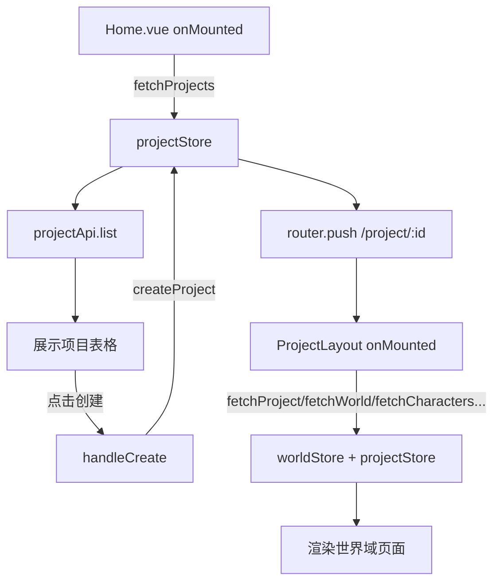
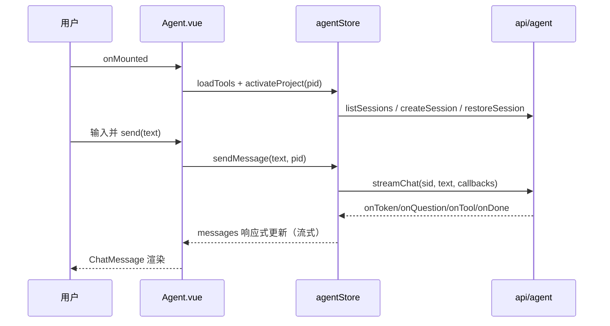

# 前端页面层（Pages / 视图层）

## 1. 概述

`frontend/src/pages` 目录是当前 Novel Engine 前端的所有路由级视图组件所在位置，共 **23 个 `.vue` 单文件组件**，全部由 `frontend/src/app/router.ts` 以懒加载方式（`() => import('@/pages/...')`）挂载到 `AppLayout` 或 `ProjectLayout` 之下。页面层本身**不直接调用 HTTP 客户端**，而是统一通过 Pinia store（`stores/`）与 `api/` 封装层间接取数/写回，形成「页面 → store → api → 后端」的单向数据流向。页面按业务域可划分为：项目入口（Home/Search/Settings）、项目导航壳下的世界域（World/Characters/Locations/Factions/Items/Rules/Relationships/Timeline）、故事域（Story/StoryBoard/Storylines/Foreshadows）、工具域（Graph/Proposals/Extract/History/Snapshots/AITrace）、对话驱动入口（Agent/ProjectDashboard）。所有页面均为 `script setup` + `<script setup lang="ts">` 组合式 API 写法，样式采用 `<style scoped>` + CSS 设计变量（`var(--...)`）。

## 2. 模块职责

页面层的核心职责是：把领域 store 的数据投影为可交互的 UI；收集用户表单并调用 store 的 CRUD action；在 `onMounted`（或 `watch` 世界就绪）时触发数据加载；通过 `router-link` / `router.push` 在业务域之间导航。具体而言：

- **入口与全局**：`Home.vue` 管理项目列表与增删改；`Search.vue` 提供跨实体全文检索；`Settings.vue` 管理应用级设置（直连 `api`）。
- **世界域**：围绕 `worldStore` 展示人物/地点/势力/物品/规则/关系/时间线，其中 Characters/Locations/Factions 还拥有各自的「设计档案」面板（调用 `api/character` 的子资源接口）。
- **故事域**：围绕 `storyStore` 管理叙事树（卷/弧/章/场景）、看板、剧情线、伏笔。
- **工具域**：`Graph` 用 SVG 自绘关系图谱；`Proposals`/`AITrace`/`Snapshots`/`History` 偏审计与回溯；`Extract` 是一个纯转发壳，渲染 `ExtractionPanel` 组件。
- **对话驱动**：`Agent.vue` 是创建引导的主入口，串接 `agentStore` 的 SSE 流式会话；`ProjectDashboard.vue` 是项目内部首页概览。

## 3. 目录与源码对照

### 3.1 路由路径 ↔ 页面文件 ↔ 功能

| 路由路径 | 页面文件 | 功能 |
| --- | --- | --- |
| `/` | `Home.vue` | 项目列表、创建/编辑/删除项目、按名称搜索 |
| `/search` | `Search.vue` | 全局实体搜索（人物/地点/势力/物品），结果跳转世界子类页 |
| `/settings` | `Settings.vue` | 应用设置（项目名/语言/模型/字体/自动保存/写作风格/自动验证） |
| `/project/:id/dashboard` | `ProjectDashboard.vue` | 项目概览卡片 + 人物/地点/剧情线/伏笔摘要 |
| `/project/:id/agent` | `Agent.vue` | AI 创作引导对话（流式聊天 + 会话历史） |
| `/project/:id/world` | `World.vue` | 世界详情、统计、世界事实、编辑世界元信息 |
| `/project/:id/world/characters` | `Characters.vue` | 人物 CRUD + 角色档案/状态面板 |
| `/project/:id/world/locations` | `Locations.vue` | 地点 CRUD + 设计字段面板 |
| `/project/:id/world/factions` | `Factions.vue` | 势力 CRUD + 设计字段面板 |
| `/project/:id/world/items` | `Items.vue` | 物品 CRUD（attributes JSON 编辑） |
| `/project/:id/world/rules` | `Rules.vue` | 世界规则 CRUD（RULE 级别 + 执行级别） |
| `/project/:id/world/relationships` | `Relationships.vue` | 关系 CRUD（编辑以「删除后重建」实现） |
| `/project/:id/world/timeline` | `Timeline.vue` | 时间线事件展示（只读） |
| `/project/:id/story` | `Story.vue` | 叙事树 卷/弧/章/场景 的多级展开与 CRUD |
| `/project/:id/story/board` | `StoryBoard.vue` | 按状态的看板列（Scene/Chapter 可点击写作） |
| `/project/:id/story/storylines` | `Storylines.vue` | 剧情线 CRUD |
| `/project/:id/story/foreshadows` | `Foreshadows.vue` | 伏笔 CRUD |
| `/project/:id/graph` | `Graph.vue` | 实体关系图谱（SVG 圆形布局 + 检视器） |
| `/project/:id/proposals` | `Proposals.vue` | AI 提案审阅（接受/拒绝/校验） |
| `/project/:id/extract` | `Extract.vue` | 信息抽取面板壳（转发 `ExtractionPanel`） |
| `/project/:id/history` | `History.vue` | 事件日志 + 版本差异（转发组件） |
| `/project/:id/snapshots` | `Snapshots.vue` | 世界快照创建/删除/恢复 |
| `/project/:id/trace` | `AITrace.vue` | LLM 生成运行 + 校验运行审计 |
| `/project/:id/write/:sceneId?` | `WritingLayout.vue`（layout，非 pages） | 写作器（不在 pages 目录，属 layouts） |

> 说明：`router.ts:10` 为 `Home`，`:11` Search，`:12` Settings；`ProjectLayout` 子路由 `:17-:39`；写作路由 `:40` 指向 `layouts/WritingLayout.vue`，因此 23 个页面 = 23 条 `import('@/pages/...')` 路由，一一对应，无遗漏。

### 3.2 页面文件 ↔ 行数 ↔ 主要职责

| 文件路径 | 行数 | 主要职责 |
| --- | --- | --- |
| `frontend/src/pages/Home.vue` | 535 | 项目列表/创建/编辑/删除 |
| `frontend/src/pages/Search.vue` | 131 | 实体搜索与跳转 |
| `frontend/src/pages/Settings.vue` | 120 | 应用设置读写 |
| `frontend/src/pages/ProjectDashboard.vue` | 336 | 项目概览 |
| `frontend/src/pages/Agent.vue` | 423 | AI 对话引导 |
| `frontend/src/pages/World.vue` | 390 | 世界详情/编辑 |
| `frontend/src/pages/Characters.vue` | 258 | 人物 + 档案/状态 |
| `frontend/src/pages/Locations.vue` | 194 | 地点 + 设计字段 |
| `frontend/src/pages/Factions.vue` | 193 | 势力 + 设计字段 |
| `frontend/src/pages/Items.vue` | 225 | 物品（JSON attributes） |
| `frontend/src/pages/Rules.vue` | 200 | 世界规则 |
| `frontend/src/pages/Relationships.vue` | 182 | 关系管理 |
| `frontend/src/pages/Timeline.vue` | 81 | 时间线（只读） |
| `frontend/src/pages/Story.vue` | 327 | 叙事树 CRUD |
| `frontend/src/pages/StoryBoard.vue` | 109 | 状态看板 |
| `frontend/src/pages/Storylines.vue` | 256 | 剧情线 CRUD |
| `frontend/src/pages/Foreshadows.vue` | 326 | 伏笔 CRUD |
| `frontend/src/pages/Graph.vue` | 322 | 关系图谱可视化 |
| `frontend/src/pages/Proposals.vue` | 439 | AI 提案审阅 |
| `frontend/src/pages/Extract.vue` | 13 | 抽取面板壳 |
| `frontend/src/pages/History.vue` | 23 | 历史/版本差异壳 |
| `frontend/src/pages/Snapshots.vue` | 147 | 快照管理 |
| `frontend/src/pages/AITrace.vue` | 197 | LLM/校验审计 |

## 4. 功能要点

| 页面/路由 | 主要功能 | 依赖 store/api |
| --- | --- | --- |
| Home | 项目列表、创建/编辑/删除、搜索过滤 | `projectStore`（fetchProjects/createProject/updateProject/deleteProject）、`uiStore.addToast` |
| Search | 实体全文搜索、类型过滤、跳转子页 | `worldStore.fetchEntities`、`projectStore`；`typeRouteMap` 映射 |
| Settings | 应用设置表单读写 | `settingsApi.get/update`（直连 api） |
| ProjectDashboard | 统计卡 + 各域摘要（取前 5） | `projectStore`、`worldStore`、`storyStore` |
| Agent | 流式对话、会话列表/重命名/删除、提示词编辑、工具重试 | `agentStore`（loadSessions/newSession/sendMessage/executeTool 等）、`projectStore` |
| World | 世界元信息、统计、世界事实、编辑 | `worldStore.currentWorld`、`worldApi.update` |
| Characters | 人物 CRUD + 档案/状态编辑 | `worldStore` CRUD + `characterApi.getProfile/getState/updateProfile/updateState` |
| Locations | 地点 CRUD + 设计字段 | `worldStore` CRUD + `locationProfileApi.get/upsert`（注：从 `@/api/character` 导出） |
| Factions | 势力 CRUD + 设计字段 | `worldStore` CRUD + `factionProfileApi.get/upsert`（注：从 `@/api/character` 导出） |
| Items | 物品 CRUD（attributes JSON） | `worldStore.fetchEntities/createEntity/deleteEntity`、`entityApi.update` |
| Rules | 规则 CRUD | `rulesApi.list/create/update/delete` |
| Relationships | 关系 CRUD | `worldStore.fetchRelations/createRelation/deleteRelation` |
| Timeline | 事件时间线（只读） | `worldStore.fetchEvents`、`worldStore.events` |
| Story | 叙事树多级 CRUD、跳转写作 | `storyStore.tree/fetchNodes/createNode/updateNode/deleteNode` |
| StoryBoard | 按状态看板、可写节点跳转写作 | `storyStore.nodes` |
| Storylines | 剧情线 CRUD | `storyStore.fetchStorylines/createStoryline/updateStoryline/deleteStoryline` |
| Foreshadows | 伏笔 CRUD | `storyStore.fetchForeshadows/createForeshadow/updateForeshadow/deleteForeshadow` |
| Graph | 关系图谱 + 检视器 + 缩放 | `worldStore` 的 characters/locations/factions/relations |
| Proposals | 提案接受/拒绝/单条变更/运行校验 | `proposalApi`、`validationApi` |
| Extract | 转发 `ExtractionPanel` | 组件内自取数 |
| History | 转发 `EventLog` + `VersionDiff` | 组件内自取数 |
| Snapshots | 快照创建/删除/恢复 | `snapshotsApi` |
| AITrace | 生成/校验运行审计 | `traceApi` |

## 5. 核心流程

### 5.1 项目创建 → 进入世界域（Home 主导）



### 5.2 Agent 对话驱动（创作引导主入口）



### 5.3 世界域子页加载（ProjectLayout 预取 + 子页补偿）

```mermaid
flowchart TD
  PL[ProjectLayout loadData] -->|fetchWorld+fetchCharacters+...| WS[worldStore]
  WS --> P[进入 Characters 等子页]
  P -->|onMounted/ watch world| WS2[worldStore 已就绪则直接用]
  Note[Items.vue 用 watch(currentWorld?.id) 补偿深链直达]
```

## 6. 接口/导出

- **路由定义**（全部懒加载，见 `frontend/src/app/router.ts:5-44`）：
  - 根 `AppLayout`：`:10` Home、`:11` Search、`:12` Settings。
  - `ProjectLayout`（`:13-:39`）：dashboard/agent/world 及其子页（characters/locations/factions/items/rules/relationships/timeline）、story（story/board/storylines/foreshadows）、graph/proposals/extract/history/snapshots/trace。
  - 写作路由 `:40` `WritingLayout`（非 pages）。
- **页面作为默认导出组件**：每个 `.vue` 通过 `<script setup>` 编译为默认导出，供 `router.ts` 的 `import()` 使用。
- **`Settings.vue`/工具页直连 api**：`Settings.vue:66` `import { settingsApi } from '@/api'`；`Proposals.vue:95-97` 直连 `proposalApi`/`validationApi`；`Snapshots.vue:64` 直连 `snapshotsApi`；`AITrace.vue:90-94` 直连 `traceApi`。
- **`Extract.vue:3` / `History.vue:14-15`**：仅 `import` 子组件并透传 `project-id`，自身无独立数据逻辑。
- **跨页跳转约定**：`World.vue:55-70`、`ProjectDashboard.vue:27-50`、`Story.vue:210`、`StoryBoard.vue:26` 等均使用 `router-link :to="/project/${id}/world/..."` 拼路径。

## 7. 问题/代码异味

1. **`World.vue:72` 统计卡「事件」计数错误**：`stat-value` 绑定 `worldStore.events.length`，但 `World.vue` 的 `onMounted:245-247` 只调用 `fetchWorld`，**从未调用 `fetchEvents`**，因此该统计恒为 0（对比 `ProjectDashboard.vue:153` 显式 `fetchEvents(projectId)`）。属数据不完整/与仪表盘不一致。

2. **`Locations.vue:68` 导出路径异味**：`import { locationProfileApi } from '@/api/character'`，但 `api/index.ts:5` 另有独立 `export { locationApi } from './location'`。`LocationProfile` 接口却挂在 `character.ts` 模块下，模块归属混乱，易误导。

3. **`Factions.vue:68` 同样**：`factionProfileApi` 也从 `@/api/character` 导出；与上面合并看，地点/势力档案 API 被塞进 `character.ts`，违反「一个实体一个 api 文件」的直觉。

4. **`Items.vue` 创建缺少 profile 写回**：`:149` `worldStore.createEntity` 只传 `name/summary/description`，而 `attributes` 字段在 `:130-153` 仅用于编辑（update）分支，**新建物品时不提交 attributes**，用户填写的 JSON 在创建时被丢弃（只有再次编辑才保存）。

5. **`Relationships.vue:131-132` 编辑以「删后建」模拟 PUT**：注释自陈「后端无 PUT」，但 `relationApi` 实际只暴露 `create/delete`（`api/world.ts:22-26`），确无 update；这是后端能力缺失在前端的 workaround，删除后再建会导致关系 ID 变化、丢失引用顺序。

6. **`Search.vue:51-56` 路由缺参回退**：`/search` 是顶层路由无 `:id`，靠 `projectStore.currentProject?.id` 回退；若用户直接进入 `/search` 且当前无项目，会静默拿到空 `worldId`，搜索无结果且无提示（只显示「无匹配结果」），属缺失的空状态/引导。

7. **`Settings.vue:81-88` 载入失败静默吞错**：`catch {}` 无提示，仅保留默认值，与「严禁静默处理」的工程约束相悖，且用户无法感知设置未同步。

8. **`Graph.vue:255-260` fit/center 未真正实现**：`fitGraph`/`centerGraph` 仅把 `scale` 重置为 1，未做自适应缩放/居中，功能名不副实（代码异味/缺失功能）。

9. **`Story.vue:156` 展开状态硬编码**：`expanded` 初值写死 `'vol-1'/'arc-2'/'ch-4'`，若真实数据 ID 不符则默认全部折叠，依赖假设 ID，脆弱。

10. **重复的对话/详情样式与表单逻辑**：`Characters.vue`/`Locations.vue`/`Factions.vue` 三页结构高度雷同（EntityCard + EntityDialog + 详情面板），仅字段不同，未抽取为统一 `EntityDetailPage` 组件，存在明显重复逻辑（可维护性异味）。

11. **`World.vue:239` 直接写 `worldStore.error`**：保存失败时绕过 store action 直接赋值 `error`，而 `fetch*` 也写同一 `error` 字段，多页面共享 `worldStore.error` 易出现串扰（如 Graph 加载错误被 World 编辑覆盖）。

## 8. 小结

`pages/` 是一组以「路由懒加载 + 组合式 API + scoped 样式」为统一范式的视图组件，23 个页面与 `router.ts` 完全一一对应，无未使用/未注册页面。数据访问以 `worldStore`/`storyStore`/`projectStore`/`agentStore` 为主轴，少量工具页（Settings/Proposals/Snapshots/AITrace/Extract/History）直连 `api/`。主要弱点集中在：世界域三个档案页的 API 模块归属混乱、Items 创建丢失 attributes、关系编辑无 PUT 的删建 workaround、World 统计卡漏取 events、Graph 的 fit/center 空实现，以及人物/地点/势力三页高度重复未抽象。建议优先统一实体档案 API 出口、补 `Items` 创建 attributes、修正 `World` 事件统计取数，并将三页合并为通用实体详情组件。
