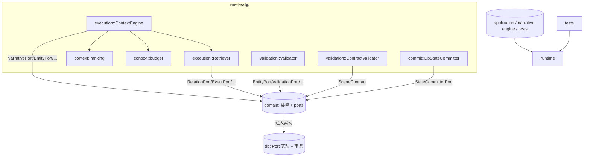
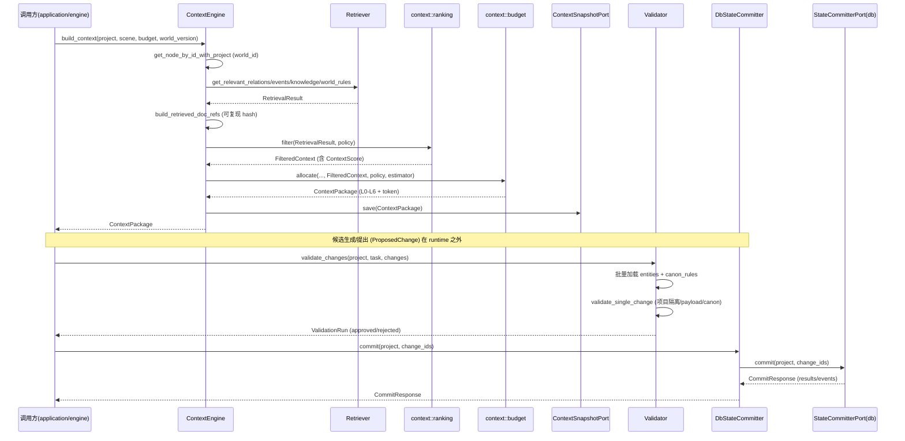

# runtime（运行时组件层）

> 覆盖范围：`crates/runtime/src` 全部 `.rs` 源文件（lib.rs、commit/*、context/*、execution/*、validation/*）与 `tests/*` 测试；并对照 `domain`、`ai`、`application::mutation`。
> 说明：本草稿为核对版，落地目标文件 `docs/modules/runtime.md`。所有结论均标注 `文件:行号`。

## 1. 概述（职责：Context Engine、Validator、Extractors、Commit）

`runtime` 是「运行时组件层」，处于 `domain` 之上、不依赖 `db`/`sqlx`，也不依赖 `infrastructure`（`lib.rs:1-15`）。其职责是把「AI 提出的候选」变成「可进入世界 Canonical 状态的动作」，按 ChatGPT 评审 P1 拆成三个子层：

- **execution（执行/生成候选）**：`Context Engine`（`execution/context_engine.rs`）+ `Retrieval`（`execution/retrieval.rs`）组装动态上下文包 `ContextPackage`。
- **validation（裁决候选）**：`Validator`（`validation/validator.rs`）+ `ContractValidator`（`validation/contract_validator.rs`）校验 `ProposedChange` 与 `SceneContract`。
- **commit（落库候选）**：`StateCommitter`（`commit/state_committer.rs`）把裁决通过的 `ProposedChange` 事务化提交到 World Canon。

关于「Extractors」：模板将其列为职责之一，但**本 crate 中没有 Extractor 实现**。`domain` 的 `extraction`（结构化抽取）由 `application::extraction_executor` 实现，`ai::extractor` 那套未接线 trait 已移除（`ai/src/lib.rs:6-8`）。故 runtime 实际不包含 Extractor，文档如实记为「不在本层」。

边界原则（`lib.rs:3-5`、`validation/validator.rs:1-5`）：AI 只能提出 `ProposedChange`，所有变更必经 Validator 验证，再由 StateCommitter 在独立事务中提交。具体数据库事务被下沉到 `domain::ports::StateCommitterPort`，由 `db` crate 注入（`commit/state_committer.rs:1-5`）。

## 2. 模块职责

| 模块 | 职责 | 关键类型/文件 |
| --- | --- | --- |
| `context`（子层） | 可见性 + 评分排序 + Token 预算分配，不直接碰 DB | `context/mod.rs`、`budget.rs`、`ranking.rs` |
| `execution` | 编排 7 步检索 → Ranking → Budget → 组装 `ContextPackage` 并持久化快照 | `execution/context_engine.rs`、`execution/retrieval.rs` |
| `validation` | 变更不变量校验（领域规则）+ 场景契约校验（纯函数） | `validation/validator.rs`、`validation/contract_validator.rs` |
| `commit` | 把 Approved 的 `ProposedChange` 批量事务提交 | `commit/state_committer.rs` |

`context` 子层被 `execution` 复用：`context_engine` 只做编排，具体逻辑下沉到 `context::ranking`（可见性+评分）与 `context::budget`（Token 预算）（`execution/context_engine.rs:1-9`、`context/mod.rs:1-16`）。

## 3. 依赖关系（依赖 domain/ai；文字 + mermaid graph TD）

- `runtime` → `domain`：使用 domain 的领域类型（`Entity`、`CurrentState`、`NarrativeNode`、`ProposedChange`、`ContextPackage`、`CanonRule`、`SceneContract` 等）与 `domain::ports` 抽象（`*Port` 系列）。**从不**直接 `use db` 或 `sqlx`（`state_committer.rs:8-9`）。
- `runtime` → `ai`：**无直接 `use`**。runtime 仅通过 domain 类型间接相关；`ai` crate 本身也只 `use domain`（`ai/src/lib.rs:14-18`），二者是兄弟层，都依赖 domain。
- `runtime` 被 `application`、`narrative-engine`、测试通过 `pub use` 顶层路径引用（`lib.rs:22-27` 保留历史顶层路径以保证兼容）。

依赖方向（修正后，ai/lib.rs:14-18）：`db → domain`，`ai → domain`，`application/runtime/narrative-engine → domain (+ai)`。`runtime` 不反向依赖 `ai` 或 `db`。



## 4. 目录与源码对照（表格：文件路径 | 行数 | 职责）

| 文件路径 | 行数 | 职责 |
| --- | --- | --- |
| `src/lib.rs` | 28 | 声明子模块与历史顶层 `pub use` 重导出 |
| `src/context/mod.rs` | 59 | 定义 `ContextRequest`/`RetrievalResult`/`FilteredContext` 及 Context 公共类型重导出 |
| `src/context/budget.rs` | 165 | `TokenEstimator` trait、`CharacterTokenEstimator`、`TokenBudgets`、`allocate()` 预算分配 |
| `src/context/ranking.rs` | 278 | `ContextScore`（五维）、`filter()` 可见性+排序、L0–L5 层 build 函数 |
| `src/execution/mod.rs` | 11 | 声明 `context_engine`/`retrieval` 子模块与重导出 |
| `src/execution/context_engine.rs` | 446 | `ContextEngine`/`ContextEngineDeps` 编排：7 步检索 + Ranking + Budget + 快照 |
| `src/execution/retrieval.rs` | 167 | `Retriever`：关系/事件/知识/世界规则的按实体集合检索 |
| `src/validation/mod.rs` | 11 | 声明 validator/contract_validator 子模块 |
| `src/validation/validator.rs` | 304 | `Validator`/`ValidatorDeps`：批量校验 `ProposedChange`（项目隔离、payload、Canon Rule） |
| `src/validation/contract_validator.rs` | 137 | `ContractValidator`/`ContractValidationResult`：纯函数校验 `SceneContract` 与 `phrase_matches` |
| `src/commit/mod.rs` | 10 | 声明 `state_committer` 子模块 |
| `src/commit/state_committer.rs` | 32 | `DbStateCommitter`：薄编排，委托 `StateCommitterPort` |
| `tests/data_correctness_tests.rs` | 665 | 数据正确性/硬化测试：Approved-only 提交、项目隔离、CAS、Validator 批量、状态机 |
| `tests/integration_tests.rs` | 314 | DB 集成测试：事务原子性、跨项目隔离、CAS 冲突回滚 |

> 注：框架要求中的 `execution/retrieval.rs` 已读；无 `extraction/` 子目录（Extractors 不在本层）。

## 5. 字段设计（Context/Budget/Ranking/Validation 结果等核心类型；表格 + 文件:行号；与 domain 对照）

### 5.1 Context 核心类型（`context/mod.rs`）
| 类型 | 字段 | 行号 | 说明 / domain 对照 |
| --- | --- | --- | --- |
| `ContextRequest` | `project_id, world_id, scene_node_id, skill_type, token_budget, extra_requirements` | `mod.rs:26-34` | 上下文引擎输入；`SkillType` 来自 `domain::skill` |
| `RetrievalResult` | `scene_node, scene_attrs, characters, location, relations, recent_events, knowledge, chapter_summary, volume_summary, arc_summary, prev_scene_summary, world_rules` | `mod.rs:37-50` | 检索内部聚合；`NarrativeNode`/`SceneAttributes`/`Entity`/`CurrentState`/`Relation`/`Event` 均来自 domain |
| `FilteredContext` | `layers: Vec<(ContextLayerType, ContextLayer, ContextScore)>` | `mod.rs:53-55` | ranking 产出，交给 budget |

### 5.2 Ranking（`context/ranking.rs`）
| 类型 | 字段 | 行号 | 说明 |
| --- | --- | --- | --- |
| `ContextScore` | `relevance, importance, recency, explicitness, visibility: f64` | `ranking.rs:13-19` | 五维评分 |
| `total_score()` | 乘积 `relevance*importance*visibility*recency*explicitness` | `ranking.rs:22-24` | **乘积**模型：任一维为 0 则总分为 0（见 §8 异味） |
| `default_score()` | 全部 0.5/visibility=1.0 | `ranking.rs:26-34` | 默认 0.0625 |

### 5.3 Budget（`context/budget.rs`）
| 类型 | 字段 | 行号 | 说明 |
| --- | --- | --- | --- |
| `TokenEstimator` (trait) | `fn estimate(&self, text:&str)->i32` | `budget.rs:18-20` | 估算抽象，未来可接 tokenizer |
| `CharacterTokenEstimator` | 公式 `(chars*2)/3` | `budget.rs:26-33` | 默认实现，正确处理中文 UTF-8 |
| `TokenBudgets` | `SMALL=8000 / MEDIUM=12000 / LARGE=20000` | `budget.rs:36-42` | 预设常量 |
| `allocate()` 输出 | `ContextPackage` | `budget.rs:45-52, 125-164` | L0–L6 层组装，域对照 `domain::generation::ContextPackage`（generation.rs:76-101） |

### 5.4 Validation 结果（`validation/*`）
| 类型 | 字段 | 行号 | 说明 / domain 对照 |
| --- | --- | --- | --- |
| `Validator` 使用 `ValidationRun`/`ValidationIssue`/`ProposedChangeStatus` | —— | `validator.rs:1-44` 引用 | 全部来自 `domain::validation`（validation.rs:241-345） |
| `ContractValidationResult` | `passed, required_events_met, forbidden_events_violated, required_characters_met, required_facts_met, reader_learns_met, protagonist_learns_met, world_changes_met, issues` | `contract_validator.rs:7-18` | runtime 自定义结果类型，对照 `domain::contract::SceneContract`（contract.rs:15-34） |

### 5.5 与 domain 的字段对照要点
- `ContextLayer`（content/token_estimate/included）= `domain::generation::ContextLayer`（`generation.rs:105-109`），runtime 仅构造它。
- `ContextPackage` 由 runtime `budget::allocate` 填充（`budget.rs:125-164`），其 schema 定义在 `domain::generation::ContextPackage`（`generation.rs:76-101`）。注意 L6 层在 `allocate` 中**恒为 `empty_layer`**（`budget.rs:160`），与 `ContextPolicy::scene_writer` 等未把 L6 列入有关（§8 异味）。
- `ReproducibilityMeta`（world_version/retrieval_strategy/retrieved_documents 等）定义在 `domain::generation::ReproducibilityMeta`（`generation.rs:124-139`）；runtime 在 `context_engine.rs:146-157` 填充 world_version 与检索文档引用，并明确**不**回写 model/temperature/prompt_hash（由 Generation Runtime 负责）。

## 6. 核心流程（一次上下文构建→校验→提交，mermaid 时序图）

端到端的三段式：① Context Engine 构建上下文 → ② Validator 校验候选 → ③ StateCommitter 提交。



关键源码锚点：
- 7 步检索：`context_engine.rs:168-230`（`retrieve_context`）。
- 可复现引用固化（必须在 `filter` move 之前）：`context_engine.rs:124-126, 406-445`。
- 排序后消费：`context_engine.rs:129`（ranking）→ `132`（budget）。
- 校验裁决：`validator.rs:49-112`（`validate_changes`，Critical→Rejected，Warning→PendingApproval，否则→Approved）。
- 提交：仅 Approved 可提交，端口层校验状态（`state_committer.rs:25-31`；测试验证 Rejected/Pending 被拒 `tests/data_correctness_tests.rs:144-207`）。

## 7. 接口/类型签名（关键 pub fn/trait，附 文件:行号）

### execution
```rust
// execution/context_engine.rs:41-65
pub struct ContextEngine {
    narrative: Arc<dyn NarrativePort>,
    entity: Arc<dyn EntityPort>,
    state: Arc<dyn StatePort>,
    retriever: Arc<Retriever>,
    snapshot: Arc<dyn ContextSnapshotPort>,
    token_estimator: Box<dyn TokenEstimator>,
}
pub fn new(deps: ContextEngineDeps) -> Self                       // :51
pub fn with_token_estimator(deps, estimator) -> Self             // :67
pub async fn build_context(project_id, scene_node_id, token_budget, world_version) -> Result<ContextPackage>   // :84
pub async fn build_context_with_policy(project_id, scene_node_id, token_budget, &ContextPolicy, world_version) -> Result<ContextPackage>  // :102

// execution/retrieval.rs:21-41
pub struct Retriever { relation, event, knowledge, canon: Arc<dyn ...Port> }
pub fn new(relation, event, knowledge, canon) -> Self             // :29
pub async fn get_relevant_relations(project, &SceneAttributes) -> Result<Vec<Relation>>   // :44
pub async fn get_recent_events(project, &SceneAttributes) -> Result<Vec<Event>>           // :71
pub async fn get_character_knowledge(project, character_id) -> Result<String>             // :98
pub async fn get_world_rules_summary(project) -> Result<String>                            // :138
```

### context
```rust
// context/ranking.rs:41
pub fn filter(result: RetrievalResult, policy: &ContextPolicy) -> Result<FilteredContext>
// context/budget.rs:45
pub fn allocate(project_id, scene_node_id, token_budget, filtered: FilteredContext,
                policy: &ContextPolicy, estimator: &dyn TokenEstimator) -> ContextPackage
// context/budget.rs:18
pub trait TokenEstimator { fn estimate(&self, text: &str) -> i32; }
```

### validation
```rust
// validation/validator.rs:17-44
pub struct ValidatorDeps { entity, validation, approval, canon, proposed_change: Arc<dyn ...Port> }
pub fn new(deps: ValidatorDeps) -> Self                          // :36
pub async fn validate_changes(project_id, task_id, &[ProposedChange]) -> Result<ValidationRun>  // :49
pub async fn list_approved_changes(project_id, task_id) -> Result<Vec<ProposedChange>>          // :301

// validation/contract_validator.rs:22-30
pub struct ContractValidator;
pub fn new() -> Self
pub fn validate(&self, contract: &SceneContract, draft_content: &str) -> Result<ContractValidationResult>
```

### commit
```rust
// commit/state_committer.rs:15-31
pub struct DbStateCommitter { port: Arc<dyn StateCommitterPort> }
pub fn new(port: Arc<dyn StateCommitterPort>) -> Self
pub async fn commit(&self, project_id: Uuid, change_ids: &[Uuid]) -> Result<CommitResponse>
```

## 8. 问题/代码异味（逐条：与 application::mutation 职责重叠、未使用、validation 规则分散、死代码，每条附 文件:行号）

**1. 与 `application::mutation` 存在两套 Canon 写入口（职责重叠）。**
- runtime：`commit/state_committer.rs:15-31` 走 `domain::ports::StateCommitterPort` + `ProposedChange` → `CommitResponse`（无 project 校验外的额外逻辑，纯委托）。
- application：`application/src/mutation/committer.rs:14-63` 的 `MutationCommitter` 走 `domain::mutation::MutationCommitterPort` + `MutationCommand`/`MutationBatch` 写入 Canon，并有自己的 `validate_mutation`（`application/src/mutation/validator.rs:8-52`）。
- 二者都是「World Canon 统一写入口」语义（committer.rs:1-6 声称「只有此处能把变更落到 Canon」），但 runtime 与 application 各有一套端口与命令模型。实际存在 `StateCommitterPort`（`ports.rs:155-157`）与 `MutationCommitterPort`（`domain::mutation`）两套并行写入边界，提交路径/状态机不统一，易产生重复实现与行为分歧。**建议**统一为单一写入口（见 §9）。

**2. 未使用的策略字段 `excluded_layers`。**
- `domain::skill::ContextPolicy` 定义 `excluded_layers: Vec<ContextLayerType>`（`skill.rs:27-33`），但 `context/ranking.rs::filter`（`ranking.rs:41-168`）只检查 `required_layers`/`optional_layers`，从未读取或应用 `excluded_layers`；`budget::allocate`（`budget.rs:45-164`）也未消费。即 `ContextPolicy::location_designer` 等配置的 `excluded_layers`（`skill.rs:36-44` 等）是死配置。

**3. validation 规则分散在两处、逻辑割裂。**
- 领域不变量（Canon Rule 结构化比较 EQUAL/NOT_EQUAL/IN/NOT_IN）在 `validation/validator.rs:190-298`（`check_canon_rules_structured`）。
- 场景契约（forbidden/required/reader/protagonist/world 短语匹配）在 `validation/contract_validator.rs:30-87`。
- 二者校验语义彼此独立、无共享入口；且 `ContractValidator` 仅做纯文本 `phrase_matches`（`contract_validator.rs:92-102`），不碰 DB，而契约中的 `required_characters: Vec<Uuid>`（`contract.rs:23`）需要名字解析 DB 访问——结果 `required_characters_met` 被硬编码为 `true` 占位（`contract_validator.rs:47-50`，含 TODO 注释），使该契约项形同未校验。

**4. 死代码 / 恒为假或恒为空的字段。**
- `budget::allocate` 中 `l6_optional_supplement` 恒为 `empty_layer`（`budget.rs:160`），`ContextPolicy` 未定义 L6 进入 required/optional 的路径，L6 永远空。
- `context/ranking.rs::filter` 在 `:161-165` 对 `layers` 做了一次 `sort_by(total_score)` 排序，但随后 `budget::allocate` 在 `budget.rs:80-94` 又**重新**按 `total_score()/token_estimate` 排序并消费——`filter` 内的排序结果未被直接使用（ranking 的排序对最终预算分配无影响），属冗余/误导代码。
- `ContextScore::default_score()`（`ranking.rs:26-34`）在 `filter` 与 `budget` 中均未被调用；`ContextRequest::extra_requirements`（`context/mod.rs:33`）在 Context Engine 中未被使用。

**5. `required_characters_met` 占位导致契约校验不完整（安全相关）。**
- `contract_validator.rs:47-50` 写死 `true`，契约的「必须出现角色」约束完全不生效，且 `passed` 依赖该项（`contract_validator.rs:68-74`）。这是正确性缺陷而非纯风格问题。

**6. `ContextScore` 乘积模型的脆弱性。**
- `total_score()` 用五维**乘积**（`ranking.rs:22-24`）：若任一维度为 0（如 `explicitness` 在 L3/L5 取 0.2–0.3，`ranking.rs:110,154`），总分被压低；而 `default_score` 给 0.5。不同层的评分量级不可比，排序（`budget.rs:80-94`）依赖此乘积/token 比率，但 L0 常取 1.0 各项（`ranking.rs:52-58`）使其永远优先——评分体系一致性未经论证，建议文档化或改为加权和。

## 9. 小结

`runtime` 是整洁的三段式运行时层，正确贯彻了「AI 只提案、Validator 裁决、StateCommitter 提交」的安全边界，并通过 `domain::ports` 的依赖倒置与 `db` 解耦（`lib.rs`、`state_committer.rs`）。其亮点包括：Context Engine 的 7 步检索与可复现元数据固化（`context_engine.rs:124-157, 406-445`）、Validator 的批量查询避免 N+1（`validator.rs:55-69`）、严格的状态机与 Approved-only 提交（测试 `data_correctness_tests.rs`/`integration_tests.rs` 覆盖完好）。

主要待办（供主代理决策落地）：
1. **统一 Canon 写入口**：消除 runtime `StateCommitter` 与 application `MutationCommitter` 的职责重叠（§8.1）。
2. **激活/移除 `excluded_layers` 与 L6**：当前为死配置/死字段（§8.2、§8.4）。
3. **补全 `ContractValidator::required_characters` 校验**：移除 `true` 占位，否则契约该项无效（§8.3、§8.5，安全相关）。
4. **收敛 validation 规则**：把领域不变量与场景契约校验纳入统一入口，避免逻辑分裂（§8.3）。
5. **清理冗余排序与未用字段**：`ranking::filter` 内排序、`ContextScore::default_score`、`ContextRequest::extra_requirements`（§8.4）。
6. **明确评分模型**：`ContextScore` 乘积的合理性需文档化或改为可解释加权（§8.6）。

文档中全部结论均可在上述 `文件:行号` 处核对；Extractors 不在本层，已在 §1 说明。
