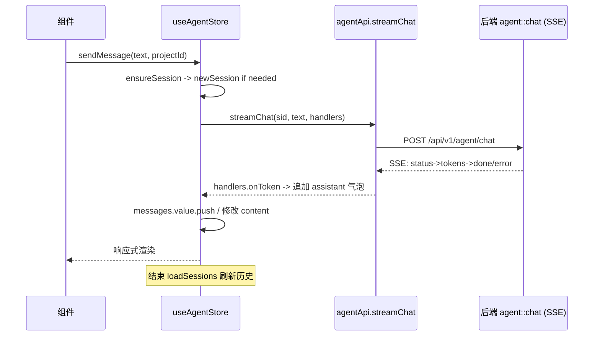

# stores（前端基础层 · Pinia 状态管理）

## 1. 概述
`frontend/src/stores` 用 Pinia `defineStore` 管理跨组件响应式状态，是 API 层与 Vue 组件之间的"适配器"。每个 store 对应一个业务域（project/world/story/editor/context/generation/proposal/agent/ui），通过调用 `api/*` 拉取数据并缓存到 `ref`/`computed` 中。所有导出经 `stores/index.ts:1-8` 统一重导出。

## 2. 模块职责
- 缓存实体列表、当前选中项、加载/错误态。
- 把后端返回映射成本地响应式结构（如 `tree` 计算属性由 `nodes` 组装）。
- 持久化（agent 用 localStorage 绑定项目会话）。
- 轮询（generation 用 `setInterval` 轮询任务状态）。

## 3. 目录与源码对照

| 文件路径 | 行数 | 主要职责 |
|---|---|---|
| `stores/index.ts` | 8 | 重导出 8 个 store |
| `stores/project.ts` | 93 | `useProjectStore`：项目 CRUD + `recentProjects` |
| `stores/world.ts` | 197 | `useWorldStore`：world/entity/relation/event/fact + 角色/地点/势力 CRUD |
| `stores/story.ts` | 138 | `useStoryStore`：narrative 树 + storyline + foreshadow |
| `stores/editor.ts` | 44 | `useEditorStore`：当前场景内容编辑/保存 |
| `stores/context.ts` | 67 | `useContextStore`：场景上下文（实体/条目/令牌） |
| `stores/generation.ts` | 73 | `useGenerationStore`：生成任务轮询 |
| `stores/proposal.ts` | 61 | `useProposalStore`：提案接受/拒绝 |
| `stores/agent.ts` | 243 | `useAgentStore`：会话/消息流/SSE/工具/提示词 |

## 4. 字段/类型设计与后端对照

### 4.1 useWorldStore 的实体拆分
```ts
// frontend/src/stores/world.ts:16-18
const characters = ref<Entity[]>([])
const locations = ref<Entity[]>([])
const factions = ref<Entity[]>([])
```
后端 `world.ts:34-61` 通过 `listEntities(worldId, "Character"|"Location"|"Faction")` 三类独立拉取，与 `mod.rs:43,50,56` 路由匹配。**一致**。`createCharacter`/`createLocation`/`createFaction`（`world.ts:104-158`）调用 `entityApi.createCharacter` 等，对应 `mod.rs:43,50,56` ✓。

### 4.2 useContextStore（**依赖 501 端点**）
```ts
// frontend/src/stores/context.ts:15-33
async function loadContext(sceneId) {
  const snap = await contextApi.getSceneContext(sceneId)
  entities.value = snap.entities ?? []
  ...
}
```
后端 `context.rs:8-14` 的 `get_context` 返回 501。所以 `loadContext` 必然进入 `catch`→`reset()`，UI 永远空白。**功能断裂**。

### 4.3 useGenerationStore（**轮询状态机错位**）
```ts
// frontend/src/stores/generation.ts:37-48
pollTimer = setInterval(async () => {
  const t = await generationApi.get(task.id)
  if (t.status === "Completed" || t.status === "Failed" || t.status === "Cancelled") stopPolling()
}, 2500)
```
后端 `TaskStatus`（`domain/src/generation.rs:56-62`）真实终态包含 `Running`（运行中是 `Running`，不是前端的 `Generating`）。前端 `types/generation.ts` 无 `Running`，且后端 `execute_task` 会把任务从 `Pending` 置为 `Running`。**结果**：前端轮询匹配不到 `Running`→`Completed` 的过渡，但终态 `Completed/Failed/Cancelled` 仍在，故最终能停；然而 `isGenerating` 计算属性（`composables/useGeneration.ts:13-16`）判断 `status==='Generating'||'BuildingContext'`，而后端从未产出这两个状态，导致进度条永远不亮。

### 4.4 useAgentStore（**与后端 AgentSession 对齐良好**）
```ts
// frontend/src/stores/agent.ts:40-48
export interface AgentSession {
  id; project_id; title: string|null; messages: ChatMessage[];
  current_step: string; created_at; updated_at;
}
```
后端 `domain/src/agent_store.rs:24-34` 的 `AgentSession`：`id, project_id, title: Option<String>, messages: Vec<ChatMessage>, current_step: String, created_at, updated_at`——**字段完全匹配**（仅 `title` 的 null vs Option 语义一致）。本地持久化 `agent:currentSessionId:${projectId}`（`agent.ts:22-40`）与 `021_bind_session_to_project.sql` 的"会话-项目强绑定"一致。

### 4.5 useEditorStore（**content 来源正确**）
`editor.ts:16-38` 通过 `narrativeApi.getNode`/`updateNode` 读写 `content` 字段，对应 `narrative_node.content`（`001:244`）。**一致**。

### 4.6 useStoryStore.tree（**纯前端计算，无后端依赖**）
`story.ts:14-29` 由 `nodes` 客户端组装树，与后端 `narrative_node.parent_id` 结构一致（`001:242`）。**一致**。

## 5. 核心流程（会话发送消息 → SSE → 本地气泡更新）


## 6. 接口/导出（关键签名）
- `project.ts:6-93`：`fetchProjects`/`fetchProject`/`createProject`/`updateProject`/`deleteProject` + `recentProjects` computed。
- `world.ts:6-197`：`fetchWorld`/`fetchCharacters`/`fetchLocations`/`fetchFactions`/`fetchEntities`/`fetchRelations`/`fetchEvents`/`fetchFacts` + 全套 CRUD + `selectEntity`。
- `story.ts:6-138`：`fetchNodes`/`fetchStorylines`/`fetchForeshadows` + CRUD + `tree`/`selectedNode` computed + `selectNode`。
- `editor.ts:5-44`：`loadScene`/`updateContent`/`saveContent` + `wordCount`/`charCount` computed。
- `context.ts:8-67`：`loadContext`/`reset`/`togglePin`/`toggleExclude`。
- `generation.ts:6-73`：`loadTasks`/`startGeneration`/`cancelGeneration` + `stopPolling`。
- `proposal.ts:6-61`：`fetchProposals`/`fetchProposal`/`acceptProposal`/`rejectProposal`/`acceptChange`/`rejectChange`。
- `agent.ts:12-243`：`loadTools`/`loadSessions`/`newSession`/`restoreSession`/`selectSession`/`deleteSession`/`renameSession`/`ensureSession`/`sendMessage`/`executeTool`。
- `ui.ts:4-53`：`toggleSidebar`/`toggleRightPanel`/`openCommandPalette`/`closeCommandPalette`/`addToast`/`removeToast`。

## 7. 问题/代码异味
1. **useContextStore 必失败**（`stores/context.ts:15-33` 依赖 `context.rs` 501）：功能不可用，UI 空白。
2. **generation 轮询/进度状态机错位**（`stores/generation.ts:41` 与 `composables/useGeneration.ts:13-16`）：前端 `Generating`/`BuildingContext` 后端从不产出，进度指示永不激活；后端 `Running` 态前端未建模。
3. **大量 try/catch 静默吞错**（`world.ts:34-101`、`story.ts:46-63`、`project.ts:23-87` 等）：`catch (e: any) { error.value = e.message }` 有时连 error 都不设（如 `world.ts:36` 部分分支只 `characters.value=[]`），难以排查。
4. **useWorldStore 中 `createRelation`/`createEntity` 用 `any`**（`world.ts:161,173`）：绕过类型检查，与"强类型契约"目标相悖。
5. **useEditorStore.loadScene 失败保留旧内容**（`editor.ts:21-23`）：注释称"避免误清空"，但切换场景时若新场景加载失败会显示上一个场景内容，存在数据混淆风险。
6. **agent store 的 `ChatMessage` 接口与 `api/agent.ts` 重复定义**（`stores/agent.ts:6-10` 与 `agent.ts:34-38`），两处分别维护 `role`/`content`/`created_at?` vs `streaming?`，易漂移。
7. **`sseConnected` ref 定义但从未赋值**（`generation.ts:10,68`）：死状态。

## 8. 小结
stores 层逻辑基本健全，agent/world/story/editor 与后端对齐良好；但 context store 因后端 501 彻底失效，generation store 因状态机错位导致进度 UI 失效。建议优先修复 context 后端实现，并统一 generation 状态枚举（引入 `Running`）。
