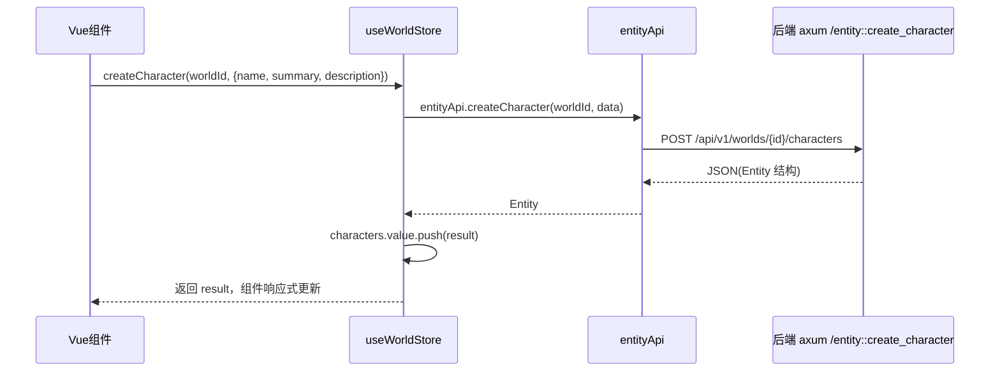

# types（前端基础层 · 类型定义）

## 1. 概述
`frontend/src/types` 是前端所有 TypeScript 类型的唯一来源（single source of truth），通过 `index.ts:1-13` 使用 `export *` 把 13 个子模块的类型全部重导出。它定义了前端与后端 axum 服务之间的"契约"：API 返回体、store 状态、Vue 组件 props/emits 都从这里取类型。其字段必须与后端 `crates/domain` 结构体及 `crates/db/migrations` 表列保持一致，否则会出现静默字段缺失或反序列化错位。

## 2. 模块职责
- 定义领域模型（Project / World / Entity / Character / Faction / Narrative / Knowledge / Context / Generation / Proposal / Approval / Quality）。
- 定义 API 输入/输出镜像类型与枚举（如 `ProjectStatus`、`NarrativeNodeType`、`StateChangeType`）。
- 通过 `Timestamps` 公共接口复用 `created_at`/`updated_at`。

## 3. 目录与源码对照

| 文件路径 | 行数 | 主要职责 |
|---|---|---|
| `types/index.ts` | 13 | 重导出所有子模块类型 |
| `types/common.ts` | 30 | `Timestamps`、`PaginatedResponse`、`ApiError`、`SortOptions`、`FilterOptions` |
| `types/project.ts` | 35 | `Project`、`CreateProjectInput`、`UpdateProjectInput`、`ProjectStatus` |
| `types/world.ts` | 108 | `World`、`Entity`、`EntityType`、`Relation`、`Fact`、`Event`、`StateChange` 及枚举 |
| `types/character.ts` | 44 | `CharacterProfile`、`CharacterState`、`LocationProfile` |
| `types/faction.ts` | 19 | `FactionProfile` |
| `types/narrative.ts` | 122 | `NarrativeNode`、`VolumeAttributes`、`ArcAttributes`、`SceneAttributes`、`BeatAttributes`、`Storyline`、`Foreshadowing` |
| `types/knowledge.ts` | 31 | `KnowledgeState`、`ReaderKnowledge` |
| `types/context.ts` | 29 | `ContextEntity`、`ContextItem`、`ContextSnapshot` |
| `types/generation.ts` | 42 | `GenerationTask`、`GenerationProgressEvent` 及枚举 |
| `types/proposal.ts` | 59 | `Proposal`、`ProposalChange`、`ValidationResult`、`ExtractionResult` |
| `types/approval.ts` | 25 | `ApprovalRecord`、`ApprovalStatus`、`ApprovalTargetType` |
| `types/quality.ts` | 24 | `QualityScore`、`QualityIssue` |

## 4. 字段/类型设计（核心类型与三源对照）

### 4.1 Project
```ts
// frontend/src/types/project.ts:13-25
export interface Project extends Timestamps {
  id: string; name: string; description?: string; language?: string;
  world_setting?: string; system_setting?: string; default_model?: string;
  default_style?: string; default_params: Record<string, unknown>;
  config: Record<string, unknown>; status: ProjectStatus;
}
```
后端对照：`domain/src/project.rs:11-32` 与 `001_canonical_schema.sql:19-33`。**一致**。`ProjectStatus` 前后端枚举完全匹配。

### 4.2 Entity / World
```ts
// frontend/src/types/world.ts:6-30
export interface Entity extends Timestamps {
  id; project_id; world_id; entity_type_id; name; summary?; description?;
  attributes: Record<string,unknown>; version: number; created_by;
  updated_by?; source_generation_id?;
}
```
后端对照：`domain/src/entity.rs:46-66` 与 `001_canonical_schema.sql:67-83`。**一致**。注意表多了一个 `status VARCHAR DEFAULT 'Active'` 列，前端未建模（影响软删除语义，但前端暂无使用）。

### 4.3 CharacterProfile / CharacterState（**严重不一致**）

前端：
```ts
// frontend/src/types/character.ts:5-29
export interface CharacterProfile extends Timestamps {
  id; entity_id; real_name?; nickname?; age?; gender?; identity?;
  appearance?; background?; social_status?; core_personality?; values?;
}
export interface CharacterState extends Timestamps {
  id?; entity_id?; location?; health?; cultivation?; money?;
  wanted?: boolean; extra?: unknown;
}
```
后端域模型 `domain/src/character.rs:278-328`（R2 方案）：
- `CharacterProfile` 已改为 `name`、`aliases`、`age: Option<AgeRange>`（枚举，非字符串）、`identity`、`appearance`、`background_origin`（**不是 background**）、`social_position`（结构体，非 social_status 字符串）、`core_personality`、`values`、`role_in_story`、`narrative_necessity` 等。
- `CharacterState` 已改为 `physical_state`、`mental_state`、`resource_state`、`social_state`、`flags: Vec<String>`（**无 health/cultivation/money/wanted**）。

后端表 `001_canonical_schema.sql:583-616` 经 `017_character_r2_refactor.sql` 把 `real_name→name`、`background→background_origin`、`age→age_range`（枚举文本）、`social_status` 等已废弃。

**结论**：前端 `CharacterProfile`/`CharacterState` 停留在 R2 重构前的旧 schema，与后端当前返回结构完全错位——`real_name`/`background`/`age`(string)/`social_status`/`health`/`cultivation`/`money`/`wanted` 这些字段后端已不再生产或已改名。同时后端 `get_character_profile`/`get_character_state`（`api/entity.rs:91-113`）直接返回 `serde_json::Value`，前端若强类型断言会拿到 `undefined` 字段。

### 4.4 FactCertainty（**枚举值不一致**）
```ts
// frontend/src/types/world.ts:69
export type FactCertainty = 'Confirmed' | 'Likely' | 'Rumor' | 'Uncertain'
```
后端 `domain/src/canon.rs:100-115`：`Canon` / `Probable` / `Rumor` / `Belief` / `Speculation` / `FalseBelief` / `Unknown`。后端表 `001:121` 默认 `'CANON'`。**前端枚举与后端完全不匹配**（Confirmed≠Canon，且缺少 Belief/Speculation/FalseBelief/Unknown，多出 Likely/Uncertain）。`api/world.ts` 的 `factApi.list` 会把 `'CANON'` 等字符串填进前端的 `Fact.certainty: FactCertainty`，类型校验通过但语义错误。

### 4.5 NarrativeNode / Storyline / Foreshadowing
前端 `narrative.ts:23-99` 与后端 `domain/src/narrative.rs:39-144`、`001:237-251`、`840-851`、`911-925` **基本匹配**。`NarrativeNodeStatus` 枚举一致。`StorylineStatus` 前端为 `Planned|Active|Resolved|Abandoned`，后端表默认 `'Active'`，枚举一致。`ForeshadowingStatus` 前端 `Planned|Introduced|Active|Revealed|Abandoned` 与表默认 `'Planned'` 一致。**但**后端 `foreshadowing` 表有 `storyline_id` 列，前端 `Foreshadowing` 接口缺少该字段（丢失与 storyline 的关联）。

### 4.6 GenerationTask（**状态枚举与字段不一致**）
```ts
// frontend/src/types/generation.ts:14-21
export type GenerationTaskStatus =
  'Pending'|'BuildingContext'|'Generating'|'Validating'|'Completed'|'Failed'|'Cancelled'
```
后端 `domain/src/generation.rs:56-62`：`Pending | Running | Completed | Failed | Cancelled`。后端表 `001:441` status 默认 `'Pending'`。**前端多出 `BuildingContext`/`Generating`/`Validating` 三态，且缺失后端真实存在的 `Running` 态**；后端 poll 的是 `Running`，前端 `useGenerationStore` 永远匹配不到该状态。字段上前端有 `context_tokens`、`result`，后端表有 `result JSONB`、`context_tokens INTEGER`——基本匹配。

### 4.7 KnowledgeState / ReaderKnowledge（**多处缺失**）
前端 `knowledge.ts:8-30` 的 `KnowledgeState` 缺后端 `domain` 中的 `subject_type` 取值（Author/Character/Reader/Faction 与 `knowledge_state` 表一致），但 `reader_knowledge` 表 `001:952-961` 有 `confidence` 默认 `'Certain'`、前端 `ReaderKnowledge.confidence` 枚举 `Certain|Likely|Uncertain|Speculative` 匹配。问题：前端 `KnowledgeLevel`（`knowledge.ts:6`）枚举 `Unknown|Hearsay|Partial|Complete|Misunderstood|FalseBelief` 与后端表 `knowledge_level` 默认 `'Unknown'` 部分匹配，但后端语义以 `domain/src/character_mind.rs` 为准（见后续对照缺失）。

### 4.8 ApprovalRecord（**目标类型与字段不一致**）
```ts
// frontend/src/types/approval.ts:15-25
export interface ApprovalRecord {
  id; project_id; target_type: ApprovalTargetType; target_id; status;
  reviewer?; review_notes?; created_at; reviewed_at?;
}
```
后端表 `approval_record` `001:889-902`：`proposed_by`、`reviewer_id`(UUID)、`reviewer_comment`、`proposal_content JSONB`、`content_hash`。**前端 `reviewer`(string)、`review_notes`(string) 与后端 `reviewer_id`(UUID)、`reviewer_comment` 字段名与类型都不一致**；且 `target_type` 前端含 `Volume|Arc|Scene|Storyline|Fact|{Custom}`，后端 `target_type` 为自由 VARCHAR 无枚举约束。另外**前端没有 `proposal_api` 对应的 `proposed_change` 表结构**——`Proposal` 类型的 `changes`/`validation_results` 与后端 `proposed_change` + `validation_run`/`validation_issue` 是分离的两张表，前端把两者合并进一个 `Proposal`，但后端 `proposal::get_proposal` 如何拼装未知（`proposal.rs` 在 narrative-engine/api 下，未读其返回 shape，但类型上 `Proposal.validation_results: ValidationResult[]` 与后端 `validation_issue` 表字段 `issue_type/severity/message/suggestion/proposed_change_id` 对应，前端 `ValidationResult` 的 `dimension` 字段后端无对应列）。

## 5. 核心流程（以"创建角色"为例）


## 6. 接口/导出（关键导出）
- `index.ts:1-13`：全部重导出。
- `world.ts:39-53`：`ENTITY_TYPE_NAMES` 常量对象（与 `domain/src/entity.rs:28-42` 的 `EntityType` 常量完全一致）。
- 各类型接口与枚举见上表。

## 7. 问题/代码异味
1. **CharacterProfile/CharacterState 字段严重过时**（`types/character.ts:5-29`）：后端已完成 R2 重构（domain/src/character.rs:278-328，迁移 017），前端仍用 `real_name/background/age(string)/social_status/health/cultivation/money/wanted`，会导致读到的全是 `undefined`。
2. **FactCertainty 枚举值不匹配**（`types/world.ts:69` vs `domain/src/canon.rs:100-115`）：`Confirmed`≠`Canon`，缺 5 个值，多 2 个值。
3. **GenerationTaskStatus 前后端状态机错位**（`types/generation.ts:14-21` vs `domain/src/generation.rs:56-62`）：前端无 `Running`、多 3 个中间态，poll 永远不终态。
4. **ApprovalRecord 字段名/类型错位**（`types/approval.ts:15-25` vs `001:889-902`）：`reviewer` 应为 `reviewer_id`(UUID)，`review_notes` 应为 `reviewer_comment`。
5. **Foreshadowing 缺 storyline_id**（`types/narrative.ts:106-117` vs `001:914`）：丢失与 storyline 的关联。
6. **KnowledgeLevel 与后端 domain 语义未对齐**（`types/knowledge.ts:6`）：后端以 `character_mind.rs` 为准，前端 `Hearsay`/`Misunderstood` 等取值未在表默认或枚举中体现。

## 8. 小结
`types/` 是契约层，但已明显滞后于后端的领域重构：人物模块（R2）、事实确定性、生成任务状态机、审批记录三处存在字段/枚举级不一致，会直接导致前端读到空值或错误语义。建议以 `001_canonical_schema.sql` + `domain/src` 为权威基线，重新生成 `character.ts`、`world.ts`（FactCertainty）、`generation.ts`、`approval.ts`。
